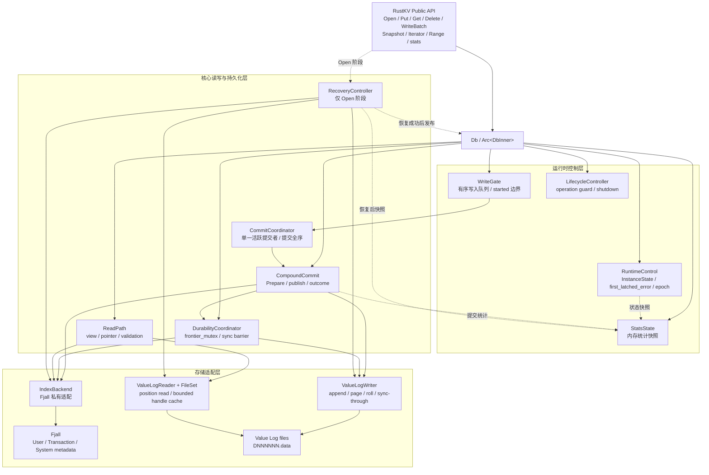
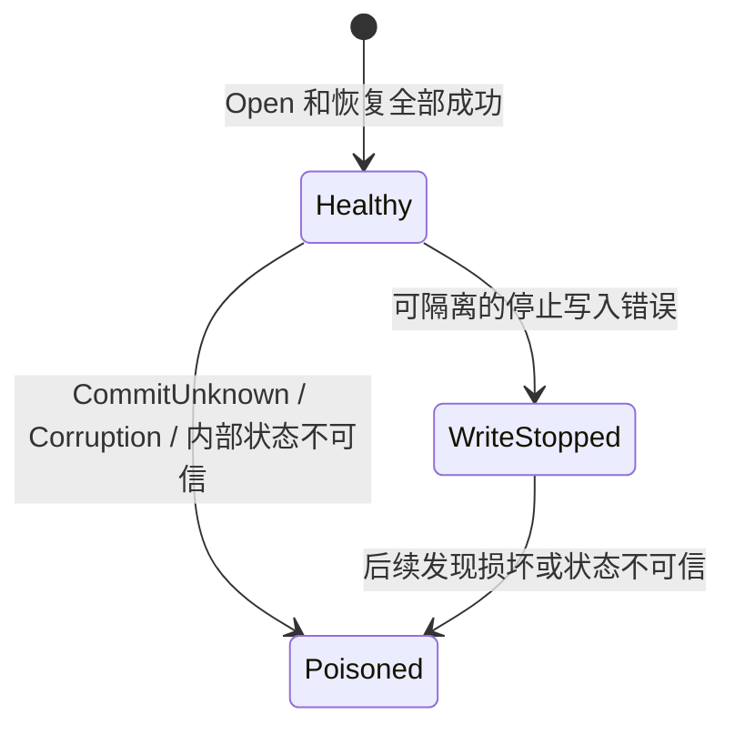

# RustKV 系统设计文档 v3

## 1. 文档信息

| 项目 | 内容 |
|---|---|
| 文档类型 | 系统设计文档 |
| 文档版本 | v3 |
| 文档状态 | `delete-optimize` 分支设计基线 |
| 同级唯一规范 | [`RustKV-复合提交与崩溃恢复协议_v3.md`](./RustKV-复合提交与崩溃恢复协议_v3.md) |
| 历史背景 | [`../../需求分析文档_v2.md`](../../需求分析文档_v2.md) |

### 1.1 文档范围

本文档定义 RustKV 的总体架构、模块边界、磁盘格式、核心读写流程、恢复与并发模型、公共 Rust API、验证职责和关键测试设计。本文档与《RustKV-复合提交与崩溃恢复协议_v3》共同构成 `delete-optimize` 分支的唯一实现规范。根目录 v2 原文保持不变；本版直接重写内部 v0 布局，不兼容或迁移旧数据库。

公共可观测能力仅包括 `stats()`；内部诊断不构成公共契约。RustKV 不提供结构化事件监听器、事件回调或可查询事件历史。

### 1.2 系统边界

- RustKV 是使用 Rust 实现的单机嵌入式 KV 库；
- 一个数据库目录同时只允许一个进程打开，同一进程内允许多个 OS 线程共享数据库实例；
- 公共 API 子集及可观察语义对齐 LevelDB，不兼容 LevelDB 内部实现和磁盘格式；
- Key 和 Value 是任意字节数组；Key 必须至少包含1字节，Value 允许为空；Key 按无符号字节数组字典序排序；
- `key_len + value_len` 不得超过60000字节，完整物理记录不得跨越64KiB逻辑页面；
- 所有 Put 的 Value 均与索引分离并追加写入 Value Log，索引只保存 `UserKey -> ValuePointer` 或删除状态；
- 本设计不实现 Value Log GC，不可达记录和 Snapshot 可能引用的历史记录允许继续占用磁盘；
- 极简事务只包括 WriteBatch 原子提交和 Snapshot 一致性读，不提供通用事务接口；
- 公共 API 不提供自定义 Comparator、FilterPolicy、Cache、Env、RepairDB 和属性查询等扩展接口。

## 2. 设计目标与原则

| 设计原则 | 设计含义 |
|---|---|
| 使用 Fjall 作为 LSM-Tree 索引组件 | Fjall 提供持久化有序索引、原子 Batch、Snapshot、Iterator 和后台整理能力 |
| 索引组件版本固定为 Fjall `3.1.8` | 依赖使用精确版本并提交 `Cargo.lock`，升级前执行兼容性、正确性和性能回归测试 |
| 具体调用以锁定版本的 Fjall API 为准 | `IndexBackend` 适配器严格使用 Fjall `3.1.8` 的 API、类型和语义 |
| 使用私有 IndexBackend 隔离 Fjall | 公共 API、Value Log 格式和 Benchmark 不直接依赖 Fjall 类型 |
| Fjall User Index 只保存 `UserKey -> ValuePointer` 或删除状态 | 完整 User Value 只追加到 Value Log；事务和系统元数据使用私有 Keyspace，且不得保存 User Value |
| 所有前台写入通过短生命周期提交协调器排序 | 建立提交全序，协调 Value Log 追加、事务序号、Fjall 原子提交、页面/文件滚动和 sync 屏障 |
| 普通读取、Snapshot、Iterator 和 Range 不获取提交协调器 | 写提交协调不能把普通读取路径全局串行化 |
| 按事务类型准备持久化载体，再原子发布 | Put/含Put Batch先追加完整 Prepare Envelope；IndexOnlyDelete不写VLog；二者都通过Fjall原子提交User Index、完整descriptor和`head_seq` |
| Put、Delete 和 WriteBatch 在 Fjall 原子 Batch 提交点一次性变为可见 | 读取者只能观察到整个逻辑事务提交前或提交后的状态 |
| 实例错误状态与写入结果相互独立 | 使用 `Healthy/WriteStopped/Poisoned` 管理实例，使用 `Ok/NotCommitted/CommitUnknown` 表达写请求结果 |
| 持久化前沿必须显式管理 | `sync=true` 通过不可拆分的 DurableFrontier 构成提交全序上的前缀持久化屏障 |
| 不实现 Value Log GC | 保留 Snapshot 可能引用的历史 Value Log 记录和不可达记录 |
| LevelDB 对齐限于公共 API 子集和可观察语义 | 不兼容 LevelDB 内部实现和磁盘文件格式 |

Fjall 版本策略如下：

- 实现基线固定为 Fjall `3.1.8`；
- `Cargo.toml` 使用精确约束 `fjall = "=3.1.8"`，`Cargo.lock` 提交到项目中以保证可重复构建；
- 具体 API 名称和调用方式以 Fjall `3.1.8` 官方文档及源码为准；
- 依赖版本不得自动漂移；版本升级必须通过兼容性、正确性和性能回归测试，并同步更新本文档。

## 3. 总体架构、运行时模型和数据库组织

### 3.1 总体架构

RustKV 由公共 API/生命周期层、运行时控制层、复合提交与读取层、存储适配层四个逻辑层次组成。恢复控制器只在 Open 阶段运行；Open 成功并完成恢复后，才创建并发布 `Healthy` 的 `DbInner`。



总体职责如下：

- `DbInner` 是一个已成功 Open 的数据库实例的共享组合根，保存配置、运行时控制对象、索引适配器、Value Log 读写组件和可观测状态；
- `RuntimeControl` 组合公共实例状态、首个锁存错误、状态 epoch 和统一写闸门，保证状态发布与停止写入边界具有同一个同步点；
- `WriteGate` 接受并排序 Put、Delete、WriteBatch 和空 `sync=true` 屏障；`CommitCoordinator` 从队首选择单一活跃提交者，负责分配提交序号、规划 VLog 追加并发布 Fjall 原子事务；
- `CompoundCommit` 实现 VLog Prepare Envelope 与 Fjall 原子发布之间的复合提交，不把二者描述成同一个底层存储事务；
- `DurabilityCoordinator` 管理 `frontier_mutex` 和 `sync=true` 前缀持久化屏障；DurableFrontier 的字段、编码和推进算法见第5.5节和第7章；
- `IndexBackend` 是 RustKV 私有的 Fjall 能力边界。User Index、Transaction Metadata、System Metadata 三类 Keyspace 的固定名称与规则见第5.1节，内部键值编码见第5.3～5.6节；
- `ValueLogWriter` 负责单一追加位置、页面切换、文件滚动和同步到指定位置；`ValueLogReader` 负责按 Pointer 并发读取及完整校验；
- `RecoveryController` 同时依赖目录拓扑、Value Log 和 IndexBackend，只在 Open 阶段执行复合恢复，不能放入单独的 Value Log 子模块；
- `StatsState` 只维护可由 `stats()` 读取的内存统计快照，不执行磁盘 I/O，也不得改变事务结果、实例状态或首个锁存错误；
- Fjall 内置的 KV separation 必须禁用，公共 API、公共错误和磁盘格式均不得暴露 Fjall 类型。

四条高层路径如下：

1. **写路径**：公共 API 参数预检 → 统一写闸门 → 有序提交队列 → 产生物理副作用前再次检查 → 按 transaction_kind 决定是否执行 VLog Prepare → Fjall 原子发布；`sync=true` 还通过 DurabilityCoordinator 完成前缀持久化屏障。
2. **读路径**：实例状态检查 → 获取普通或固定 Snapshot 的 Fjall 读取视图 → User Index 查询 Pointer → Value Log 位置读 → 边界、CRC 和 User Key 校验 → 返回 Value 或结构化错误。
3. **Open/恢复路径**：取得根目录独占锁 → 验证格式和物理拓扑 → 打开 Fjall 与 Value Log 恢复组件 → 执行复合恢复并确定唯一追加位置 → 组装 `DbInner` → 以 `Healthy` 状态开放 API。
4. **错误传播路径**：任一前台或后台组件产生结构化故障 → RuntimeControl 判断是否迁移状态 → 关闭写闸门并处理排队请求 → 锁存首错 → 更新内存状态快照。

### 3.2 运行时状态与并发模型

#### 3.2.1 共享对象和所有权

```text
Db / Snapshot / Iterator / RangeCursor / OperationGuard
└── Arc<DbInner>
    ├── Arc<dyn IndexBackend>                 # 并发索引视图与原子提交
    ├── ValueLogReader + FileSet              # 并发位置读与有界句柄缓存
    ├── RuntimeControl                        # 状态、epoch、首错、写闸门和有序队列
    ├── CommitCoordinator                     # 单一活跃提交者与提交全序
    │   └── ValueLogWriter                    # 唯一 append cursor
    ├── DurabilityCoordinator                 # frontier_mutex 与同步屏障
    ├── StatsState                            # 只读内存统计快照
    ├── LifecycleController                   # operation guard 与 shutdown
    └── Arc<Options>                          # 打开后只读配置
```

公共 `Db` 是持有 `Arc<DbInner>` 的轻量可克隆句柄，并实现 `Clone + Send + Sync`。公共操作使用 `&self`，调用方不需要取得 `&mut Db`，也不需要用覆盖整个数据库的 `Mutex<Db>` 将读写全部串行化。

Snapshot、Iterator、RangeCursor 和每个已经进入 RustKV 的操作都持有 `Arc<DbInner>` 或等价的 operation guard，保证操作执行期间根目录锁及其依赖资源不会提前释放。每个 Iterator/RangeCursor 的可变游标位置仍由该对象独占；对象本身只有在其 Rust 类型满足相应同步约束时才能跨线程共享。

#### 3.2.2 实例状态机

公共活实例状态固定为：



状态只能单向升级，同一实例不支持从 `WriteStopped` 或 `Poisoned` 在线恢复为 `Healthy`。Open 失败时不创建活实例；重新 Open 成功后创建新的 `Healthy` 实例生命周期。

| 状态 | 新写入与持久化维护 | 普通读取 | 保证可用的控制操作 |
|---|---|---|---|
| `Healthy` | 允许 | 允许 | `stats()`、Drop |
| `WriteStopped` | 拒绝 | Get、Snapshot、Iterator、Range 继续执行完整校验并传播真实错误 | `stats()`、Drop |
| `Poisoned` | 拒绝 | 不再提供普通读取保证；尚未开始的读返回 `StoragePoisoned` | `stats()`、Drop |

所有 Db clone、Snapshot、Iterator 和 RangeCursor 共享同一个 RuntimeControl。`Corruption`、`InvalidLayout` 和 `IncompatibleFormat` 是错误类别，不是实例状态；活实例检测到可信存储损坏时，本次操作返回相应错误并把实例升级为 `Poisoned`。

只有能够证明已提交 User Index 和 DurableFrontier 仍可信、普通读取仍可完成全部校验，且停止后续写即可隔离故障时，才允许进入 `WriteStopped`。典型情况包括未提交 VLog 尾部的容量/配额错误、写前发现的只读文件系统，以及可隔离的 VLog 位置读 `EIO`。

出现以下任一情况必须进入 `Poisoned`：写请求结果为 `CommitUnknown`；Fjall 已 poisoned 或其索引/元数据不可信；DurableFrontier 或已提交状态不一致；可见 Pointer 越界、文件缺失、CRC 失败或 User Key 不匹配；VLog、文件或目录同步失败；继续读取可能返回未校验或交叉版本数据。

#### 3.2.3 状态同步与统一写闸门

RuntimeControl 采用以下同步组织：

```text
RuntimeControl
├── state_word: AtomicU64               # 原子打包的 InstanceState + state_epoch
├── first_latched_error: OnceLock<Arc<ErrorSummary>>
└── gate: Mutex<WriteGateInner>
    ├── accepting_writes: bool
    ├── ordered_queue: VecDeque<WriteRequest>
    └── active_request: Option<RequestId>
```

- `state_word` 把 `InstanceState` 和单调递增的 `state_epoch` 打包为一个原子字，供普通读取、`stats()` 和快速拒绝路径获得一致快照；状态发布使用 Release、读取使用 Acquire；
- `gate` 是写入接纳、请求从 queued 变为 started、关闭写入口和撤销排队请求的唯一同步边界；API 入口的原子状态读取仅用于快速失败，不能替代闸门内检查；
- `first_latched_error` 只保存第一个使实例离开 `Healthy` 的错误摘要，后续错误不能覆盖它；`WriteStopped -> Poisoned` 只升级状态和记录升级原因；
- 状态迁移必须持有 `gate`：先令 `accepting_writes=false`，再锁存首错，以一次原子写发布“新状态 + 递增后的 epoch”，随后取出尚未 started 的排队请求；释放锁后唤醒这些请求并以 `NotCommitted` 完成；
- 每次真实状态迁移只递增一次 `state_epoch`，并在不执行 I/O 的前提下更新内存统计快照。

所有前台和后台故障都必须通过 `RuntimeControl::latch_failure()` 或语义等价的单一入口迁移状态：

1. 获取 `gate`，读取当前 `state_word`，按 `Healthy < WriteStopped < Poisoned` 计算是否需要升级；
2. 目标状态没有升级时不修改 `first_latched_error`，只保留后续诊断；
3. 发生升级时先设置 `accepting_writes=false`；仅在首次离开 `Healthy` 时写入 `first_latched_error`；
4. 递增 `state_epoch`，以一次 Release 原子写发布新状态；取出全部尚未 `started` 的排队请求；
5. 释放 `gate` 后，以 `NotCommitted` 和当前状态对应的结构化错误完成被撤销请求；
6. 在锁外更新统计快照。`WriteStopped -> Poisoned` 的升级原因只进入内部诊断，不能覆盖首错。

写请求按以下状态划分：

1. **尚未通过写闸门**：实例非 `Healthy` 时立即拒绝，以 `NotCommitted` 和当前状态对应的结构化错误完成；
2. **已经排队但尚未 started**：状态迁移关闭闸门时从队列撤销，以 `NotCommitted` 完成，不能继续修改 VLog 或 Fjall；
3. **已经 started**：协调器已经在 `gate` 内完成第二次状态检查并登记为 `active_request`。该请求不得被异步终止，必须运行到复合提交协议能够判定的 `Ok`、`NotCommitted` 或 `CommitUnknown`；
4. 活跃请求失败并关闭写闸门后，任何后序排队请求都不得越过它开始提交。

提交协调器采用短生命周期 leader/follower 模式，不创建常驻专用写线程：第一个取得活跃资格的调用线程成为 leader 并执行提交；其他并发调用按入队顺序等待。一个请求完成后，只有在实例仍为 `Healthy` 时，队首请求才可成为下一个 leader。提交协调器不实现 group commit，不合并不同公共写请求的事务边界。

#### 3.2.4 读取、状态变化与错误锁存

- Get、Snapshot 读取、Iterator 和 Range 不取得提交协调器或写闸门；它们基于已发布的 Fjall 视图并发执行；
- 读取开始时以 Acquire 读取一次 `state_word`。观察到 `Healthy` 或 `WriteStopped` 时可以继续，观察到 `Poisoned` 时立即返回 `StoragePoisoned`；
- 读取必须完成 Pointer 边界、Record CRC 和 User Key 匹配校验。发现可信数据损坏时，先向 RuntimeControl 锁存 `Poisoned`，当前调用返回 `Corruption`；
- 读取期间 epoch 发生变化且最终状态为 `Poisoned` 时，保守地返回原始读取错误或 `StoragePoisoned`，不得返回未经过完整验证的 Value；变化到 `WriteStopped` 不妨碍已经完成全部校验的读取成功；
- Snapshot、Iterator 和 RangeCursor 不能绕过实例状态检查；进入 `Poisoned` 后，Iterator/RangeCursor 必须保存并暴露终止错误。

#### 3.2.5 锁顺序与非阻塞边界

- 同时需要持有持久化前沿锁和写提交协调锁时，固定顺序为 `frontier_mutex -> commit_coordinator/gate`，任何路径不得反向取得；
- Value Log、Fjall、目录同步等 I/O 期间不得持有 RuntimeControl 的 `gate`；活跃请求资格在锁内登记，实际提交在锁外执行；
- 普通读取不取得 `frontier_mutex`、提交协调锁或写闸门；
- Value Log 只读句柄缓存采用有界 FIFO；查找锁不得跨文件打开、位置读、CRC 或解析持有，被淘汰句柄必须在缓存锁外释放；
- `stats()` 只读取内存中的原子值、锁存错误摘要和统计快照，不触发磁盘 I/O、恢复、同步、Flush、Compaction 或状态迁移。

#### 3.2.6 后台任务与生命周期

- Fjall 后台 Flush/Compaction 和 RustKV 后台维护不得自行推进 DurableFrontier，也不得越过统一写闸门执行会改变持久化承诺的维护；
- Open 期间存在一个受限例外：FORMAT、DatabaseIdentity、固定 Keyspace 布局和只读 Recovery 分析全部成功后，可以在公共 `Db`、正常 Writer 和任何 RustKV 后台维护尚未创建或开放时启动 Fjall 内部 Flush/Compaction，仅用于支持 Recovery 写入和解除 Fjall 自身反压；
- Descriptor cleanup 只能删除 `commit_seq <= durable_seq` 的描述符；它不得推进 DurableFrontier，也不得清理由 RecoveryState 或未稳定前缀保护的描述符；
- 后台任务发现错误时，必须通过 RuntimeControl 关闭写闸门、锁存首错并按错误协议迁移状态，不能只保存一条字符串错误后继续写；
- `Db`、`Snapshot`、`DbIterator`、`RangeCursor` 和每个已接纳请求的 operation guard 都持有 `Arc<DbInner>`。Drop 任意一个 `Db` clone 不影响这些共享对象；已经 started 的写还必须持有 `Arc<DbInner>`，因此 `DbInner` 的最终析构不会与这些请求并发；
- LifecycleController 分别跟踪可发起操作的外部对象租约和已经接纳的 operation guard，不能把 `Arc::strong_count` 当作并发关闭条件。最后一个外部对象租约释放时关闭接纳入口；最终资源释放仍等待全部 operation guard 释放；
- LifecycleController 使用非循环所有权协调后台任务：后台 worker 不得以永久强引用形成 `Arc<DbInner>` 环，最终析构负责通知并回收后台任务，再按组件依赖逆序释放资源；
- `WriteStopped` 或 `Poisoned` 下的 Drop 不执行在线修复、不清除首错、不承诺成功 flush，且不得 panic；关闭期间的新错误只能进入内部诊断，不能覆盖首错或改变已经返回的结果；
- 上层取消只能撤销尚未 started 的请求。请求开始物理修改后，取消等待不得异步终止提交，RustKV 仍须计算最终协议结果。

### 3.3 Cargo 工程和模块边界

工程结构如下：

```text
src/
├── lib.rs                         # crate 入口和稳定公共导出
├── db.rs                          # Db 生命周期、公共 API 实现和组件装配
├── options.rs                     # Options / ReadOptions / WriteOptions
├── error.rs                       # 公共结构化错误、写结果与重试建议
├── batch.rs                       # WriteBatch 与 BatchOperation
├── snapshot.rs                    # Snapshot 包装
├── cursor.rs                      # Iterator/Cursor 与 Range 适配
├── stats.rs                       # 公共 Stats 类型与私有内存快照
├── runtime/
│   ├── mod.rs
│   ├── state.rs                   # InstanceState、epoch、首错锁存和状态迁移
│   ├── write_gate.rs              # 写入接纳、有序队列、started 边界和唤醒
│   └── lifecycle.rs               # operation guard、shutdown 和 Drop 协调
├── commit/
│   ├── mod.rs
│   ├── coordinator.rs             # 提交全序、leader/follower 和 commit_seq
│   ├── protocol.rs                # 复合提交阶段和结果判定
│   ├── durability.rs              # frontier_mutex 与 sync 持久化屏障
│   └── descriptor.rs              # 事务 descriptor 编解码与清理
├── index/
│   ├── mod.rs                     # 私有 IndexBackend 能力边界
│   └── fjall.rs                   # 锁定版本的 Fjall 适配实现
├── vlog/
│   ├── mod.rs
│   ├── format.rs                  # File/Page/Envelope/Record/Pointer 编解码
│   ├── writer.rs                  # Append、页面切换、文件滚动和 sync-through
│   ├── reader.rs                  # 位置读、Envelope 扫描和记录校验
│   └── file_set.rs                # 数据文件集合与有界只读句柄缓存
├── recovery/
│   ├── mod.rs                     # Open 阶段的复合恢复编排
│   ├── topology.rs                # 受管文件盘点、身份和物理拓扑验证
│   └── undo.rs                    # RecoveryState 与逆序 Undo
├── format.rs                      # 根 FORMAT 元数据
├── lock.rs                        # 根目录独占锁和路径身份
└── fault_injection.rs             # 测试构建启用的确定性故障点
```

`lib.rs` 只重新导出第4章定义的公共 Rust 类型；`runtime`、`commit`、`index`、`vlog` 和 `recovery` 均为 crate 私有模块，`stats.rs` 中除公共统计 DTO 外的状态维护实现同样为私有。本文档定义 Rust library 形式的嵌入式能力，`staticlib`、`cdylib` 和 C ABI 不在设计范围内。源文件可以按代码规模拆分，但不得跨越下表的责任边界。

| 模块边界 | 主要责任 | 可以依赖 | 禁止承担或暴露 |
|---|---|---|---|
| `lib/db` | 参数预检、公共 API 语义、组件装配、Open 成功后发布实例 | runtime、commit、index、vlog、recovery、stats | Fjall 类型、磁盘编码细节、绕过写闸门直接提交 |
| `runtime` | 实例状态、写闸门、请求生命周期、shutdown | 公共错误摘要、stats 私有快照 | VLog/Fjall 编码、恢复算法、业务 Key/Value |
| `commit` | 提交全序、复合提交阶段、descriptor、DurableFrontier 屏障 | runtime、index、vlog、stats 私有快照 | 公共 API 外观、直接解析 Fjall 私有文件、目录拓扑修复 |
| `index` | Fjall Keyspace、读取视图和跨 Keyspace 原子批次适配 | 锁定版本的 Fjall | User Value、RustKV 公共 API、Value Log 文件操作 |
| `vlog` | 文件/页/记录编码、append、roll、位置读、sync-through、句柄缓存 | 文件 I/O、格式和校验工具 | 提交真相判断、Fjall 操作、独立决定事务已提交 |
| `recovery` | Open 阶段拓扑验证、提交前缀收敛、Undo 和 Trim 编排 | format、lock、index、vlog、stats 私有快照 | 向用户开放半恢复实例、普通在线读写、猜测性 Repair |
| `stats` | 公共统计 DTO 与只读内存快照维护 | runtime、commit、vlog 提供的摘要值 | 磁盘 I/O、状态迁移决策、改变事务结果 |
| `format/lock` | 根 FORMAT、数据库身份、路径身份和根目录独占锁 | 文件系统适配 | User Index、提交或读取路径 |
| `fault_injection` | 测试构建中的确定性协议故障点 | 各内部阶段的测试钩子 | Release 默认路径中的业务逻辑 |

依赖方向固定为公共编排层向内部控制层和存储适配层单向依赖。`index` 与 `vlog` 不互相调用，跨二者的操作只能由 `commit` 或 Open 阶段的 `recovery` 编排；`recovery` 不属于 `vlog`，因为它必须同时验证和收敛 Fjall 与 Value Log。所有 Fjall 错误先在 `index/fjall.rs` 转换为内部结构化结果，再由提交或恢复层补齐 protocol stage、write outcome、instance state 和 retry advice。

### 3.4 数据库目录

数据库目录如下：

```text
<db>/
├── LOCK                    # RustKV 根级 OS 排他锁
├── FORMAT.tmp              # 仅可能存在于尚未完成的初始化
├── FORMAT                  # RustKV FORMAT v0 元数据
├── index/                  # Fjall 3.1.8 管理的数据库目录
└── vlog/                   # RustKV 管理的 Value Log 目录
    ├── D000000.data
    ├── D000001.data
    └── ...
```

目录职责：

- `index/` 作为 Fjall 的数据库路径，其内部文件和目录完全由 Fjall 管理；
- `vlog/` 只保存 RustKV 自己管理的 `DNNNNNN.data`；
- `LOCK` 保护 `FORMAT + index + vlog` 这一整个 RustKV 数据库组合；Fjall 在 `index/` 内部可能使用的锁不能替代根级 `LOCK`；
- `FORMAT.tmp` 与最终 `FORMAT` 使用相同编码，只用于证明正式 FORMAT 尚未发布的初始化过程；正常打开的数据库不得保留该文件；
- `FORMAT` 用于识别 RustKV 数据库并解释固定磁盘格式。

路径与锁遵守以下规则：

- 对已存在的数据库根目录解析绝对/相对路径、`.`、`..` 和根目录符号链接别名，以规范路径及根目录的设备号/inode 标识同一个数据库；
- 进程内锁表阻止同一进程通过路径别名重复 Open，`LOCK` 上的 OS 非阻塞排他锁阻止跨进程重复 Open；锁随文件描述符关闭或进程退出自动释放；
- 数据库根目录本身可以通过符号链接别名访问，但 `LOCK`、`FORMAT`、`FORMAT.tmp`、`index`、`vlog` 和 `DNNNNNN.data` 等受管子对象不得是符号链接；
- 根目录尚不存在时，先规范化其现有父目录并以原子目录创建处理并发创建竞争，随后立即取得根 `LOCK`，再检查或创建其他受管对象；
- Open、Recovery 和 DestroyDB 在检查或修改受管对象前必须取得根锁，并持有到操作全部完成；
- 受管子对象优先通过已经打开的根目录或 `vlog/` 目录句柄访问，使用平台提供的不跟随末级符号链接语义。

### 3.5 FORMAT v0

FORMAT v0 的逻辑结构如下：

```text
FormatMetadataV0 {
    magic:              [u8; 8]   = b"RUSTKV00"
    format_version:     u32       = 0
    database_uuid:      [u8; 16]
    page_size:          u32       = 65536
    max_key_value_size: u32       = 60000
}
```

整数采用小端编码，FORMAT v0 固定长度为 36 字节：

| Offset | 长度 | 字段 | v0 取值与含义 |
|---:|---:|---|---|
| 0 | 8 | `magic` | ASCII `RUSTKV00`，识别 RustKV FORMAT 文件 |
| 8 | 4 | `format_version` | `0`，表示 RustKV 磁盘格式 v0 |
| 12 | 16 | `database_uuid` | 创建数据库时生成的 128 位 UUID，标识数据库实例 |
| 28 | 4 | `page_size` | `65536`，打开时必须校验 |
| 32 | 4 | `max_key_value_size` | `60000`，打开时必须校验 |

FORMAT 规则：

- `format_version = 0` 对应第5.3～5.7节的内部元数据/ValuePointer v0，以及第6章的 Record、PageHeader 和 VLog FileHeader v0；
- Open 时固定长度或 Magic 损坏返回 `Corruption/InvalidLayout`，未知格式版本返回 `IncompatibleFormat`，已知版本下页面大小或最大 Key+Value 不一致返回 `Corruption`；任何情况都不得继续打开；
- `database_uuid` 在创建数据库时生成，此后保持不变；同一 UUID 还必须写入第5.5.1节的 Fjall `DatabaseIdentity`，Open 时两者必须一致；
- FORMAT 创建后不做普通原地更新。初次创建使用同目录临时文件，完整写入并同步后原子重命名为 `FORMAT`；
- FORMAT 仅保存数据库格式元数据，不属于 Value Log Append-Only 记录。

#### 3.5.1 初始化协议

初始化状态由 `FORMAT.tmp` 和最终 `FORMAT` 表示：

1. 创建或打开根目录并取得 `LOCK`；
2. 以 `create_new` 创建 `FORMAT.tmp`，写入完整 FORMAT 编码，同步该文件和根目录；
3. 创建 `index/` 和 `vlog/`，初始化 Fjall 三类 Keyspace，并以同一个 SyncAll 初始化 Batch 写入不可变 `DatabaseIdentity{database_uuid=FORMAT.tmp.database_uuid,...}`、`head_seq=0` 和 `DurableFrontier={durable_seq:0,durable_vlog_seq:0,durable_vlog_end:Empty}`；此时 User Index 和 Transaction Metadata 为空，不存在 Descriptor 或 RecoveryState；
4. 同步初始化产生的文件和目录项；
5. 原子重命名 `FORMAT.tmp -> FORMAT`，再同步根目录；
6. 只有最终 FORMAT 已发布且后续 Open/Recovery 验证全部成功后，才能开放公共 API。

步骤3的 SyncAll Batch 只允许执行一次确定的初始化尝试。提交前失败时三元组确定不存在；一旦已调用 Fjall commit 而结果无法判定，当前 Open 必须停止、保留 FORMAT.tmp 且不得发布 FORMAT，也不得在同一进程中盲目重放初始化 Batch。后续 Open 按磁盘恢复后的实际三元组和下述残留规则重新判定；不存在“只补写 Identity”或“只补写 HeadSeq/Frontier”的修复路径。

FORMAT 是初始化完成的唯一提交标志。Open 按下表解释目录：

| 状态 | 解释与处理 |
|---|---|
| 无 FORMAT、无 FORMAT.tmp、无 `index/vlog` | 数据库不存在 |
| 无 FORMAT，存在合法 FORMAT.tmp 和可归属的初始化产物 | 初始化中断；按下述 identity 规则验证后，允许清理并按选项重新初始化 |
| 存在合法 FORMAT，不存在 FORMAT.tmp | 已初始化数据库 |
| FORMAT 与 FORMAT.tmp 同时存在 | `InvalidLayout`，不得猜测清理 |
| 无 FORMAT，但存在不能由合法 FORMAT.tmp 解释的 `index/vlog` | `InvalidLayout`，不得初始化为空库 |
| 存在 FORMAT，但 `index/vlog` 缺失、类型非法，或 Fjall/VLog identity 与 FORMAT 不一致 | `InvalidLayout/Corruption` |

自动清理初始化残留的依据是：最终 FORMAT 从未发布，公共实例从未开放，且临时 FORMAT、数据库 UUID 和全部可读取的初始化产物能够一致归属到本次创建。Fjall 初始化残留按以下规则判定：

- `DatabaseIdentity` 已存在时，必须完整校验并与 FORMAT.tmp UUID/format 一致，同时满足 `head_seq=durable_seq=0`、DurableFrontier 为 Empty、User Index/Transaction Metadata 为空且不存在 RecoveryState；
- `DatabaseIdentity` 尚不存在时，只允许 Fjall 容器不存在，或以不创建 Keyspace 的检查模式证明三个 Keyspace 没有任何用户、事务或系统状态；该情况表示初始化 SyncAll 尚未生效；
- Identity 缺失但存在任意业务/事务/非初始化系统状态、Identity 与 FORMAT.tmp 不匹配、Fjall 无法安全读取，或者 VLog 已含无法解释的内容时，必须 fail closed，不得作为初始化残留删除。

存在最终 FORMAT 的数据库必须具有有效且匹配的 `DatabaseIdentity`；缺失不能作为旧格式兼容处理。任何身份、类型或 Fjall 初始状态无法解释的情况都必须 fail closed。

## 4. 公共 Rust API

### 4.1 DB

```rust
#[derive(Clone)]
pub struct Db {
    inner: std::sync::Arc<DbInner>,
}

impl Db {
    pub fn open(
        options: &Options,
        path: impl AsRef<std::path::Path>,
    )
        -> Result<Self>;

    pub fn put(
        &self,
        options: &WriteOptions,
        key: &[u8],
        value: &[u8],
    ) -> Result<()>;

    pub fn get(
        &self,
        options: &ReadOptions<'_>,
        key: &[u8],
    ) -> Result<Option<Vec<u8>>>;

    pub fn delete(
        &self,
        options: &WriteOptions,
        key: &[u8],
    ) -> Result<()>;

    pub fn write(
        &self,
        options: &WriteOptions,
        batch: &WriteBatch,
    ) -> Result<()>;

    pub fn snapshot(&self) -> Result<Snapshot>;

    pub fn iter(
        &self,
        options: &ReadOptions<'_>,
    ) -> Result<DbIterator>;

    pub fn range(
        &self,
        options: &ReadOptions<'_>,
        range: KeyRange<'_>,
        limit: usize,
    ) -> Result<RangeCursor>;

    pub fn stats(&self) -> DbStats;

    pub fn destroy(
        path: impl AsRef<std::path::Path>,
        options: &Options,
    ) -> Result<()>;
}
```

`Db` 实现 `Clone + Send + Sync`。克隆操作只增加 `Arc<DbInner>` 的引用计数，所有 `Db` 句柄共享同一个数据库实例。所有实例方法使用 `&self`，调用者不需要取得 `&mut Db`。`Db` 不提供显式 `close`；数据库资源由 `Arc<DbInner>` 统一管理，最后一个相关对象释放后通过 `Drop` 关闭数据库。

`Db::open` 借用 `Options`，不消费配置对象。`Db::write` 借用 `WriteBatch`，不消费或修改调用者的 Batch；一次提交结束后，同一 Batch 可以再次提交。

`Db::destroy` 是不依赖数据库实例的关联函数，对应 LevelDB 的独立 `DestroyDB` 操作。

`DbIterator` 拥有 `Arc<DbInner>` 和创建时的读取视图，不借用某个 `Db` 变量。释放创建 Iterator 的 `Db` 句柄不会使 Iterator 失效。不同 Iterator 可以并发使用；单个 Iterator 的游标移动需要可变访问，不支持多个线程无同步地同时推进。

`Db::stats()` 是不失败的内存快照操作；它不得触发磁盘 I/O、恢复、同步、Flush、Compaction 或状态迁移。

### 4.2 Options

RustKV 公开 LevelDB 风格的稳定 Options，不公开 Fjall 的 `DatabaseBuilder`、`KeyspaceCreateOptions` 或其他 Fjall 类型。适配层负责把能够对齐的 RustKV 配置转换为 Fjall 3.1.8 配置。

#### 4.2.1 公共配置类型

```rust
#[derive(Clone, Copy, Debug, Eq, PartialEq)]
pub enum Compression {
    NoCompression,
    Lz4,
}

pub struct Options {
    pub create_if_missing: bool,
    pub error_if_exists: bool,
    pub write_buffer_size: usize,
    pub max_open_files: usize,
    pub block_cache_size: usize,
    pub block_size: usize,
    pub block_restart_interval: usize,
    pub max_file_size: usize,
    pub compression: Compression,
    pub vlog_read_handle_cache_capacity: usize,
}

pub struct WriteOptions {
    pub sync: bool,
}

pub struct ReadOptions<'a> {
    pub snapshot: Option<&'a Snapshot>,
}
```

`ReadOptions` 不提供 `fill_cache` 和 `verify_checksums`。RustKV 的 Value Log Record CRC、Pointer 边界和 Key 一致性校验始终执行，不能由单次读取关闭。

#### 4.2.2 默认值

```text
Options:
  create_if_missing     = false
  error_if_exists       = false
  write_buffer_size     = 4 MiB
  max_open_files        = 1000
  block_cache_size      = 8 MiB
  block_size            = 4 KiB
  block_restart_interval = 16
  max_file_size         = 2 MiB
  compression           = Compression::NoCompression
  vlog_read_handle_cache_capacity = 64

WriteOptions:
  sync = false

ReadOptions:
  snapshot = None
```

`block_cache_size = 0` 仍可由调用者显式用于关闭 Fjall 索引 Block Cache；RustKV 默认设为8MiB，以对齐 LevelDB 在未提供自定义 Cache 时创建8MiB内部 Block Cache 的行为。它不控制 RustKV Value Log Page Cache。

`vlog_read_handle_cache_capacity` 是 Value Log 独立只读文件句柄缓存可保留的最大句柄数，默认64；设为0表示禁用缓存，每次未持有可用句柄时临时打开并在读取结束后释放。

#### 4.2.3 索引配置语义边界

`write_buffer_size`、`max_open_files`、`block_cache_size`、`block_size`、`block_restart_interval`、`max_file_size` 和 `compression` 均配置索引，不改变 Value Log 磁盘格式。

RustKV 不提供 `reuse_logs` 和 `paranoid_checks`。Comparator、Env、Logger、FilterPolicy 和用户自定义 Cache 也不属于当前公共 API。

#### 4.2.4 Value Log 固定配置与独立配置边界

以下参数属于 RustKV v0 固定磁盘格式，不作为可由调用者修改的公共 `Options` 字段：

| 内部固定项 | v0 值 | 约束来源 |
|---|---:|---|
| `VLOG_PAGE_SIZE` | 65536 bytes | 固定64KiB逻辑页 |
| `VLOG_MAX_FILE_SIZE` | `2^32` bytes | 单数据文件4GiB后滚动 |
| `MAX_KEY_VALUE_SIZE` | 60000 bytes | `key_len + value_len` 上限 |
| `PAGE_HEADER_SIZE` | 16 bytes | 第6.3节 PageHeader v0 |
| `VLOG_FILE_HEADER_SIZE` | 48 bytes | 第0页 PageHeader 后的文件身份头 |
| `RECORD_HEADER_SIZE` | 39 bytes | 第6.2节 RecordHeader v0 |
| `VALUE_POINTER_SIZE` | 16 bytes | 第5.7节 ValuePointer v0 |
| 文件编号范围 | `0..=999999` | `D000000.data`～`D999999.data` |

这些值由实现常量和根目录 FORMAT 共同约束。Open 必须验证 FORMAT 中的页面大小、最大 Key+Value 和格式版本与当前实现一致；不一致时返回 Unsupported 或 Corruption，不得用本次打开参数改变已有数据库格式。

`vlog_page_size`、`vlog_max_file_size` 和 `max_key_value_size` 是磁盘格式常量，不属于公共 `Options`。

`max_open_files` 只映射 Fjall 索引文件句柄上限。Value Log 只读句柄缓存由 `vlog_read_handle_cache_capacity` 独立管理，不参与该额度。

内部重试预算、恢复资源预留、Fjall 原生 Options 和第4.2.4节已经冻结的磁盘格式参数均不作为公共配置。RustKV 不提供结构化事件监听器或事件回调配置。

### 4.3 WriteBatch

```rust
pub struct WriteBatch {
    operations: Vec<BatchOperation>,
}

enum BatchOperation {
    Put { key: Vec<u8>, value: Vec<u8> },
    Delete { key: Vec<u8> },
}

impl WriteBatch {
    pub fn new() -> Self;
    pub fn put(
        &mut self,
        key: impl AsRef<[u8]>,
        value: impl AsRef<[u8]>,
    ) -> Result<()>;
    pub fn delete(&mut self, key: impl AsRef<[u8]>) -> Result<()>;
    pub fn clear(&mut self);
    pub fn len(&self) -> usize;
    pub fn is_empty(&self) -> bool;
}
```

`WriteBatch::put/delete` 是 fallible 构造操作。每次调用必须在修改 `operations` 前完成：

1. 校验 Key 非空且不超过60000字节；Put 还使用检查加法验证 `key.len + value.len <= 60000`；
2. 使用检查加法验证 `operations.len()+1`、Key/Value 长度转换和后续计数字段可表示；
3. 分别为局部 Key/Value 缓冲调用 `try_reserve_exact`，容量成功后才复制调用者字节；禁止使用会在本路径隐式不可恢复分配的 `to_vec/Vec::push` 代替；
4. 完整构造局部 `BatchOperation` 后，对 `operations` 调用 `try_reserve(1)`；只有全部检查和分配成功后才执行一次不会再分配的 `push`。

任一步失败都返回结构化 `InvalidArgument/ResourceExhausted/CapacityExceeded`，`protocol_stage=Preflight`、`write_outcome=NotCommitted`，且 Batch 的操作数量、顺序和已有 Key/Value 字节保持逐字节不变。资源失败不设置隐藏的 sticky error；调用方释放资源后可以对同一个 Batch 重试本次构造操作。`clear()` 只清空已成功加入的操作并保留实现可复用的容量。

即使所有公开构造方法已经执行上述检查，`Db::write` 在提交前仍必须统一复核全部成员、计数、编码长度和 fallible allocation，避免部分记录已经追加到 Value Log 后才发现错误。`Db` 按操作成功加入的顺序处理内部 `operations`。

`WriteBatch` 不公开 `iterate()` 或 Handler 类型。

### 4.4 Snapshot

```rust
#[derive(Clone)]
pub struct Snapshot {
    inner: std::sync::Arc<SnapshotInner>,
}
```

`Snapshot` 实现 `Clone + Send + Sync`，只通过 `ReadOptions::snapshot` 选择读取视图，不重复提供 `get`、`iter` 或 `range` 方法。`SnapshotInner` 持有 `Arc<DbInner>` 和拥有型 Fjall Snapshot；因此创建它的 `Db` 变量被释放后，Snapshot 仍然有效。最后一个 Snapshot 引用释放时才释放底层 Snapshot。

把其他数据库实例创建的 Snapshot 放入本实例的 `ReadOptions` 必须返回 `InvalidArgument`。`Healthy` 和 `WriteStopped` 状态允许创建和使用 Snapshot；`Poisoned` 拒绝创建新 Snapshot，已经存在的 Snapshot 也不再获得普通读取成功保证。由 Snapshot 创建的 Iterator 或 RangeCursor 克隆并持有拥有型读取视图，不借用调用者的 Snapshot 变量。

### 4.5 Iterator、Range 与 Stats

#### 4.5.1 DbIterator

```rust
pub enum CursorState {
    Unpositioned,
    Valid,
    Exhausted,
    Failed,
}

pub struct DbIterator {
    db: std::sync::Arc<DbInner>,
    // owned backend read view + current key/value state
}

impl DbIterator {
    pub fn valid(&self) -> bool;
    pub fn seek_to_first(&mut self);
    pub fn seek_to_last(&mut self);
    pub fn seek(&mut self, target: &[u8]);
    pub fn next(&mut self);
    pub fn prev(&mut self);
    pub fn key(&self) -> Option<&[u8]>;
    pub fn value(&self) -> Option<&[u8]>;
    pub fn status(&self) -> std::result::Result<(), &StorageError>;
}
```

`DbIterator` 使用接近 LevelDB 的 cursor 外观。每次定位或移动都立即读取并校验当前项的 ValuePointer、Value Log Record、CRC 和 User Key；只有 Key 与 Value 均已就绪时状态才是 `Valid`。`valid()==true` 时 `key()` 和 `value()` 必须同时返回 `Some`。调用定位或移动方法后，之前取得的 Key/Value 借用失效。

新建 Iterator 的状态为 `Unpositioned`。`seek_to_first`、`seek_to_last` 和 `seek` 可以从 `Unpositioned` 或 `Exhausted` 重新定位；到达边界后进入 `Exhausted`。任何读取或校验错误使游标进入终止态 `Failed`，保存第一个 `StorageError`，令 `valid()==false` 并通过 `status()` 返回该错误。`Unpositioned` 和 `Exhausted` 的 `status()` 返回 `Ok(())`；在无效游标上调用 `next` 或 `prev` 是无副作用操作，不得 panic；`Failed` 不允许重新定位。

`seek` 的 target 是排序定位边界而不是写入 Key，因此允许空字节数组；`seek(&[])` 等价于从最小排序位置开始查找。非空 target 长度不得超过60000字节，参数错误通过游标 `status()` 暴露。

方向切换必须遵守 LevelDB cursor 语义，不能重复或跳过当前位置邻接的 Key。普通 Iterator 在创建时取得一个隐式稳定 Fjall Snapshot，整个生命周期固定使用该视图；显式 Snapshot Iterator 固定使用传入的 Snapshot 视图。`DbIterator` 不实现 `Sync`，但相互独立的 Iterator 可以并发执行。

#### 4.5.2 Range

```rust
pub struct KeyRange<'a> {
    pub start: Option<&'a [u8]>,
    pub end: Option<&'a [u8]>,
}

pub struct RangeCursor {
    inner: DbIterator,
    end: Option<Vec<u8>>,
    remaining: usize,
}

impl RangeCursor {
    pub fn valid(&self) -> bool;
    pub fn key(&self) -> Option<&[u8]>;
    pub fn value(&self) -> Option<&[u8]>;
    pub fn next(&mut self);
    pub fn status(&self) -> std::result::Result<(), &StorageError>;
}
```

`Db::range` 返回流式、只向前移动的 `RangeCursor`，不一次性构造 `Vec`。范围语义固定为 `[start, end)`；`None` 表示该方向无界，`Some(&[])` 表示合法的最小边界而不是无界。非空边界长度不得超过60000字节。`start >= end` 或 `limit==0` 返回正常的空游标。

创建成功的 RangeCursor 已定位到范围中的第一项；最多返回 `limit` 个条目，到达排他 `end`、数量上限或索引末尾后进入正常终止状态。当前项遵守 DbIterator 的立即读取与完整校验规则；错误保存在内部游标并通过 `status()` 暴露。RangeCursor 在整个生命周期固定使用创建时的隐式或显式 Snapshot 视图。

#### 4.5.3 Stats

```rust
#[derive(Clone, Debug)]
pub struct VLogPosition {
    pub file_id: u32,
    pub offset: u64,
}

#[derive(Clone, Debug)]
pub struct LatchedErrorSummary {
    pub kind: StorageErrorKind,
    pub operation: Operation,
    pub protocol_stage: ProtocolStage,
    pub retry_advice: RetryAdvice,
    pub os_code: Option<i32>,
    pub commit_seq: Option<u64>,
    pub vlog_file_id: Option<u32>,
    pub vlog_offset: Option<u64>,
}

#[derive(Clone, Debug)]
pub struct DbStats {
    pub schema_version: u16,
    pub instance_state: InstanceState,
    pub state_epoch: u64,
    pub first_latched_error: Option<LatchedErrorSummary>,
    pub head_seq: u64,
    pub durable_seq: u64,
    pub durability_lag: u64,
    pub durable_vlog_end: Option<VLogPosition>,
    pub active_vlog_file_id: Option<u32>,
    pub vlog_file_count: u32,
    pub vlog_logical_bytes: u64,
}
```

`schema_version` 在错误 schema v1 中固定为1。`durability_lag` 精确等于 `head_seq - durable_seq`；不变量损坏不得以饱和减法隐藏，而应由产生不一致的路径把实例转入 `Poisoned`。公共 `DbStats` 不增加 `durable_vlog_seq`；该字段仅存在于私有持久化和运行时状态。`durable_seq > 0` 时 `durable_vlog_end` 仍可为 `None`，表示持久前缀中还没有 VLogEnvelope。只有追加状态为 `AppendState::Open` 时 `active_vlog_file_id` 为 `Some`；`Empty` 和 `AtFileLimit` 均为 `None`。

`vlog_logical_bytes` 是全部受管 Value Log 文件当前 `st_size` 之和，由 Open、追加、滚动和 Trim 路径维护在内存中。纯 Delete 不得改变 `vlog_file_count`、`vlog_logical_bytes`、`active_vlog_file_id` 或 append cursor。私有 `StatsState` 使用短临界区 `RwLock` 保护复合统计快照；取得快照后立即释放锁，任何 I/O 均在锁外。实现必须避免锁中毒使 `stats()` 失败，或在异常情况下返回最后一个完整快照。`stats()` 在 `Healthy`、`WriteStopped` 和 `Poisoned` 均可调用。

`LatchedErrorSummary` 不包含用户 Key、Value、底层 `source` 或任意可能泄露业务数据的文本。统计中的 `VLogPosition` 仅用于诊断，不接受为任何写入、恢复或定位 API 的输入，也不承诺替代磁盘格式兼容接口。RustKV 不公开结构化事件监听器；状态和持久化进度由调用者按需读取 `stats()`。

### 4.6 结构化存储错误、写结果与重试契约

#### 4.6.1 三个正交维度

RustKV 分别表达错误原因、失败写结果、活实例状态和重试建议。公共 API 以 `Result::Ok` 表示成功；失败的 Put、Delete、WriteBatch 或同步屏障使用 `WriteOutcome` 区分 `NotCommitted` 与 `CommitUnknown`。

| 维度 | 取值 | 含义 |
|---|---|---|
| API 成功 | `Result::Ok` | 请求已经达到 WriteOptions 要求 |
| 失败写结果 | `NotCommitted`、`CommitUnknown` | 本次请求是否可能已经提交 |
| 活实例状态 | `Healthy`、`WriteStopped`、`Poisoned` | 当前实例还能执行哪些操作 |
| 重试建议 | `RetryAdvice` | 调用方的后续动作 |

`NotCommitted` 不表示实例仍可写；`Poisoned` 也不表示被写闸门拒绝的新请求为 `CommitUnknown`。例如 `Io + NotCommitted + WriteStopped`、`Io + CommitUnknown + Poisoned`、`InvalidArgument + NotCommitted + Healthy` 都是合法组合。

#### 4.6.2 公共类型

```rust
pub type Result<T> = std::result::Result<T, StorageError>;

#[derive(Clone, Copy, Debug, Eq, PartialEq)]
pub enum WriteOutcome {
    NotCommitted,
    CommitUnknown,
}

#[derive(Clone, Copy, Debug, Eq, PartialEq)]
pub enum InstanceState {
    Healthy,
    WriteStopped,
    Poisoned,
}

#[derive(Clone, Copy, Debug, Eq, PartialEq)]
pub enum RetryAdvice {
    FixRequestAndRetrySameInstance,
    RetrySameInstance,
    FixEnvironmentAndReopen,
    ReopenAndVerify,
    RestoreOrRepair,
    DoNotRetry,
}

#[derive(Clone, Copy, Debug, Eq, PartialEq)]
pub enum StorageErrorKind {
    InvalidArgument,
    NotFound,
    Busy,
    Unsupported,
    ResourceExhausted,
    CapacityExceeded,
    Io,
    Corruption,
    InvalidLayout,
    IncompatibleFormat,
    StorageWriteStopped,
    StoragePoisoned,
    Unrecoverable,
}

#[derive(Clone, Copy, Debug, Eq, PartialEq)]
pub enum Operation {
    Open,
    Put,
    Delete,
    WriteBatch,
    Get,
    Snapshot,
    Iterator,
    Range,
    Sync,
    Destroy,
    Drop,
    Background,
    Recovery,
}

#[derive(Clone, Copy, Debug, Eq, PartialEq)]
pub enum ProtocolStage {
    Admission,
    Preflight,
    VLogAppend,
    VLogSync,
    IndexCommit,
    DurableFrontier,
    Read,
    Recovery,
    Maintenance,
    Lifecycle,
}
```

`Operation` 表示正在执行的公共或内部操作，`ProtocolStage` 表示错误发生的协议层。二者组合提供稳定的机器可读上下文，例如 `WriteBatch + VLogAppend`、`Put + IndexCommit`、`Open + Recovery`。公共阶段保持粗粒度，不随内部函数拆分而演进。

结构化错误的逻辑字段为：

```rust
pub struct StorageError {
    pub schema_version: u16,                 // 错误 schema v1 固定为1
    pub kind: StorageErrorKind,
    pub operation: Operation,
    pub protocol_stage: ProtocolStage,
    pub write_outcome: Option<WriteOutcome>, // 失败写请求或Batch构造失败时存在
    pub instance_state: Option<InstanceState>,
    pub retry_advice: RetryAdvice,
    pub os_code: Option<i32>,
    pub commit_seq: Option<u64>,
    pub tx_uuid: Option<[u8; 16]>,
    pub vlog_file_id: Option<u32>,
    pub vlog_offset: Option<u64>,
    pub destroy_failure: Option<DestroyFailureContext>,
    pub message: String,
    pub source: Option<Box<dyn std::error::Error + Send + Sync>>,
}
```

Put、Delete、`Db::write` 和空同步屏障失败时 `write_outcome` 必须存在；读取、Open、Recovery、Destroy 和后台操作失败时为 `None`。`WriteBatch::put/delete` 的构造错误尚未绑定活 DB，但已经能够证明不会产生提交效果，因此使用 `operation=WriteBatch`、`protocol_stage=Preflight`、`write_outcome=NotCommitted`、`instance_state=None`：输入错误使用 `FixRequestAndRetrySameInstance`，fallible allocation 失败使用 `RetrySameInstance`，表示释放资源后可在不丢弃既有 Batch 内容的情况下重试，不表示存在需要恢复的 DB 实例。只有 DestroyDB 失败可以携带 `destroy_failure`，其他操作必须为 `None`。活实例操作返回错误时携带返回时的 `instance_state`；Open 和 Batch 构造尚未创建或绑定实例，因此为 `None`。`CommitUnknown` 必须与 `Poisoned` 同时出现。

删除不存在的 Key 返回 `Ok(())`，Get 不存在返回 `Ok(None)`。Pointer、CRC、User Key 或稳定状态不一致不能转换为 NotFound。错误字段、message 和 source chain 均不得包含原始 User Key 或 User Value；Fjall 错误只能作为经过清理的内部 source，不能把 Fjall 类型公开为 RustKV API。

#### 4.6.3 公共和私有阶段边界

精细故障位置使用 crate 私有枚举，不通过 `lib.rs` 导出：

```rust
enum InternalFaultPoint {
    VLogFileCreate,
    VLogHeaderWrite,
    TxBeginWrite,
    OperationRecordWrite,
    TxPreparedEndWrite,
    VLogFileSync,
    VLogDirectorySync,
    FjallCommitEnter,
    FjallCommitReturn,
    RecoveryStateCommit,
    RecoveryUndoBatch,
    TrimTruncate,
    TrimDeleteFile,
    TrimDirectorySync,
}
```

该枚举只用于故障注入和内部调试诊断。内部故障点必须映射到一个公共 `ProtocolStage`：文件创建和记录写入映射到 `VLogAppend`，文件/目录同步映射到 `VLogSync`，Fjall commit 映射到 `IndexCommit`，Undo/Trim 映射到 `Recovery`。调用方不得依赖内部故障点名称。

#### 4.6.4 错误阶段映射

| 场景 | 写结果 | 返回时状态 | 重试建议 |
|---|---|---|---|
| `WriteBatch::put/delete` 构造输入或分配失败，无 I/O | `NotCommitted` | 无活实例状态；`instance_state=None` | 修正输入或释放资源后对未变化的 Batch 重试本次构造操作 |
| 参数、大小或编码错误，无 I/O | `NotCommitted` | `Healthy` | `FixRequestAndRetrySameInstance` |
| 可恢复资源预检失败，无 I/O | `NotCommitted` | `Healthy` | `RetrySameInstance` |
| VLog 首字节前瞬时失败 | `NotCommitted` | `Healthy` 或停止写 | `Healthy` 时为 `RetrySameInstance`；停止写时按锁存原因返回 `FixEnvironmentAndReopen` 或 `ReopenAndVerify` |
| VLog 部分追加后 `ENOSPC/EDQUOT` | `NotCommitted` | `WriteStopped` | `FixEnvironmentAndReopen` |
| VLog 写 `EIO`，尚未进入 Fjall commit | `NotCommitted` | 默认 `Poisoned`；可证明隔离时为 `WriteStopped` | `Poisoned` 时为 `ReopenAndVerify`；`WriteStopped` 时为 `FixEnvironmentAndReopen` |
| VLog、文件或目录同步失败 | `NotCommitted` | `Poisoned` | `ReopenAndVerify` |
| Fjall commit 是否应用无法判断 | `CommitUnknown` | `Poisoned` | `ReopenAndVerify` |
| DurableFrontier commit 是否应用无法判断 | `CommitUnknown` | `Poisoned` | `ReopenAndVerify` |
| 可见 Pointer、CRC 或 User Key 损坏 | 不适用 | `Poisoned` | `RestoreOrRepair` |
| VLog 读取 `EIO` 且索引/元数据可信 | 不适用 | `WriteStopped` | `FixEnvironmentAndReopen` |
| Fjall User Index 或内部元数据读取 `EIO` | 不适用 | `Poisoned` | `ReopenAndVerify` |
| Descriptor cleanup 失败但状态仍可信 | 不影响既有结果 | 保持原状态 | `DoNotRetry`（调用方不重试；内部允许有限任务级重试） |
| Fjall 后台状态不可信 | 不改变既有 `Ok` | `Poisoned` | `ReopenAndVerify` |

分类必须同时依据协议阶段、是否已经产生物理副作用以及 Fjall Batch 是否可能应用，不能只根据 errno 决定。闸门在 `WriteStopped/Poisoned` 下拒绝的新写统一返回 `NotCommitted`，错误 kind 分别为 `StorageWriteStopped/StoragePoisoned`；只有已进入 Fjall commit 且结果无法确定的活跃请求返回 `CommitUnknown`。

#### 4.6.5 内部重试预算

v0 使用以下有限默认预算：

| 情况 | 内部处理 |
|---|---|
| `EINTR` | 同一系统调用最多连续重试8次，且仅在语义能够证明安全时重试 |
| 正短写 | 每次有正进展时从已写偏移继续，不重新执行整个请求 |
| 零字节写 | 立即作为无进展失败 |
| `EAGAIN` | 最多重试3次，依次退避1ms、2ms、4ms，总退避不超过7ms |
| `EMFILE` | 淘汰 VLog 只读句柄缓存后立即重试1次 |
| `ENFILE` | 退避10ms后重试1次 |
| Descriptor cleanup | 允许有限任务级重试，不改变原事务结果 |
| Fjall 后台任务 | 只有锁定版本契约证明源文件、Version和可见状态均未改变时才允许有限重试 |

禁止自动重新执行已经产生副作用的完整 Put、Delete 或 WriteBatch；禁止对 `ENOSPC`、`EDQUOT`、`EIO` 或未知 Fjall 错误无限重试；禁止在 `CommitUnknown` 后盲目重放；禁止在同一实例中把 `WriteStopped/Poisoned` 恢复为 `Healthy`。

调用方只有同时满足以下条件才能在同一实例重试：

```text
write_outcome == NotCommitted
instance_state == Healthy
retry_advice ∈ {
    FixRequestAndRetrySameInstance,
    RetrySameInstance,
}
```

`NotCommitted + WriteStopped` 的标准路径是修复环境、释放旧实例、重新 Open 后再提交。`CommitUnknown + Poisoned` 必须重新 Open 并验证原请求整体存在或整体不存在，不能直接重放。内部 `tx_uuid` 不是公共幂等请求 ID，不能用于调用方自动去重。

### 4.7 Open、Drop 与数据库销毁

#### 4.7.1 Open 选项和阶段

`create_if_missing` 与 `error_if_exists` 按以下矩阵解释：

| 数据库状态 | `create_if_missing` | `error_if_exists` | 结果 |
|---|---:|---:|---|
| 不存在 | `false` | 任意 | `NotFound` |
| 不存在 | `true` | 任意 | 执行第3.5.1节初始化 |
| 合法数据库已存在 | 任意 | `true` | `InvalidArgument`，表示数据库已存在 |
| 合法数据库已存在 | 任意 | `false` | 打开并执行必要恢复 |
| 存在无法解释的受管残留 | 任意 | 任意 | `InvalidLayout/Corruption` |
| 存在可证明的初始化中断 | `true` | 任意 | 清理该次初始化产物后重新初始化；最终 FORMAT 尚未发布，因此不触发 `error_if_exists` |
| 存在可证明的初始化中断 | `false` | 任意 | 返回数据库不存在或初始化中断错误，不创建数据库 |

Open 固定按以下阶段执行：

1. 规范化路径，建立进程内路径身份并取得根 `LOCK`；
2. 根据 FORMAT/FORMAT.tmp 和受管目录识别不存在、初始化中断或已初始化状态；
3. 必要时执行第3.5.1节的初始化协议；否则严格校验 FORMAT；
4. 不跟随符号链接地盘点根目录和全部 VLog，完成结构拓扑验证；
5. 以“必须已经存在”和零 Fjall worker 的方式打开索引，完成 Fjall 自身 journal 恢复；不得因 manifest/journal 损坏创建新索引；
6. 在读取或解释其他 Fjall 状态前，读取并严格解码不可变 `DatabaseIdentity`，与 FORMAT 的 `database_uuid/format_version` 以及固定 Keyspace layout 交叉验证；缺失、损坏、未知版本或错配时不得启动 Fjall worker，也不得执行任何 RustKV 恢复写入；
7. Identity 验证成功后，在零 worker Backend 上读取 DurableFrontier、head_seq、RecoveryState 和 Descriptor，执行引用感知拓扑、stable prefix 与未稳定 Envelope 的全部只读验证，生成不持有 Fjall Snapshot、Iterator、Keyspace 或 Backend 引用的完全拥有型 `RecoveryPlan`；
8. 只读分析成功后关闭零 worker Backend；数据库根目录独占锁必须在关闭和重开之间持续持有；
9. 使用正常后台 worker 重新打开同一索引，并在第一次 Recovery 写入前立即再次读取、严格解码和交叉验证 `DatabaseIdentity`；第二次打开或身份验证失败时不得执行 Recovery 写入，也不得返回半可用实例；
10. 在该启用 worker 的 Backend 上按第8章执行 `RecoveryPlan`，完成 Undo、前沿持久化、Trim 和 Finalize；全部恢复 Batch 都禁止修改 `DatabaseIdentity`，Fjall Flush/Compaction worker 可以处理 Recovery commit 产生或遇到的反压；
11. 再次盘点物理尾，根据 accepted_end 创建唯一 Writer append 状态，并复用只读分析所用的 ValueLogReader 和有界句柄缓存；
12. 使用步骤9打开且已经完成 Recovery 的同一个 Backend 组装 RuntimeControl、提交协调器和 Descriptor cleanup，以新的 `Healthy` 实例开放 API；Recovery 后不得无意义地再次重开 Fjall。

任何阶段失败都必须释放已构造资源和根锁，返回结构化 Open/Recovery 错误，不得返回半可用实例。FORMAT、DatabaseIdentity、固定 Keyspace 布局和只读 Recovery 分析完成前，不得启动 Fjall 后台 Flush/Compaction。首次身份验证和只读分析成功后，允许启用 Fjall 内部 Flush/Compaction，以支持 Recovery 写入并解除反压；但 Db 公共 API、正常 Writer、Descriptor cleanup 和其他 RustKV 后台维护仍必须在 Recovery 全部完成后开放或启动。

#### 4.7.2 Drop

单个 `Db` clone 被释放时只减少 `Arc<DbInner>` 引用计数。数据库的关闭分为“停止接纳”和“最终释放”两个边界：最后一个可发起新操作的外部对象（`Db`、Snapshot、DbIterator 或 RangeCursor）释放时，LifecycleController 开始停止接纳；在途 operation guard 可以继续持有 `Arc<DbInner>`，直到请求得到协议可判定结果。最终资源释放只发生在最后一个相关 `Arc<DbInner>` 引用被释放之后。

停止接纳和最终释放依次执行：

1. 标记数据库正在关闭，拒绝新操作并关闭写入口；
2. 从有序队列撤销全部尚未 started 的写请求，以 `NotCommitted` 完成；
3. 等待已经 started 的写运行到协议可判定结果，不异步终止提交；
4. 停止并回收后台任务；
5. 处理活动 Value Log 文件的用户态缓冲，并按组件依赖逆序释放索引、只读缓存和写句柄；
6. 最后释放根目录 `LOCK`。

Drop 不能向调用者返回错误，因此可能影响持久化承诺的错误必须在显式写操作中返回并锁存。Drop 不得隐式执行 `sync=true` 屏障，不得把 `sync=false` 升级为更强的持久化保证，不执行在线恢复、不清除锁存错误且不得 panic。关闭期间发生的新错误只进入内部诊断，不覆盖首个锁存错误。

#### 4.7.3 `Db::destroy`

DestroyDB 不执行 Recovery 或隐式 Repair。目标数据库仍被任一进程打开时，根锁获取失败并返回 `Busy`。路径不存在，或目录中只有 `LOCK` 和普通非受管文件时，按 LevelDB 风格返回成功。

删除算法为：

1. 规范化路径并取得与 Open 相同的根 `LOCK`；
2. 在删除前完整盘点受管对象，拒绝根受管符号链接、非法文件类型和不能归属到 FORMAT UUID 的 VLog；存在最终 FORMAT 且 `index/` 已初始化时，必须以不创建数据库/Keyspace的验证模式读取 `DatabaseIdentity` 并与 FORMAT UUID/format 交叉验证，Identity 缺失、损坏、未知版本、错配或 Fjall 无法安全读取时不开始删除；仅存在合法 FORMAT.tmp 时，Identity 若存在也必须与其匹配，Identity 若尚不存在则必须按第3.5.1节证明三个 Keyspace 没有任何状态后才能把它当作初始化残留；
3. 从高编号到低编号删除已确认归属的 VLog 文件，同步并删除空 `vlog/`；
4. 在不跟随符号链接的前提下递归删除 Fjall `index/`；对 verified index 目录内部的符号链接只删除链接本身，不跟随到目录外；
5. 删除合法的 FORMAT.tmp 初始化残留并同步根目录；
6. 最后删除 FORMAT，再次同步根目录；
7. 保留根目录、`LOCK` 和全部普通非受管文件，随后释放根锁。

数据库存在性由合法 FORMAT 决定。保留根目录和 `LOCK` 可以使销毁、重新创建和路径别名始终竞争同一锁对象，避免删除锁文件后出现两个锁命名空间。

DestroyDB 不承诺失败回滚。公共结构化失败上下文为：

```rust
pub enum ManagedObject {
    Lock,
    Format,
    FormatTemporary,
    DatabaseIdentity,
    IndexDirectory,
    VLogDirectory,
    VLogFile { file_id: u32 },
}

pub enum DestroyStage {
    AcquireLock,
    Inventory,
    RemoveFile,
    RemoveTree,
    SyncDirectory,
}

pub struct DestroyFailureContext {
    pub failed_object: ManagedObject,
    pub stage: DestroyStage,
    pub partially_deleted: bool,
    pub os_code: Option<i32>,
}
```

第一个成功删除动作发生后，后续失败必须令 `partially_deleted=true`。FORMAT 最后删除，因此 FORMAT 仍存在时重试可以继续清理；FORMAT 已删除且没有其他受管数据对象时，重试返回成功。不得为了回滚而重新创建已经删除的文件，也不得删除普通非受管文件。

## 5. Fjall 存储组织和 IndexBackend 原子能力

### 5.1 Fjall Database 和三类 Keyspace

一个 RustKV 数据库只打开一个 Fjall `Database`，并在其中创建或打开下列三个固定 Keyspace：

| 逻辑角色 | 固定 Fjall 名称 | 保存内容 | 用户读取路径是否访问 |
|---|---|---|---|
| User Index | `rustkv_user_index` | `UserKey -> EncodedValuePointer`；删除状态为 Absent | 是 |
| Transaction Metadata | `rustkv_txn_metadata` | TxMeta、TxMutation、BeforeState 和 AfterState | 否 |
| System Metadata | `rustkv_system_metadata` | 不可变 DatabaseIdentity、`head_seq`、DurableFrontier 和 RecoveryState | 否 |

三类 Keyspace 遵守以下规则：

- User Index 的 Key 直接使用已经通过 RustKV 非空校验的 User Key，排序为无符号字节数组字典序；
- User Index Value 只保存当前格式的 ValuePointer，不能保存 User Value、`commit_seq` 或事务描述符；
- Transaction Metadata 可以为恢复目的重复保存 User Key 和新旧 Pointer，但不能保存 User Value、Value 分片或完整 Key+Value payload；
- System Metadata 只保存 RustKV 内部全局状态；DatabaseIdentity 把整个 Fjall Database 及其中三个固定 Keyspace 绑定到根 FORMAT，DurableFrontier 必须编码为一个不可拆分的逻辑值；
- Transaction Metadata 和 System Metadata 使用第5.4～5.6节定义的 Key/Value 二进制编码；
- 三类 Keyspace 都是 crate 私有实现，不能通过 RustKV 公共 API、Snapshot、Iterator、Range 或错误类型暴露；
- Snapshot、历史版本保留和 User Index 排序由 Fjall 提供；RustKV 不依赖 Fjall 内部序列号和磁盘文件布局。

Fjall 打开与 Keyspace 创建配置固定如下：

```text
DatabaseBuilder:
  manual_journal_persist(true)
  + RustKV Database 级 cache/max-open-files 配置

rustkv_user_index:
  RustKV User Index 配置映射
  manual_journal_persist(true)
  with_kv_separation(None)

rustkv_txn_metadata / rustkv_system_metadata:
  KeyspaceCreateOptions::default()
  manual_journal_persist(true)
  with_kv_separation(None)
```

`manual_journal_persist(true)` 使复合提交显式选择本次 Fjall Batch 的持久化方式；任何 Keyspace 都不得依赖默认的隐式 journal persist。三个 Keyspace 全部关闭 Fjall 内置 KV separation，RustKV 自建 Value Log 是唯一的 User Value 分离层。User Index 的 memtable、block 和 compression 等配置按公共 Options 映射；两个内部 Metadata Keyspace 使用 RustKV 固定内部配置，不增加公共调节参数。

### 5.2 私有 IndexBackend 原子能力

#### 5.2.1 能力边界

`IndexBackend` 是复合提交、恢复和用户读取共用的私有存储适配边界。它必须支持：

1. 在一个原子 Batch 中同时修改 User Index、Transaction Metadata 和 System Metadata；
2. 为每次 Batch 显式选择 `Buffer` 或 `SyncAll`；
3. 提供 User Index 的普通读取、稳定 Snapshot 和有序 Iterator；
4. 提供提交与恢复模块读取/扫描内部 Metadata 的能力；
5. 提供不创建数据库或 Keyspace 的 `DatabaseIdentity` 读取能力，使 Open/Destroy 能在解释其他 Fjall 状态前验证根 FORMAT 绑定；
6. 在 Fjall 类型进入上层前完成错误转换和“确定未应用/应用状态未知”分类。

内部数据类型的语义结构如下；名称允许在编码阶段按 Rust 惯例微调，但能力不能弱化：

```rust
enum InternalIndexSpace {
    Transaction,
    System,
}

enum IndexMutation {
    InitializeDatabaseIdentity {
        encoded_identity: Vec<u8>,
    },
    PutUser {
        user_key: Vec<u8>,
        encoded_pointer: Vec<u8>,
    },
    DeleteUser {
        user_key: Vec<u8>,
    },
    PutInternal {
        space: InternalIndexSpace,
        key: Vec<u8>,
        value: Vec<u8>,
    },
    DeleteInternal {
        space: InternalIndexSpace,
        key: Vec<u8>,
    },
}

struct IndexAtomicBatch {
    operations: Vec<IndexMutation>,
}

enum IndexCommitMode {
    Buffer,
    SyncAll,
}

enum IndexApplyState {
    NotApplied,
    Unknown,
}

struct IndexCommitError {
    apply_state: IndexApplyState,
    source: InternalIndexError,
}
```

`IndexBackend` 的语义接口为：

```rust
trait IndexBackend: Send + Sync {
    type Snapshot: Clone + Send + Sync;
    type UserIterator: DoubleEndedIterator<Item = Result<IndexEntry>> + Send;
    type InternalIterator: Iterator<Item = Result<IndexEntry>> + Send;

    fn commit_atomic(
        &self,
        batch: IndexAtomicBatch,
        mode: IndexCommitMode,
    ) -> std::result::Result<(), IndexCommitError>;

    fn get_database_identity(&self) -> Result<Option<Vec<u8>>>;

    fn get_user(
        &self,
        key: &[u8],
        snapshot: Option<&Self::Snapshot>,
    ) -> Result<Option<Vec<u8>>>;

    fn get_internal(
        &self,
        space: InternalIndexSpace,
        key: &[u8],
    ) -> Result<Option<Vec<u8>>>;

    fn scan_internal(
        &self,
        space: InternalIndexSpace,
        range: InternalKeyRange,
    ) -> Result<Self::InternalIterator>;

    fn snapshot(&self) -> Result<Self::Snapshot>;

    fn iter_user(
        &self,
        snapshot: Option<&Self::Snapshot>,
    ) -> Result<Self::UserIterator>;
}
```

`get_database_identity()` 必须使用已经存在的 Fjall Database 和 System Metadata Keyspace，不得隐式创建数据库、目录或 Keyspace；`None` 只供初始化中断盘点区分“首次初始化 Batch 尚未生效”，最终 FORMAT 已发布时必须把 `None` 分类为 `Corruption`。

内部 Metadata 扫描返回流式、可失败的有序 Iterator，避免为整个 descriptor 集合一次性分配内存。Iterator 必须保持确定的遍历顺序，并传播迭代期间的读取、解码和分配错误。

#### 5.2.2 原子写入约束

- 生产 IndexBackend 不提供可绕过复合提交的直接 `put_user()`、`delete_user()` 或公共 WriteBatch 提交入口；
- `InitializeDatabaseIdentity` 只允许出现在新建空 Fjall Database 的首次 SyncAll 初始化 Batch 中；同一 Batch 必须同时写入 `head_seq=0` 和空 DurableFrontier，且 User/Transaction Keyspace 必须为空；
- `database_identity` 是保留 System Metadata Key。普通 `PutInternal/DeleteInternal`、用户提交、空同步屏障、RecoveryState、Undo、frontier 更新和 descriptor cleanup 均不得写入或删除该 Key；IndexBackend 必须在进入 Fjall commit 前拒绝违规 Batch；
- Put、Delete、非空 WriteBatch、空 `sync=true` 屏障、恢复 Undo 和 descriptor cleanup 都通过 `commit_atomic()` 执行各自需要的跨 Keyspace 原子 Batch；
- 非空 `sync=false` 使用 `IndexCommitMode::Buffer`；非空 `sync=true` 和需要落盘的 DurableFrontier/恢复状态更新使用 `IndexCommitMode::SyncAll`；
- 空 `sync=true` 在 `head_seq > durable_seq` 时使用只修改 System Metadata 的 SyncAll Batch 推进完整 DurableFrontier；二者相等时不提交 Batch；
- descriptor cleanup 使用不推进 DurableFrontier 的 Buffer Batch，cleanup 成败不能改变已经返回的事务结果；
- IndexBackend 不向提交层提供独立 `persist()` 作为提交协议步骤，避免出现“先提交用户状态，再单独 persist/推进 frontier”的双步骤错误；
- `SyncData` 不属于 RustKV 复合提交协议的 IndexCommitMode。

#### 5.2.3 Fjall 错误的保守提交分类

IndexBackend 必须记录 Fjall 原子 Batch 是否已经进入 `commit()` 调用：

| 失败位置 | `IndexApplyState` | 上层含义 |
|---|---|---|
| 参数、编码、容量预检或 Batch 构造在调用 Fjall `commit()` 前失败 | `NotApplied` | 该 Fjall Batch 确定未应用；完整写请求结果还需结合此前 VLog 副作用判断 |
| 已调用 Fjall `commit()`，返回错误且无法证明 Batch 未应用 | `Unknown` | 写请求为 `CommitUnknown`，实例进入 `Poisoned` |
| Fjall 报告 poisoned 或其内存/持久状态不可信 | `Unknown` 或读/后台致命错误 | RuntimeControl 将实例升级为 `Poisoned`，禁止继续提交 |

Fjall 3.1.8 的公开错误契约没有提供通用的“返回错误但确定 Batch 未应用”证明。因此生产适配器把 `commit()` 调用后的所有错误分类为 `Unknown`。Fjall 原始类型和错误字符串不能泄漏到公共 API。

#### 5.2.4 Fjall 3.1.8 能力验证基线

能力契约测试位于 [`tests/fjall_compound_spike.rs`](../tests/fjall_compound_spike.rs)，直接使用 Fjall 3.1.8 公开 API。

| 验证项 | 结果 |
|---|---|
| 固定名称创建/重开三个 Keyspace | 通过 |
| 三个 Keyspace 显式关闭 Fjall KV separation | 通过 |
| `Database` 和 `Keyspace` 满足 `Send + Sync` | 通过 |
| 一个 `OwnedWriteBatch` 跨三个 Keyspace 提交，提交前均不可见、成功后均可见 | 通过 |
| 同一 Batch 内相同 User Key 的后操作覆盖前操作 | 通过 |
| Database Snapshot 同时观察三个 Keyspace 的同一版本 | 通过 |
| descriptor cleanup 不改变 User Index 和 System Metadata | 通过 |
| Buffer Batch 在不执行 Drop 的子进程退出后，三个 Keyspace 一致恢复 | 通过 |
| SyncAll Batch 在不执行 Drop 的子进程退出后，三个 Keyspace 一致恢复 | 通过 |
| 后续 System Metadata SyncAll Batch 在 API 层覆盖此前 Buffer Batch | 通过 |

该能力基线锁定 Fjall 的公开 API 形状和可观察原子性。DatabaseIdentity 是 v1.4 新增的 RustKV 格式不变量，正式实现前还必须在同一能力测试中补充：初始化 Batch 原子写入 Identity/HeadSeq/DurableFrontier、重开读取字节不变、普通提交/Undo/cleanup 无法修改保留 Key，以及根 FORMAT UUID 与 Fjall Identity 错配时在任何恢复写入前失败。进程崩溃、OS/文件系统故障和锁定版本源码契约由第10章的独立测试覆盖；commit 错误始终采用第5.2.3节的保守分类。

### 5.3 持久化元数据公共类型与编码规则

#### 5.3.1 CommitSeq

提交序号固定使用：

```rust
type CommitSeq = u64;
```

- `0` 是空库哨兵，首个非空事务使用 `1`；
- 新事务在提交全序保护下分配 `head_seq + 1`；
- 持久化 Value 中的序号使用小端，Transaction Metadata Key 中的序号使用大端，以保持 Fjall 字典序与提交顺序一致；
- `head_seq == u64::MAX` 时必须在产生 I/O 前返回容量错误，禁止溢出或回绕；
- Recovery Undo 后可以重新分配已经回滚的序号，但新事务必须生成不同的 `tx_uuid`。

#### 5.3.2 TxUuid

```rust
struct TxUuid([u8; 16]);
```

- 每个非空 Put、Delete、WriteBatch 使用操作系统安全随机源生成一个 UUID v4；全零值非法；
- 空 WriteBatch 不分配 `commit_seq` 或 `tx_uuid`；
- `tx_uuid` 用于恢复时识别序号复用和防止 ABA 误认，不作为公共幂等请求 ID；
- UUID 生成失败必须发生在 VLog I/O 前并返回 `NotCommitted`。

#### 5.3.3 VLogPos 与空位置

```rust
struct VLogPos {
    file_id: u32,
    offset: u64,
}

enum DurableVLogEnd {
    Empty,
    Position(VLogPos),
}
```

`VLogPos` 持久化为 `file_id:u32 + offset:u64`，共12字节、小端编码，并按 `(file_id, offset)` 比较。`offset` 合法范围为 `0..=2^32`，必须能表达4GiB文件的排他末端；ValuePointer 中只表示 Record 起点的字段不受此处类型约束。

`VLogEnvelope` 事务的 `vlog_begin/vlog_end` 必须是普通 `VLogPos` 且满足 `begin < end`。`IndexOnlyDelete` 按第5.4.2节使用全零 `VLogPos` 作为不对应任何物理区间的 kind-specific 占位编码，不应用 `begin < end`。无 VLog 物理末端使用显式 `DurableVLogEnd::Empty`，不占用特殊 `file_id`，避免与合法的0号文件位置混淆。

#### 5.3.4 通用规则

- 固定长度结构必须要求 Fjall Value 长度精确匹配；变长结构必须检查所有长度和整数运算，并在解码结束时拒绝尾随字节；
- 持久化 Value 的整数使用小端，需要按序扫描的 Fjall Key 整数字段使用大端；
- 本文定义的 `format_version` 均为 `0`，未知版本在修改存储前返回 `IncompatibleFormat`；
- 适用结构中的 Magic、长度、枚举、字段关系或 CRC 不合法返回 `Corruption`；
- CRC32C 用于检测非恶意存储损坏，不提供抗恶意篡改能力；并非每个子结构都保存独立 CRC，Transaction Descriptor 使用整体 CRC 覆盖 TxMeta 和全部 TxMutation；
- 编码、计数转换和内存扩容必须使用检查运算及 fallible allocation，失败时不得截断或部分构造逻辑事务。

### 5.4 Transaction Descriptor

#### 5.4.1 Transaction Metadata Key

同一事务的 TxMeta 和 TxMutation 使用连续、有序的二进制 Key：

```text
TxMetaKey:
  "TX" + commit_seq_be:u64 + kind:u8(0)
  固定11字节

TxMutationKey:
  "TX" + commit_seq_be:u64 + kind:u8(1) + ordinal_be:u64
  固定19字节
```

`"TX"` 是两字节 Key Magic。`kind=0` 的 TxMeta 排在同序号全部 `kind=1` 的 TxMutation 之前；ordinal 从0连续递增。未知 Magic、长度、kind 或不规范编码均为 `Corruption`。该布局使一个事务的全部 Descriptor 条目形成可精确扫描和删除的连续 Key 区间。

#### 5.4.2 TxMeta v0

逻辑结构为：

```rust
struct TxMeta {
    magic: [u8; 4],
    format_version: u16,
    transaction_kind: TransactionKind,
    commit_seq: u64,
    tx_uuid: TxUuid,
    prev_seq: u64,
    vlog_begin: VLogPos,
    vlog_end: VLogPos,
    logical_op_count: u64,
    distinct_key_count: u64,
    envelope_crc32c: u32,
    descriptor_crc32c: u32,
}

enum TransactionKind {
    VLogEnvelope = 0,
    IndexOnlyDelete = 1,
}
```

`TransactionKind`、`TxMeta`及其编解码能力均为 crate 内部实现，不增加或改变公共 API。

TxMeta v0 在 v3 中直接重写为固定87字节；不提供旧86字节 v0 解码或迁移：

| Offset | 长度 | 字段 |
|---:|---:|---|
| 0 | 4 | magic=`RKTM` |
| 4 | 2 | format_version=`0` |
| 6 | 1 | transaction_kind：`0=VLogEnvelope`，`1=IndexOnlyDelete` |
| 7 | 8 | commit_seq |
| 15 | 16 | tx_uuid |
| 31 | 8 | prev_seq |
| 39 | 4 | vlog_begin.file_id |
| 43 | 8 | vlog_begin.offset |
| 51 | 4 | vlog_end.file_id |
| 55 | 8 | vlog_end.offset |
| 63 | 8 | logical_op_count |
| 71 | 8 | distinct_key_count |
| 79 | 4 | envelope_crc32c |
| 83 | 4 | descriptor_crc32c |

校验要求：

- TxMeta Key 和 Value 中的 `commit_seq` 相等且不为0；`prev_seq == commit_seq - 1`；`transaction_kind` 只允许0和1；
- `tx_uuid` 不得全零；
- `VLogEnvelope` 必须满足 `vlog_begin < vlog_end`，两个位置均符合第5.3.3节，`envelope_crc32c` 必须与 VLog `TX_PREPARED_END` 一致并能重算；
- `IndexOnlyDelete` 的 `vlog_begin.file_id/offset`、`vlog_end.file_id/offset` 和 `envelope_crc32c` 必须全部为0，不对应任何 VLog 区间；
- `logical_op_count >= 1`、`1 <= distinct_key_count <= logical_op_count`；
- `IndexOnlyDelete` 的全部 TxMutation 必须为 `after_state=Absent`，包括删除不存在 Key 时的 `Absent -> Absent`；
- TxMeta 没有独立 CRC，不能单独作为可信恢复输入；只有读取全部 TxMutation 并验证 `descriptor_crc32c` 后，整个 Descriptor 才可信。

#### 5.4.3 TxMutation v0

逻辑结构保持最小化：

```rust
struct TxMutation {
    user_key: Vec<u8>,
    before_state: ValueState,
    after_state: ValueState,
}

enum ValueState {
    Absent,
    Present(ValuePointer),
}
```

TxMutation Value 编码为：

```text
user_key_len:u16
user_key:[u8; user_key_len]
before_state:ValueState
after_state:ValueState
```

ValueState 编码为：

```text
Absent:
  tag:u8 = 0

Present:
  tag:u8 = 1
  value_pointer:当前Descriptor版本对应的固定ValuePointer编码
```

Descriptor 版本由 TxMeta 给出，commit_seq/ordinal 由 TxMutation Key 给出，Pointer 按对应版本严格解码，TxMutation Key 和 Value 的完整性统一由 `descriptor_crc32c` 覆盖。

解码必须验证 User Key 非空、长度不超过合法边界、ValueState tag 已知、Present 中 Pointer 完整合法，并恰好消费完整 Fjall Value。允许 `Absent -> Present`、`Present -> Present`、`Present -> Absent` 和 `Absent -> Absent`；最后一种仍保留，因为该 Key 确实参与了逻辑事务。

#### 5.4.4 Ordinal、合并和整体校验

ordinal 按 User Key 在原 Put/Delete/WriteBatch 操作序列中的首次出现顺序分配，范围严格为 `0..distinct_key_count`。同一 Key 出现多次时，VLogEnvelope 按用户顺序保存全部逻辑操作，Descriptor 只保存一个“Batch 前 BeforeState → Batch 最终 AfterState”的 TxMutation。IndexOnlyDelete 不按操作逐条持久化：`logical_op_count` 保留原始 Delete 数，`distinct_key_count` 保留去重 Key 数。

`descriptor_crc32c` 按以下规范字节流增量计算：

```text
"RKDESC0"
+ TxMeta字节[0..83]                 # 不包含descriptor_crc32c，包含transaction_kind
+ TxMutationKey(ordinal=0)
+ mutation_value_len:u32 little-endian
+ TxMutationValue(ordinal=0)
+ ...
```

恢复或验证时必须：

1. 读取并检查 TxMeta 固定编码；
2. 按 ordinal `0..distinct_key_count-1` 读取全部 TxMutation；
3. 检查 Key 中的 commit_seq、kind、ordinal 以及 User Key 非空、无重复；
4. 严格解码 BeforeState/AfterState 和 ValuePointer；
5. 重算 `descriptor_crc32c`；
6. 扫描事务完整 Key 区间，确认不存在缺失、额外或未知条目。

重新读取 Descriptor 用于 Undo 时必须重新执行整体验证，或使用本次 Open 已完整验证并保持不变的拥有型结果；不得把未经整体校验的单条 TxMutation 直接用于恢复。Descriptor 不能保存 User Value。

### 5.5 DatabaseIdentity、HeadSeq 和 DurableFrontier

#### 5.5.1 System Metadata Key 与 DatabaseIdentity v0

System Metadata 使用固定 Key：

```rust
const DATABASE_IDENTITY_KEY: &[u8] = b"database_identity";
const HEAD_SEQ_KEY: &[u8] = b"head_seq";
const DURABLE_FRONTIER_KEY: &[u8] = b"durable_frontier";
const RECOVERY_STATE_KEY: &[u8] = b"recovery_state";
```

DatabaseIdentity 的逻辑结构为：

```rust
struct DatabaseIdentity {
    identity_format_version: u16,
    database_format_version: u32,
    database_uuid: [u8; 16],
    keyspace_layout_version: u16,
}
```

`database_identity` Value 固定编码为32字节：

| Offset | 长度 | 字段 |
|---:|---:|---|
| 0 | 4 | magic=`RKDI` |
| 4 | 2 | identity_format_version=`0` |
| 6 | 4 | database_format_version，必须等于根 FORMAT 的 `format_version` |
| 10 | 16 | database_uuid，必须等于根 FORMAT 的 `database_uuid` |
| 26 | 2 | keyspace_layout_version=`0` |
| 28 | 4 | crc32c |

`crc32c` 覆盖前28字节。layout v0 精确表示同一个 Fjall Database 中存在且仅由 RustKV 使用三个固定 Keyspace：`rustkv_user_index`、`rustkv_txn_metadata` 和 `rustkv_system_metadata`，其职责及 Key/Value 编码以本章为准。`database_uuid` 全零非法。

DatabaseIdentity 是数据库生命周期内不可变的根身份副本，只能由第3.5.1节的首次空库 SyncAll 初始化 Batch 创建；后续普通提交、同步屏障、Recovery、Undo、Trim、descriptor cleanup、Flush/Compaction 和 Destroy 前检查均不得修改或删除它。打开已有库和 DestroyDB 必须先验证该值，再解释其他 System Metadata、Transaction Metadata 或 User Index 状态。

严格解码和交叉验证规则如下：

- 最终 FORMAT 已发布时缺少 DatabaseIdentity，或 Value 长度、Magic、CRC、UUID 合法性错误，返回 `Corruption`；不得作为旧格式兼容、空库或可自动补写状态处理；
- `identity_format_version` 或 `keyspace_layout_version` 未知，返回 `IncompatibleFormat`，不得尝试升级、重建或写入恢复状态；
- DatabaseIdentity 的 `database_uuid` 或 `database_format_version` 与根 FORMAT/FORMAT.tmp 不一致，返回 `InvalidLayout`，表示根目录与 Fjall 容器可能来自不同数据库；
- DatabaseIdentity 存在但 `head_seq` 或 DurableFrontier 缺失，或者首次初始化三元组关系不成立，返回 `Corruption`；
- 任何上述错误都必须发生在 RustKV 对 Fjall 执行恢复、清理或初始化补写之前。

#### 5.5.2 HeadSeq

`head_seq` Value 固定为一个8字节小端 `u64`。Fjall 负责底层存储完整性，RustKV 必须通过以下关系交叉验证逻辑完整性：

- Value 长度严格等于8；`head_seq >= durable_seq`；
- `head_seq=0` 表示空库，`head_seq=u64::MAX` 时不得再分配事务；
- `D+1..H` 的 Descriptor 连续存在，且不存在 `commit_seq > H` 的 Transaction Metadata；
- 读取错误、长度错误、Descriptor 断档或关系不成立均返回 `Corruption`，不得猜测修复。

#### 5.5.3 DurableFrontier v0 编码

逻辑结构为：

```rust
struct DurableFrontier {
    durable_seq: u64,
    durable_vlog_seq: u64,
    durable_vlog_end: DurableVLogEnd,
}
```

DurableFrontier v0 在 v3 中直接重写，作为 `durable_frontier` 的单一 Fjall Value 固定编码为39字节；不接受旧31字节布局：

| Offset | 长度 | 字段 |
|---:|---:|---|
| 0 | 4 | magic=`RKDF` |
| 4 | 2 | format_version=`0` |
| 6 | 8 | durable_seq |
| 14 | 8 | durable_vlog_seq |
| 22 | 1 | vlog_end_tag |
| 23 | 4 | vlog_end_file_id |
| 27 | 8 | vlog_end_offset |
| 35 | 4 | crc32c |

`crc32c` 覆盖前35字节。`vlog_end_tag=0` 表示 Empty，此时 file_id 和 offset 必须均为0；`tag=1` 表示 Position，后续字段按 VLogPos 解码；其他 tag 非法。

#### 5.5.4 DurableFrontier 不变量

Open、Recovery 和每次更新均须验证：

```text
0 <= durable_vlog_seq <= durable_seq <= head_seq
durable_vlog_seq == 0  <=> durable_vlog_end == Empty
durable_vlog_seq > 0   <=> durable_vlog_end == Position(...)
```

Position 必须满足 `offset <= 2^32`，并指向事务 `durable_vlog_seq` 的 `TX_PREPARED_END` 之后；不得位于 Record、PAGE_END 或文件头中部。所需 VLog 文件必须存在，且必须从该 Position 反向定位 Footer，验证 `Footer.commit_seq == durable_vlog_seq`、`Footer.vlog_end == durable_vlog_end`、Footer 的 `tx_uuid` 非零并与其 Envelope 中全部记录一致，再验证完整 Prepare Envelope。

`seq <= durable_seq` 的 Descriptor 允许已被 cleanup，因此 stable VLog boundary 校验必须仅依赖 DurableFrontier、Footer、Prepare Envelope 和受管 VLog 拓扑，不得要求事务 `durable_vlog_seq` 或尾随 IndexOnlyDelete 的 Descriptor 仍然存在。

#### 5.5.5 原子更新和运行时规则

`head_vlog_seq/head_vlog_end` 是 crate 内运行时状态对，精确表示 `seq <= head_seq` 中最后一个已成功发布的 `VLogEnvelope` 事务序号及其物理末端；不存在时为 `0/Empty`。`last_vlog_seq(T)/last_vlog_end(T)` 表示事务 T 完成 kind 规划与适用的 Envelope 追加后，逻辑前缀 `seq <= T` 中最后一个 `VLogEnvelope` 的这对值：T 为 `VLogEnvelope` 时是 `T/vlog_end(T)`，T 为 `IndexOnlyDelete` 时沿用原 `head_vlog_seq/head_vlog_end`。新库初始为 `0/Empty`；Open 成功后从 `durable_vlog_seq/durable_vlog_end` 初始化；只有成功发布的 `VLogEnvelope` 才推进该状态对。

- 初始化空库使用一个 Fjall SyncAll Batch 同时写入不可变 DatabaseIdentity、裸 `head_seq=0` 和 `{durable_seq=0,durable_vlog_seq=0,durable_vlog_end=Empty}`；
- 非空 `sync=false` 的 Buffer Batch 写 User Index、完整 Descriptor 和 `head_seq=T`，不修改 DurableFrontier；IndexOnlyDelete 不写 VLog；
- 非空 `sync=true` 仅在存在脏 VLog 前缀时先完成 VLog 同步，再用一个 SyncAll Batch 写 User Index、完整 Descriptor、`head_seq=T` 和 `{T,last_vlog_seq(T),last_vlog_end(T)}`；
- 空 `sync=true` 在 `H==D` 时直接成功，否则仅在存在脏 VLog 时同步 VLog，再使用只修改完整 DurableFrontier 的 SyncAll Batch 推进到 `{H,head_vlog_seq,head_vlog_end}`；
- Recovery 完成必要 Undo 后，用一个 SyncAll Batch 写 `head_seq=target_seq`、完整 DurableFrontier 和下一阶段 RecoveryState，成功后才允许 Trim；
- DurableFrontier 只由 DurabilityCoordinator 在 `frontier_mutex` 保护下推进；正常运行中只前进不后退；
- Fjall Flush/Compaction、VLog 滚动和 descriptor cleanup 均不能推进 DurableFrontier；
- 除首次初始化 Batch 外，任何 Fjall Batch 都不得包含 DatabaseIdentity Key；IndexBackend 必须在提交前拒绝违规 Batch，不能依赖调用方自律；
- 内存 `head_seq/head_vlog_seq/head_vlog_end` 和 DurableFrontier 只在 Fjall Batch 成功后更新；IndexOnlyDelete 只推进 `head_seq`，保持 head VLog 字段不变；结果无法判定时返回 `CommitUnknown`、进入 `Poisoned`；
- `stats()` 只读取一致的内存快照，不读取 Fjall。

### 5.6 RecoveryState 和 Descriptor 生命周期

#### 5.6.1 RecoveryState v0 编码

逻辑结构为：

```rust
struct RecoveryState {
    phase: RecoveryPhase,
    original_head: u64,
    target_seq: u64,
    target_vlog_seq: u64,
    target_vlog_end: DurableVLogEnd,
    next_undo_seq: u64,
    trim_required: bool,
}

enum RecoveryPhase {
    Undo,
    Trim,
    Finalize,
}
```

RecoveryState v0 在 v3 中直接重写，作为 `recovery_state` 的单一 Fjall Value 固定编码为57字节；不接受旧49字节布局：

| Offset | 长度 | 字段 |
|---:|---:|---|
| 0 | 4 | magic=`RKRS` |
| 4 | 2 | format_version=`0` |
| 6 | 1 | phase：1=Undo，2=Trim，3=Finalize |
| 7 | 8 | original_head |
| 15 | 8 | target_seq |
| 23 | 8 | target_vlog_seq |
| 31 | 1 | target_vlog_end_tag |
| 32 | 4 | target_vlog_end_file_id |
| 36 | 8 | target_vlog_end_offset |
| 44 | 8 | next_undo_seq |
| 52 | 1 | trim_required：0=false，1=true |
| 53 | 4 | crc32c |

CRC32C 覆盖前53字节。RecoveryState 会指导索引 Undo 和物理文件 Trim，因此 Magic、版本、CRC、枚举和全部字段关系必须独立校验。

#### 5.6.2 创建条件和阶段不变量

恢复计算：

```text
needs_undo    = C < H
needs_promote = C > D
needs_trim    = physical_tail > accepted_end
```

存在 `needs_undo || needs_trim` 时，先执行 RecoveryState 的物理前置门禁：若 `accepted_vlog_seq > F`，必须先将 `E..accepted_end` 的已接受 VLog 前缀、相关文件元数据、新文件目录项和父目录按第8.4.1节同步成功；若未超过 F，不执行 VLog sync。只有该门禁成功后，才使用 Fjall SyncAll 创建：

```text
phase = Undo
original_head = H
target_seq = C
target_vlog_seq = accepted_vlog_seq
target_vlog_end = accepted_end
next_undo_seq = H
trim_required = needs_trim
```

只有 `needs_promote` 时不创建 RecoveryState，直接幂等推进 DurableFrontier；三者均为 false 时不修改存储。Open 发现已有 RecoveryState 后必须使用其中固定的 target 续跑，不能重新选择恢复目标。

完整关系校验必须结合当前 `HeadSeq` 和 DurableFrontier `{D,F,E}`，满足 `D <= target_seq <= next_undo_seq <= original_head`、`F <= target_vlog_seq <= target_seq`，且 `target_vlog_seq=0` 当且仅当 `target_vlog_end=Empty`。若 `target_vlog_seq == F`，必须有 `target_vlog_end == E`；若 `target_vlog_seq > F`，目标位置必须严格超过 E、指向该序号的合法 Footer 后位置，且已在创建 RecoveryState 前持久化。`target_seq>0,target_vlog_seq=0` 是合法的全 IndexOnlyDelete 目标前缀。各阶段要求：

- **Undo**：当前 `head_seq == next_undo_seq`。每次用一个 SyncAll Batch 恢复事务 i 的全部 BeforeState、删除事务 i 的完整 Descriptor、写 `head_seq=i-1` 和 `next_undo_seq=i-1`；到达 target 后，目标中新增的已接受 VLog 已由 RecoveryState 创建前的持久化门禁保护，直接原子写入目标 HeadSeq、DurableFrontier 和下一阶段；
- **Trim**：`head_seq == durable_seq == target_seq`、frontier 的 vlog seq/end 等于 target、`trim_required=true`。幂等截断边界文件、删除更高纯后缀文件并同步文件/父目录，随后用 SyncAll 删除 RecoveryState；
- **Finalize**：HeadSeq 和 DurableFrontier 已等于 target、`next_undo_seq==target_seq`、`trim_required=false`，只需用 SyncAll 删除 RecoveryState。

RecoveryState 存在期间不得开放用户 API、普通 descriptor cleanup 或其他 RustKV 后台维护。按第4.7.1节在只读分析和第二次身份验证成功后启动的 Fjall 内部 Flush/Compaction 可以继续服务 Recovery commit，但不得推进 DurableFrontier 或改变 Recovery 协议。任何字段、CRC、阶段关系不合法，或者 RecoveryState/Fjall SyncAll 结果无法确定时，均不得执行 VLog Trim。

#### 5.6.3 Descriptor 创建与保护范围

- 每个非空 Put、Delete、WriteBatch 无论 transaction_kind 都创建一个 TxMeta 和 `distinct_key_count` 个 TxMutation，并与 User Index mutation、`head_seq` 及适用的 DurableFrontier 同批原子提交；
- 空 WriteBatch 不创建 Descriptor；
- `seq > durable_seq` 的 Descriptor 是未稳定后缀的恢复/Undo 依据，禁止删除；
- `seq <= durable_seq` 的 Descriptor 已不再用于后缀 Undo，可以异步清理；Snapshot 和用户读取不依赖 Descriptor；
- cleanup 每轮必须读取已持久化的 DurableFrontier 并捕获 `captured_durable_seq`，不能只依赖内存值，也不能在执行期间越过该上界；
- RecoveryState 存在时不运行普通 cleanup。

#### 5.6.4 有界 Cleanup 算法

cleanup 对 `seq <= captured_durable_seq` 的事务执行：

1. 扫描事务完整 Key 区间，验证 Key Magic、序号、kind 和 ordinal 格式；
2. 按 ordinal 分批删除 TxMutation，全部 Mutation 删除后最后删除 TxMeta；
3. 每个删除批次使用 `IndexCommitMode::Buffer`，不修改 User Index、HeadSeq、DurableFrontier 或 RecoveryState；
4. 单批最多包含1024个 Metadata Key，或累计编码 Key 大小达到1MiB，任一条件先达到即提交；该预算是内部维护参数，不是公共 WriteBatch 上限。

允许 cleanup 中断后出现“TxMeta 存在、部分 TxMutation 已删除”的状态；重新执行时继续删除剩余 Mutation，最后删除 Meta。`seq <= durable_seq` 下发现 Meta 已删除但仍有格式合法的 Mutation，可以作为 cleanup 残留继续删除；`seq > durable_seq` 出现缺失或部分 Descriptor 必须视为 `Corruption`。

cleanup 失败不得改变既有事务结果或推进/回退 DurableFrontier。明确未应用的临时错误可以按错误协议有限重试；Fjall 状态不可信时按 RuntimeControl 规则进入相应停止状态。cleanup 可以在下次成功 Open 后继续，Drop 不承诺完成。

cleanup 仅在以下时机异步触发：

1. 非空 `sync=true` 成功返回后；
2. 空 `sync=true` 成功推进 DurableFrontier 后；
3. Recovery 完成并开放数据库后。

cleanup 不能阻塞触发它的 `sync=true` 请求返回，其失败也不能把已经成功的同步写改成失败。

### 5.7 ValuePointer v0 编码

ValuePointer 只指向完整 `KV_RECORD`，不得指向 `DELETE_RECORD`、控制记录、PageHeader、PAGE_END 或记录中部。逻辑结构为：

```rust
struct ValuePointer {
    format_version: u16,
    file_id: u32,
    record_offset: u32,
    record_len: u32,
    value_len: u16,
}
```

持久化编码固定为16字节、小端且无对齐填充：

| Offset | 长度 | 字段 | 说明 |
|---:|---:|---|---|
| 0 | 2 | `format_version` | Pointer 格式版本，v0固定为0 |
| 2 | 4 | `file_id` | 对应 `DNNNNNN.data` |
| 6 | 4 | `record_offset` | `RKVR` 第一个字节的文件内偏移 |
| 10 | 4 | `record_len` | 完整 `KV_RECORD` 的 `encoded_len` |
| 14 | 2 | `value_len` | User Value 长度 |

`record_offset:u32` 能表示 `0..=2^32-1` 的所有合法记录起点；排他文件末端 `2^32` 不可能是新 RecordHeader 的起点。`record_len:u32` 与 RecordHeader 中的 `encoded_len` 同宽，避免跨宽度编解码规则。

Pointer 不保存 `key_len`，而是使用已确定的 `KV_RECORD` 布局推导：

```text
payload_len           = record_len - 55
key_len               = payload_len - value_len
value_relative_offset = record_len - 4 - value_len
value_start           = record_offset + value_relative_offset
value_end             = record_offset + record_len - 4
```

式中的4字节为 `record_crc32c`。ValuePointer 不保存 Magic、`commit_seq`、`tx_uuid`、`op_index`、`key_len`、`value_offset`、Record CRC 副本、Pointer CRC、flags 或 reserved。Pointer 是 Fjall User Index 中的固定长度值，其字段还必须与目标 Record 交叉验证，因此不重复存储上述信息。

在产生文件 I/O 前，Pointer 解码器必须验证：

```text
encoded_pointer_len == 16
format_version == 0
file_id <= 999999
56 <= record_len <= 60055
value_len <= 60000
record_len >= 55 + 1 + value_len
```

然后使用检查运算推导 `payload_len/key_len/value_relative_offset`，并验证 `key_len >= 1` 且 `key_len + value_len <= 60000`。未知 `format_version` 返回 `IncompatibleFormat`；固定长度、字段或推导关系不合法返回 `Corruption`。

文件和页面边界使用 `u64` 检查：

```text
record_start      = u64(record_offset)
record_end        = record_start + u64(record_len)
page_no           = record_start / 65536
page_start        = page_no * 65536
record_area_start = if page_no == 0 { 64 } else { page_start + 16 }
page_end          = page_start + 65536
```

必须满足 `record_end <= 2^32`、`record_end <= file_st_size`、`record_start >= record_area_start` 且 `record_end <= page_end`。第0页的 `[0,64)` 包含 PageHeader 和 VLog FileHeader，后续页面的前16字节为 PageHeader；ValuePointer 不得指向这些结构。`record_end == 2^32` 表示记录恰好结束于4GiB文件末端，属于合法状态。

读取目标记录后必须交叉验证：

- RecordHeader 的 Magic 为 `RKVR`、`format_version=0`、`record_type=KV_RECORD`；
- RecordHeader 的 `encoded_len == pointer.record_len`；
- `KV_RECORD.value_len == pointer.value_len`，记录中的 `key_len` 等于 Pointer 推导结果；
- `commit_seq != 0`、`tx_uuid` 不为全零；
- Header CRC32C 和整记录 CRC32C 正确；
- Record 中的 User Key 与本次查询的 User Key 完全一致。

只有全部校验成功后才能返回 User Value。Pointer 失败按以下规则精确分类：

- User Index 中可见 Pointer 指向不存在的文件、截断或越界区域，或发生 Pointer/Record 长度不匹配、记录类型错误、CRC 失败、User Key 不匹配时，当前读返回 `Corruption`，活实例立即进入或升级为 `Poisoned`；
- 文件存在但位置读返回真实 `EIO` 时，当前读返回 `IOError`；若 Fjall User Index 和事务/系统元数据仍可信且错误可隔离在 VLog 读，实例进入 `WriteStopped`，无法保证已提交视图可信时进入 `Poisoned`；
- 不支持的 Pointer/Record 格式版本返回 `IncompatibleFormat`；Open 期间不创建实例，活实例检测到该内部不一致时进入 `Poisoned`；
- `EMFILE/ENFILE/EAGAIN/EINTR`、权限、容量等非数据格式错误不得改报为 `Corruption`，必须按本文第4.6节的对应阶段、结果和状态分类。

任何 Pointer 失败都不得转换为 `NotFound`。

User Index 仅保存：

```text
user_key -> ValuePointer(16 bytes)
```

TxMutation 中的 `ValueState::Present` 保存同一个16字节 Pointer，`ValueState::Absent` 不保存 Pointer。Delete 从 User Index 删除 Key，不保存指向 `DELETE_RECORD` 的 Pointer。

## 6. Value Log 文件格式

### 6.1 Prepare Envelope v0

#### 6.1.1 Envelope 结构和物理区间

每个 Put 和每个含至少一个 Put 的非空 WriteBatch 按用户操作顺序写入一个完整 Prepare Envelope。单条 Delete 和全 Delete 非空 WriteBatch 为 IndexOnlyDelete，不写本章任何物理记录：

```text
[vlog_begin]
    可选 PAGE_END / 文件滚动 / 新文件头
    TX_BEGIN
    KV_RECORD 或 DELETE_RECORD，op_index = 0
    KV_RECORD 或 DELETE_RECORD，op_index = 1
    ...
    可选 PAGE_END / 文件滚动 / 新文件头
    TX_PREPARED_END
[vlog_end，排他位置]
```

- 一个 VLogEnvelope 事务独占连续逻辑追加区间 `[vlog_begin, vlog_end)`，不同 VLogEnvelope 的物理记录不得交错；中间的 IndexOnlyDelete 不消耗位置；
- Envelope 可以跨越多个64KiB页和多个 VLog 文件，但每条独立物理记录不得跨页或跨文件；
- `PAGE_END`、文件封存和新文件头是物理结构，不分配 `op_index`，不计入逻辑操作数；`PAGE_END` 内部的 Padding 固定使用全零字节，不存在独立的 `PADDING` 记录；
- 空 WriteBatch 不分配 `commit_seq/tx_uuid`，不写 Prepare Envelope；IndexOnlyDelete 分配二者并创建完整 Descriptor，但不写 Prepare Envelope；
- `TX_PREPARED_END` 只证明 VLog 数据已备妥，不是事务 commit marker；一个未被 Fjall 已提交状态引用的完整 Envelope 仍是孤儿。

#### 6.1.2 记录类型和逻辑字段

| 类型 | `record_type` | 含义 |
|---|---:|---|
| `TX_BEGIN` | `0x01` | Envelope 起点和声明信息 |
| `KV_RECORD` | `0x02` | 一次 Put 操作的完整 User Key+Value |
| `DELETE_RECORD` | `0x03` | 一次 Delete 操作的完整 User Key |
| `TX_PREPARED_END` | `0x04` | Envelope Footer 和实际汇总信息 |
| `PAGE_END` | `0x05` | 可校验的页尾结束物理记录，不是逻辑操作 |

前四种类型构成事务逻辑记录；`PAGE_END` 只用于页面布局，可以出现在 `TX_BEGIN` 之前、事务操作记录之间或 Footer 之前。它使用所属事务的 `commit_seq/tx_uuid`，但不进入逻辑操作计数。

`TX_BEGIN` 逻辑结构为：

```rust
struct TxBegin {
    commit_seq: u64,
    tx_uuid: TxUuid,
    vlog_begin: VLogPos,
    logical_op_count: u64,
    distinct_key_count: u64,
}
```

规范字段顺序为：

```text
commit_seq:u64
tx_uuid:[u8;16]
vlog_begin.file_id:u32
vlog_begin.offset:u64
logical_op_count:u64
distinct_key_count:u64
```

该规范控制内容固定为52字节。`commit_seq` 必须大于0，`tx_uuid` 不得全零，并满足 `logical_op_count >= 1` 和 `1 <= distinct_key_count <= logical_op_count`。`distinct_key_count` 按 User Key 的字节内容去重计算。

Put 和 Delete 分别形成：

```rust
struct KvRecord {
    commit_seq: u64,
    tx_uuid: TxUuid,
    op_index: u64,
    key: Vec<u8>,
    value: Vec<u8>,
}

struct DeleteRecord {
    commit_seq: u64,
    tx_uuid: TxUuid,
    op_index: u64,
    key: Vec<u8>,
}
```

- `op_index` 从0开始连续递增，记录顺序严格等于用户加入 WriteBatch 的顺序；
- 同一 User Key 在 WriteBatch 中出现多次时，VLog 保留全部逻辑操作，不合并物理记录；
- `KV_RECORD` 保存完整 Key 和 Value，Value 可以为空；`DELETE_RECORD` 只保存 Key，不使用空 Value 表示删除；
- `DELETE_RECORD` 只出现在至少含一个 Put 的 VLogEnvelope WriteBatch 中；单 Delete 和全 Delete WriteBatch 不写它；
- 只有 `KV_RECORD` 可以被 ValuePointer 引用；对同一 Key 的最终操作为 Put 时，TxMutation AfterState 指向其最后一条 `KV_RECORD`，最终操作为 Delete 时 AfterState 为 Absent。

`TX_PREPARED_END` 逻辑结构为：

```rust
struct TxPreparedEnd {
    commit_seq: u64,
    tx_uuid: TxUuid,
    vlog_begin: VLogPos,
    vlog_end: VLogPos,
    logical_op_count: u64,
    distinct_key_count: u64,
    kv_record_count: u64,
    delete_record_count: u64,
    envelope_crc32c: u32,
}
```

不包含 `envelope_crc32c` 的规范控制内容为80字节，完整内容为84字节。必须满足：

```text
kv_record_count + delete_record_count == logical_op_count
1 <= distinct_key_count <= logical_op_count
```

BEGIN 和 Footer 中的 `commit_seq/tx_uuid/logical_op_count/distinct_key_count/vlog_begin` 必须一致。Footer 中的 `commit_seq/tx_uuid/vlog_begin/vlog_end/logical_op_count/distinct_key_count/envelope_crc32c` 必须与事务 TxMeta 一致。

#### 6.1.3 `vlog_begin` 和 `vlog_end`

- `vlog_begin` 是事务开始前捕获的追加游标，包含该事务为写入 `TX_BEGIN` 而产生的 `PAGE_END`、文件滚动和新文件头；
- `vlog_end` 是 `TX_PREPARED_END` 完整物理记录之后的排他位置，不包含后续事务产生的物理结构；
- 首个 VLogEnvelope 事务固定使用 `{file_id:0, offset:0}` 作为 `vlog_begin`；
- 提交全序中相邻的两个 VLogEnvelope 必须满足后者 `vlog_begin ==` 前者 `vlog_end`，无论它们之间是否有 IndexOnlyDelete；
- 恢复验证未稳定后缀 `D+1..H` 时，从 `durable_vlog_end` 作为 expected position 出发；IndexOnlyDelete 不改变 expected position，每个 VLogEnvelope 的 `vlog_begin` 必须等于当前 expected position，验证成功后才推进到其 `vlog_end`；
- `vlog_end.offset` 可以等于 `2^32`，表示事务结束位置恰好位于4GiB文件的排他末端；
- 布局规划器必须在实际追加前确定 Footer 的物理位置和 `vlog_end`，协调器的独占追加权保证计划与实际写入一致。

#### 6.1.4 Footer 反向定位

`TX_PREPARED_END` 物理记录的最后8字节固定为：

```text
end_record_len:u32 little-endian
tail_magic:[u8;4] = "RKTE"
```

`end_record_len` 是完整 Footer 物理记录长度，包含公共记录头、控制内容、记录 CRC 和该尾部。根据 `vlog_end` 反向定位时：

1. 读取 `vlog_end` 前8字节并校验 `tail_magic`；
2. 使用检查运算计算 `end_start = vlog_end.offset - end_record_len`；
3. 校验整个 Footer 位于同一页和同一文件；
4. 校验公共 RecordHeader 中的记录类型、完整长度与尾部一致，再校验 Header CRC 和整记录 CRC；
5. 验证 Footer 中声明的 `vlog_end` 等于用于定位它的物理位置。

#### 6.1.5 Envelope CRC32C

`envelope_crc32c` 按逻辑记录顺序覆盖规范字节流：

```text
CRC32C(
    "RKENV0"
    || canonical(TX_BEGIN)
    || canonical(operation[0])
    || ...
    || canonical(operation[N-1])
    || canonical(TX_PREPARED_END_without_envelope_crc32c)
)
```

每条逻辑记录的规范编码为：

```text
record_type:u8
canonical_body_len:u32 little-endian
canonical_body
```

KV/Delete 的 `canonical_body` 包含该结构的全部逻辑字段和完整 User Key/Value。Footer 的规范体不包含 `envelope_crc32c` 自身。PageHeader、`PAGE_END`、文件头、物理 RecordHeader、记录级 CRC 和 Footer 反向定位尾部不进入该规范字节流，由各自的物理格式校验保护。

Writer 在编码并写入记录的同一次数据遍历中增量计算记录 CRC 和 Envelope CRC，不需要为计算 Envelope CRC 再次读取 Value。CRC32C 用于检测非恶意存储损坏，不提供抗恶意篡改能力。

#### 6.1.6 Envelope 完整性判定

只有同时满足以下条件，Prepare Envelope 才是完整 prepared：

1. 能从 `vlog_end` 反向定位并完整校验 `TX_PREPARED_END`；
2. Footer 中的 `vlog_begin` 合法，且满足 `vlog_begin < vlog_end`；
3. 从 `vlog_begin` 沿受管 VLog 文件拓扑正向扫描时，第一条事务逻辑记录是 `TX_BEGIN`；其前只能出现该事务产生且事务身份匹配的合法 `PAGE_END`、文件封存或新文件头；
4. BEGIN、全部操作记录和 Footer 中的 `commit_seq/tx_uuid` 完全一致；
5. 操作记录的 `op_index` 从0开始严格连续递增，不存在缺失、重复或乱序；
6. 实际操作总数和 User Key 去重数与 BEGIN、Footer 的声明一致，实际 `KV_RECORD/DELETE_RECORD` 分类数量与 Footer 一致；
7. `[vlog_begin, vlog_end)` 中不存在其他事务的逻辑记录，`TX_BEGIN` 和 `TX_PREPARED_END` 各恰好出现一次；
8. 区间内的 PageHeader、`PAGE_END`、文件封存、文件头及跨文件连接关系全部合法；
9. 每条物理记录的 Magic、格式版本、类型、完整长度、Header CRC、整记录 CRC、页内边界和文件边界全部合法；
10. 按第6.1.5节重算的 `envelope_crc32c` 与 Footer 中的值一致；存在 TxMeta 时还必须与 TxMeta 中的值一致；
11. 正向扫描在消费完整 Footer 后恰好到达 `vlog_end`，Footer 后不存在属于该事务区间的额外字节。

完整性校验只回答 Envelope 的物理和逻辑编码是否完整，不单独证明事务已提交。完整但未被 Fjall 已提交状态引用的 Envelope 是孤儿；不完整、损坏或孤儿 Envelope 应解释为可裁剪后缀还是稳定前缀损坏，由 DurableFrontier、HeadSeq、Transaction Descriptor 和 RecoveryState 共同决定，Envelope 扫描器不得自行猜测、发布或 Trim。

### 6.2 公共物理记录编码 v0

#### 6.2.1 物理结构和 RecordHeader

普通记录与 Footer 分别使用：

```text
TX_BEGIN / KV_RECORD / DELETE_RECORD / PAGE_END:
  RecordHeader | TypeBody | record_crc32c

TX_PREPARED_END:
  RecordHeader | TypeBody | record_crc32c | EndTrailer
```

只有 `TX_PREPARED_END` 携带反向定位尾部，其他记录通过 RecordHeader 正向解析。所有整数使用小端编码，UUID 和 Magic 按原始字节保存。编解码必须逐字段完成，不得直接序列化 Rust 内存结构。

RecordHeader v0 固定为39字节：

| Offset | 长度 | 字段 | 说明 |
|---:|---:|---|---|
| 0 | 4 | `magic` | ASCII `RKVR` |
| 4 | 2 | `format_version` | 固定为 `0` |
| 6 | 1 | `record_type` | `0x01..=0x05` |
| 7 | 4 | `encoded_len` | 完整物理记录长度 |
| 11 | 8 | `commit_seq` | 非零提交序号 |
| 19 | 16 | `tx_uuid` | 非零事务 UUID |
| 35 | 4 | `header_crc32c` | 覆盖 `[0,35)` |

`encoded_len` 包含 RecordHeader、TypeBody、`record_crc32c` 以及 Footer 的 EndTrailer。公共头不保存 `header_len`、`flags`、`reserved`、`op_index`、Key/Value 长度、`payload_len` 或 `prev_seq`；类型专用字段只在对应 TypeBody 中编码。

#### 6.2.2 CRC32C 规则

全部 CRC 使用标准 CRC-32C/Castagnoli：

```text
reflected polynomial = 0x82F63B78
init                 = 0xFFFFFFFF
reflect input/output = true
xorout               = 0xFFFFFFFF
check("123456789")   = 0xE3069283
```

Header CRC 固定为：

```text
header_crc32c = CRC32C(record_bytes[0..35])
```

解码器只能在 Header CRC 成功后信任 `record_type/encoded_len/commit_seq/tx_uuid`。BEGIN、KV、DELETE 和 PAGE_END 的整记录 CRC 为：

```text
record_crc32c = CRC32C(RecordHeader || TypeBody)
```

Footer 的整记录 CRC 为：

```text
record_crc32c = CRC32C(RecordHeader || TypeBody || EndTrailer)
```

整记录 CRC 覆盖已编码的 `header_crc32c`；Footer 的 CRC 还覆盖 `envelope_crc32c/end_record_len/tail_magic`，但两者都不覆盖 `record_crc32c` 字段自身。Header CRC 和整记录 CRC 都必须校验。CRC32C 实现必须支持分段增量输入；可以使用与软件结果逐字节一致的硬件加速路径。

#### 6.2.3 `TX_BEGIN`

| Offset | 长度 | 字段 |
|---:|---:|---|
| 0 | 39 | RecordHeader，`record_type=0x01` |
| 39 | 4 | `vlog_begin.file_id` |
| 43 | 8 | `vlog_begin.offset` |
| 51 | 8 | `logical_op_count` |
| 59 | 8 | `distinct_key_count` |
| 67 | 4 | `record_crc32c` |

`encoded_len` 固定为71。类型体不重复保存公共头中的 `commit_seq/tx_uuid`。字段必须满足 `logical_op_count >= 1` 和 `1 <= distinct_key_count <= logical_op_count`。

#### 6.2.4 `KV_RECORD` 和 `DELETE_RECORD`

`KV_RECORD` 编码为：

| Offset | 长度 | 字段 |
|---:|---:|---|
| 0 | 39 | RecordHeader，`record_type=0x02` |
| 39 | 8 | `op_index` |
| 47 | 2 | `key_len` |
| 49 | 2 | `value_len` |
| 51 | `key_len` | User Key |
| `51+K` | `value_len` | User Value |
| `51+K+V` | 4 | `record_crc32c` |

```text
encoded_len = 55 + key_len + value_len
key_len >= 1
key_len + value_len <= 60000
```

`DELETE_RECORD` 不保存虚构的空 Value，编码为：

| Offset | 长度 | 字段 |
|---:|---:|---|
| 0 | 39 | RecordHeader，`record_type=0x03` |
| 39 | 8 | `op_index` |
| 47 | 2 | `key_len` |
| 49 | `key_len` | User Key |
| `49+K` | 4 | `record_crc32c` |

```text
encoded_len = 53 + key_len
1 <= key_len <= 60000
```

Key 和 Value 都是任意字节数组，`value_len=0` 合法。所有长度推导均使用检查运算，并要求推导结果与 Header 中的 `encoded_len` 精确相等。

#### 6.2.5 `TX_PREPARED_END`

| Offset | 长度 | 字段 |
|---:|---:|---|
| 0 | 39 | RecordHeader，`record_type=0x04` |
| 39 | 4 | `vlog_begin.file_id` |
| 43 | 8 | `vlog_begin.offset` |
| 51 | 4 | `vlog_end.file_id` |
| 55 | 8 | `vlog_end.offset` |
| 63 | 8 | `logical_op_count` |
| 71 | 8 | `distinct_key_count` |
| 79 | 8 | `kv_record_count` |
| 87 | 8 | `delete_record_count` |
| 95 | 4 | `envelope_crc32c` |
| 99 | 4 | `record_crc32c` |
| 103 | 4 | `end_record_len` |
| 107 | 4 | `tail_magic` = ASCII `RKTE` |

`encoded_len` 和 `end_record_len` 均固定为111。Footer 中的 `vlog_end` 必须等于该记录末端的排他物理位置，并满足 `kv_record_count + delete_record_count == logical_op_count`。

#### 6.2.6 `PAGE_END`

RustKV v0 只定义一种页尾物理记录 `PAGE_END`，不定义独立的 `PADDING` 类型，也不允许用没有 RecordHeader 的裸全零区域表示合法页尾。其精确编码为：

| Offset | 长度 | 字段 |
|---:|---:|---|
| 0 | 39 | RecordHeader，`record_type=0x05` |
| 39 | `encoded_len-43` | `zero_padding`，每个字节固定为 `0x00` |
| `encoded_len-4` | 4 | `record_crc32c` |

设 `record_start` 为 PAGE_END 起始文件偏移，`page_end` 为当前64KiB页面的排他末端，则：

```text
encoded_len = page_end - record_start
padding_len = encoded_len - 39 - 4
43 <= encoded_len <= 65520
record_start + encoded_len == page_end
```

第0页还受 FileHeader 占用约束，最大 PAGE_END 长度为65472；后续页面最大为65520。精确上限由 `record_start` 和 `page_end` 的检查运算推导，不能只按全局最大值接受。

PAGE_END 必须从当前追加位置恰好延伸到页面末端，不得提前结束、跨页或跨文件。`record_crc32c` 按第6.2.2节覆盖完整 RecordHeader 和全部 `zero_padding`；解码时既要校验 Header/Record CRC，也要验证 Padding 全部为零。全零字节本身没有页尾语义，只有合法的 RecordHeader、`record_type=0x05`、精确边界和 CRC 共同构成 PAGE_END。

PAGE_END 使用触发页面切换的事务的 `commit_seq/tx_uuid`。它可以位于该事务的 `TX_BEGIN` 之前、逻辑记录之间或 Footer 之前，但不得出现在 `TX_PREPARED_END` 与该事务 `vlog_end` 之间；不得分配 `op_index`，不得计入任何操作计数，不进入 Envelope CRC，也不能被 ValuePointer 引用。

正向扫描器遇到 PAGE_END 时必须依次验证 RecordHeader、Header CRC、长度及页边界、事务身份、全部零 Padding、Record CRC 和后继物理结构。PAGE_END 后只能是同一文件下一页的合法 PageHeader；PAGE_END 恰好结束于4GiB边界时，后继只能是物理 EOF或下一编号文件的第0页 PageHeader 与 FileHeader。PAGE_END 后不得在同一页面继续出现记录，单个 Envelope 中连续两个 PAGE_END 也不合法。

已接受或稳定 Envelope 中的 PAGE_END 损坏、缺失或被裸全零空洞替代时返回 `Corruption`。未稳定 Descriptor 引用的 Envelope 中 PAGE_END 无效时，该 Envelope 不能进入接受前缀，恢复按第8章执行 Undo 和 Trim；严格位于 `accepted_end` 之后的残缺 PAGE_END 只能作为未提交物理后缀 Trim，不能恢复为用户数据。

#### 6.2.7 Envelope CRC 的物理映射

`commit_seq/tx_uuid` 虽然物理位于 RecordHeader，但仍属于第6.1.5节规定的逻辑字段，必须进入规范 Envelope CRC 字节流：

| 记录 | `canonical_body` 长度 |
|---|---:|
| `TX_BEGIN` | 52 |
| `KV_RECORD` | `36 + key_len + value_len` |
| `DELETE_RECORD` | `34 + key_len` |
| `TX_PREPARED_END`，不含 Envelope CRC | 80 |

物理 RecordHeader 中的 `magic/format_version/encoded_len/header_crc32c`、记录级 CRC 和 EndTrailer 不进入 Envelope CRC，由各自的物理校验保护。

#### 6.2.8 64KiB 页面容纳性

最大合法 `KV_RECORD` 的长度为：

```text
RecordHeader(39) + op_index(8) + lengths(4)
+ KeyAndValue(60000) + record_crc32c(4)
= 60055 bytes
```

第0页的 PageHeader 与 VLog FileHeader 共64字节，加入最大记录后为60119字节，小于65536字节，仍剩余5,417字节；后续页面加入16字节 PageHeader 后为60071字节，仍剩余5,465字节。因此 `key_len + value_len = 60000` 的最大合法 KV 记录能完整位于任一64KiB逻辑页内。

### 6.3 PageHeader 编码

PageHeader v0 固定为16字节：

| Offset | 长度 | 字段 | 说明 |
|---:|---:|---|---|
| 0 | 4 | `magic` | ASCII `RKVP` |
| 4 | 4 | `file_id` | 文件编号 |
| 8 | 4 | `page_no` | 文件内从0开始的页号 |
| 12 | 4 | `header_crc32c` | 前12字节的 CRC32C |

PageHeader 在创建页面时写入，此后保持不变。第0页的 PageHeader 后紧跟 VLog FileHeader，其他页面的 PageHeader 后直接进入记录区域。

页面起始偏移为：

```text
page_start = page_no * 65536
```

`2^32 / 65536 = 65536`，因此一个完整 4GiB 文件最多包含 65536 个逻辑页面，页号范围为 `0..=65535`。

### 6.4 VLog FileHeader 与页面布局

每个 `DNNNNNN.data` 的第0页在 PageHeader 后保存一个固定48字节 VLog FileHeader。它只在文件创建时写入，后续不修改：

| FileHeader 相对 Offset | 文件绝对 Offset | 长度 | 字段 | 说明 |
|---:|---:|---:|---|---|
| 0 | 16 | 8 | `magic` | ASCII `RKVLOG00` |
| 8 | 24 | 4 | `format_version` | 与根 FORMAT 一致，当前为0 |
| 12 | 28 | 16 | `database_uuid` | 与根 FORMAT 完全一致 |
| 28 | 44 | 4 | `file_id` | 与文件名和第0页 PageHeader 一致 |
| 32 | 48 | 4 | `page_size` | 固定65536 |
| 36 | 52 | 8 | `max_file_size` | 固定 `2^32` |
| 44 | 60 | 4 | `header_crc32c` | FileHeader 前44字节的 CRC32C |

第0页和后续页面布局为：

```text
Page 0                                            Page N，N > 0
┌────────────────────────┐ offset 0              ┌────────────────────────┐ page_start
│ PageHeader (16B)       │                       │ PageHeader (16B)       │
├────────────────────────┤ offset 16             ├────────────────────────┤ page_start + 16
│ VLog FileHeader (48B)  │                       │ Record...              │
├────────────────────────┤ offset 64             │ ...                    │
│ Record...              │                       ├────────────────────────┤
│ ...                    │                       │ PAGE_END               │
├────────────────────────┤                       └────────────────────────┘ page_end
│ PAGE_END               │
└────────────────────────┘ offset 65536
```

记录区域起点为：

```text
page_no == 0: record_area_start = 64
page_no > 0:  record_area_start = page_no * 65536 + 16
```

文件长度小于16字节表示第0页 PageHeader 残缺，长度为16至63字节表示 FileHeader 残缺，长度等于64字节表示文件头完整但尚未追加事务记录。残缺或仅含文件头的高编号文件不自动等于可删除垃圾，必须由第8章证明其位于未提交物理后缀。FileHeader 的未知版本返回 `IncompatibleFormat`；Magic、CRC、UUID、file_id 或固定参数关系错误按拓扑位置返回 `InvalidLayout/Corruption`。

PageHeader 与 FileHeader 都不进入 Envelope CRC 的规范逻辑字节流，但分别受自身 CRC 和 Envelope 物理范围验证保护。页面中部出现非法记录或裸全零区域不能作为正常页尾；只有第6.2.6节定义的可验证 `PAGE_END`、记录恰好结束于页面边界，或者当前受管物理 EOF，才能结束合法记录序列。

### 6.5 文件滚动

文件号与文件名映射为：

```text
file_id = 0       -> D000000.data
file_id = 1       -> D000001.data
...
file_id = 999999  -> D999999.data
```

恢复后 Writer 只允许处于以下一种状态：

```rust
enum AppendState {
    Empty,
    Open { file_id: u32, offset: u64, file: File },
    AtFileLimit { last_file_id: u32 },
}
```

- `Empty` 表示当前没有 VLog 文件或物理末端；此时逻辑库可以已包含 IndexOnlyDelete 事务。首个 `VLogEnvelope` 事务才惰性创建 `D000000.data`；
- `Open` 要求 `offset < 2^32`，在已验证的 accepted_end 继续追加；
- `AtFileLimit` 表示 accepted_end 的 offset 恰为 `2^32`，下一个 VLogEnvelope 事务惰性创建下一编号文件；IndexOnlyDelete 不触发创建；
- 低于当前可追加文件的所有文件必须具有 `st_size == 2^32`。封存不写可变标志，已封存文件不再接受追加。

布局规划器对 `TX_BEGIN`、每条操作记录和 `TX_PREPARED_END` 逐条应用同一规则。定义：

```text
PAGE_END_MIN_SIZE = 43
R = 当前页面记录区的剩余字节数
L = 下一条完整事务记录的 encoded_len
```

Writer 必须维持以下页面尾部不变量：

```text
每写完一条事务记录后：R == 0 或 R >= 43
```

写入下一条记录前按以下算法规划：

1. 使用检查运算计算 `R` 和 `L`；当前追加位置已经位于页面边界时，先按页面/文件规则创建下一个 PageHeader，再重新计算 `R`；
2. `L > R` 时，写入 `encoded_len=R` 的 PAGE_END，然后进入下一页；
3. `L <= R` 且 `R-L==0` 时直接写入，记录恰好结束于页面边界；
4. `L <= R` 且 `R-L>=43` 时直接写入，并保留可供后续 PAGE_END 使用的尾部；
5. `L <= R` 且 `1<=R-L<=42` 时，不在当前页写该记录，而是先写入 `encoded_len=R` 的 PAGE_END，再把整条记录写入下一页；
6. PAGE_END 到达文件末端 `2^32` 时封存当前文件；使用下一编号和 `create_new` 创建新文件，写入第0页 PageHeader 和48字节 VLog FileHeader，再从 offset 64 继续；
7. 达到 `D999999.data` 且无法容纳下一条记录时返回容量上限错误，禁止覆盖或复用编号。

步骤2和步骤5要求 `R>=43`，由页面尾部不变量保证。该不变量能够建立，因为最小 `TX_BEGIN`、`KV_RECORD`、`DELETE_RECORD` 和 `TX_PREPARED_END` 分别为71、56、54和111字节；如果某条记录写入当前页后会留下1～42字节，记录写入前的 `R` 至少为55字节，足以先编码 PAGE_END。布局规划器同样对 Footer 应用该规则，因此一个成功发布事务的 `vlog_end` 不会留下1～42字节的不可编码页尾。

事务可以跨页和跨文件，但单条物理记录不能跨页或跨文件。该事务产生的 PageHeader、FileHeader、PAGE_END 和文件滚动字节都属于其 `[vlog_begin,vlog_end)`。PAGE_END 后的下一个物理结构必须是同一文件下一页的合法 PageHeader，或者4GiB边界后的下一编号文件第0页 PageHeader 与 FileHeader。

Writer 使用以下内存状态跟踪尚未被 DurableFrontier 覆盖的文件数据和目录项：

```rust
struct VLogDirtyState {
    dirty_files: BTreeSet<FileId>,
    pending_directory_entries: BTreeMap<FileId, CommitSeq>,
}
```

- 每次 VLogEnvelope 追加把目标文件加入 `dirty_files`；新建文件还记录 `pending_directory_entries[file_id]=当前 commit_seq`；IndexOnlyDelete 不修改 dirty state；
- `sync=false` 不同步 VLog 文件或目录，Fjall Buffer 成功后保留上述状态并返回；
- 非空或空 `sync=true` 捕获目标逻辑序号 S 和其 `last_vlog_seq/last_vlog_end` 后，仅在目标 VLog 边界高于旧 DurableFrontier 时同步涉及的全部 dirty 文件；只有 IndexOnlyDelete 未稳定时完全跳过 VLog sync；
- 屏障覆盖任何新文件时，在文件内容同步成功后同步 `vlog/` 目录，再执行推进 DurableFrontier 的 Fjall SyncAll；
- 只有 Fjall SyncAll 成功后才能清除 S 及以前对应的 dirty 和 pending 状态；任一步失败都不清除，并按第4.6节停止写入；
- Open/Recovery 依据旧 DurableFrontier 和实际文件清单重建需要同步的范围；开放新实例前已经把 accepted_end 持久化并收敛，因此初始 `VLogDirtyState` 为空。

## 7. 核心读写流程与提交设计

### 7.1 统一写入模型与提交协调

#### 7.1.1 统一写入模型

Put、Delete 和 WriteBatch 统一转换为内部有序操作序列：

```rust
enum NormalizedOperation<'a> {
    Put { key: &'a [u8], value: &'a [u8] },
    Delete { key: &'a [u8] },
}

struct NormalizedWrite<'a> {
    operations: Vec<NormalizedOperation<'a>>,
    sync: bool,
}
```

公共操作与内部事务的映射如下：

| 公共操作 | 内部事务 |
|---|---|
| Put | 一个 Put 操作 |
| Delete | 一个 Delete 操作 |
| 非空 WriteBatch | 保留原始加入顺序的多个 Put/Delete 操作 |
| 空 `sync=false` WriteBatch | 不创建事务，不产生 I/O |
| 空 `sync=true` WriteBatch | 不创建事务，执行 DurableFrontier 前缀持久化屏障 |

每个非空公共请求固定对应一个 `commit_seq`、一个非零 `tx_uuid`、一个 Transaction Descriptor 和一个 Fjall 原子 Batch。只有 `VLogEnvelope` 对应 Prepare Envelope；`IndexOnlyDelete` 不访问 VLog。Leader/Follower 不合并不同用户请求的事务边界。

#### 7.1.2 I/O 前预检

公共 API 在进入提交队列前完成以下预检；`WriteBatch::put/delete` 已执行构造期检查，但 `Db::write` 必须再次完整复核，不能信任此前检查替代提交前防线：

1. 校验全部 User Key 非空，且长度在 `1..=60000`；
2. 校验每个 Put 满足 `key.len + value.len <= 60000`，允许 Value 为空；
3. 使用检查运算验证操作数量、不同 Key 数量、物理编码长度和相关整数转换均可表示；
4. WriteBatch 任一成员非法时，整个请求以 `NotCommitted` 失败，不得产生 VLog 或 Fjall I/O；
5. 同一 User Key 的多个操作保留原始顺序；含 Put 的 Batch 不在 VLog 层合并，全 Delete Batch 仅在 Descriptor 中按首次出现顺序去重，但 `logical_op_count` 保留原始操作数。

构造 TxMutation、Descriptor、IndexAtomicBatch 和 Fjall OwnedWriteBatch 所需的容器必须在 VLog I/O 前使用检查运算与 `try_reserve/try_reserve_exact` 完成容量准备；任一失败返回 `NotCommitted`，Batch 和数据库均保持提交前状态。`commit_seq`、`tx_uuid`、最终 ValuePointer 和依赖它们的 CRC 在取得提交顺序后生成；能够在 I/O 前确定的错误不得推迟到 VLog 已经追加之后。

#### 7.1.3 写闸门与短生命周期 Leader/Follower

写请求按以下流程取得提交资格：

1. API 入口以 Acquire 读取 `state_word`，非 `Healthy` 时走快速拒绝路径；
2. 请求在 `WriteGate` 互斥区内再次确认实例仍为 `Healthy`，然后按到达顺序入队；
3. 队首请求等待前一活跃请求完成，其他请求作为 Follower 等待；
4. 队首调用线程成为短生命周期 Leader，并在产生物理副作用前于 `WriteGate` 内再次检查状态；
5. 检查通过后登记为 `started/active_request`，释放 `WriteGate`，在锁外执行 VLog、Fjall 和文件系统同步；
6. 请求到达 `Ok`、`NotCommitted` 或 `CommitUnknown` 终点后清除活跃请求；只有实例仍为 `Healthy` 时才唤醒队首请求成为下一 Leader；
7. 状态迁移撤销所有尚未 `started` 的请求；已经 `started` 的请求不能被异步取消，必须运行到可判定的协议终点。

`sync=true` 请求在取得活跃提交资格前先取得 `frontier_mutex`。同时需要两个协调对象时，锁顺序固定为：

```text
frontier_mutex -> WriteGate / CommitCoordinator
```

等待 `frontier_mutex` 或执行任何 I/O 期间不得持有 `WriteGate`。Get、Snapshot、Iterator 和 Range 不进入写队列，也不取得上述协调锁。

### 7.2 非空事务公共准备流程

Put、Delete 和非空 WriteBatch 在取得活跃提交资格后共用以下准备流程：

1. 在提交全序保护下读取当前内存 `head_seq=H`；
2. 按 User Key 在原操作序列中首次出现的顺序，对每个不同 Key 读取一次当前 User Index，严格解码其 Pointer 或 Absent 状态，形成事务开始前的 `BeforeState`；该步骤不读取 User Value；
3. 使用检查加法确认 `H+1` 可表示，分配 `commit_seq=T=H+1` 和新的非零、不复用 `tx_uuid`；
4. 如果是单 Delete 或全 Delete 非空 WriteBatch，选择 `IndexOnlyDelete`；否则选择 `VLogEnvelope`。Put 后在同批被 Delete、空 Value Put、Delete 后 Put 都属于 VLogEnvelope；
5. VLogEnvelope 从当前唯一 append cursor 规划整个 Prepare Envelope，生成每个 Put 的 ValuePointer 和 `vlog_end`；IndexOnlyDelete 不访问布局规划器或 Writer；
6. 按原始操作顺序计算每个不同 Key 的最终 `AfterState`。IndexOnlyDelete 的全部 AfterState 都是 Absent，包括 `Absent -> Absent`；
7. VLogEnvelope 构造完整物理记录和 CRC；IndexOnlyDelete 在 TxMeta 中写 `transaction_kind=IndexOnlyDelete`、全零 VLog 字段和零 Envelope CRC。二者都构造完整 TxMeta/TxMutation、最终 User Index mutation 和 `head_seq=T`；
8. 在任何 VLog I/O 前完成所有可判定编码、Descriptor CRC 和 Fjall Batch 构造；VLogEnvelope 随后按布局完整追加，IndexOnlyDelete 直接进入 Fjall 提交；
9. VLogEnvelope 追加成功后 Writer 的物理游标变为 `vlog_end`；IndexOnlyDelete 不改变物理游标。

公共准备结果至少包含：

```rust
struct PreparedCommit {
    commit_seq: CommitSeq,
    tx_uuid: TxUuid,
    transaction_kind: TransactionKind,
    vlog_envelope: Option<PreparedEnvelope>,
    index_batch: IndexAtomicBatch,
}
```

任何已发布 ValuePointer 都必须在对应 `KV_RECORD` 完整可读之后产生。VLog 和 Fjall 不构成同一个底层事务，复合协议以 Fjall 原子 Batch 作为事务发布边界。

### 7.3 非空 `sync=false` 提交

完成第7.2节的类型化准备后，`sync=false` 按以下流程发布：

```text
VLogEnvelope: 完整 Prepare Envelope 已进入 OS Buffer
IndexOnlyDelete: 无 VLog I/O
                ↓
Fjall 原子 Batch：
  最终 User Index mutation
  + 完整 Transaction Descriptor
  + head_seq=T
                ↓
IndexCommitMode::Buffer
                ↓
成功：事务线性化并返回 Ok
```

具体规则如下：

1. VLogEnvelope 不主动对 VLog 执行 `fsync/fdatasync`；IndexOnlyDelete 不调用 VLog；二者都不修改 DurableFrontier；
2. 使用一个 Fjall Buffer Batch 原子写入 User Index、Transaction Metadata 和 System Metadata 三类 Keyspace；
3. Buffer Batch 成功是事务线性化点。成功后更新内存 `head_seq=T`；只有 VLogEnvelope 同时令 `head_vlog_seq=T,head_vlog_end=vlog_end`；
4. Batch 成功后不得再执行可能使本请求返回失败的持久化操作；锁释放、统计更新和内部诊断不得改变结果；
5. `T > durable_seq`，因此该事务的完整 Descriptor 必须保留；
6. 返回 `Ok` 后事务在当前实例完整可见，单纯 DB 进程崩溃后必须恢复；OS 崩溃或掉电可以丢失最近事务，但只能丢失完整提交后缀。

### 7.4 非空 `sync=true` 提交

非空 `sync=true` 在取得 `frontier_mutex` 后执行第7.2节的公共准备，并按以下流程提交：

```text
捕获旧 DurableFrontier={D,F,E}
                ↓
VLogEnvelope完整追加；IndexOnlyDelete无VLog I/O
                ↓
如果存在脏VLog，sync-through E..head_vlog_end
                ↓
Fjall SyncAll 原子 Batch：
  最终 User Index mutation
  + 完整 Transaction Descriptor
  + head_seq=T
  + DurableFrontier={T,last_vlog_seq(T),last_vlog_end(T)}
                ↓
成功：同时完成线性化和持久化屏障
```

具体步骤如下：

1. 按固定锁序取得 `frontier_mutex` 和活跃提交资格，捕获旧 DurableFrontier `{D,F,E}` 和当前内存 head VLog 边界；
2. 完成 BeforeState 读取、`T` 分配、transaction_kind 规划和原子 Batch 构造；只有 VLogEnvelope 规划并追加 VLog；
3. 以本事务准备完成后的 `(last_vlog_seq(T),last_vlog_end(T))` 为目标；如果该边界超过 `(F,E)`，同步所有涉及的 VLog 数据、文件长度、文件头、封存元数据、新文件创建和父目录项；目标未超过 `(F,E)` 时不调用 VLog sync。当前事务是 VLogEnvelope 时，该目标必须包含它刚追加的新末端；
4. 以一个 Fjall `IndexCommitMode::SyncAll` 原子 Batch 同时提交最终 User Index mutation、完整 Descriptor、`head_seq=T` 和完整 `DurableFrontier={T,last_vlog_seq(T),last_vlog_end(T)}`；
5. SyncAll 成功是当前事务的线性化点和持久化完成点。成功后更新内存 HeadSeq 和 DurableFrontier；只有 VLogEnvelope 更新 head VLog 字段；
6. 释放协调对象并返回 `Ok`。成功后异步触发 `seq <= T` 的 Descriptor cleanup；cleanup 不得阻塞本请求返回，其失败不得修改已经确定的事务结果或 DurableFrontier。

提交协议不提供独立的 `persist()` 步骤，也不允许“先发布 User Index，再用第二个操作推进 DurableFrontier”。

`sync=true` IndexOnlyDelete 保留完整前缀屏障语义。如果它前方有脏 Put VLog，必须先完成该 VLog 同步；若此同步失败，Delete 尚未提交且返回 NotCommitted。如果没有脏 VLog，该 Delete 不得产生任何 VLog I/O。

### 7.5 Put、Delete 和非空 WriteBatch

#### 7.5.1 Put

Put 转换为只含一个 Put 的非空事务：

```text
Put(key,value)
  -> KV_RECORD(key,value)
  -> TxMutation { before_state, after_state=Present(pointer) }
  -> User Index: key -> pointer
```

Put 必须通过第7.2～7.4节的复合提交路径。其 Fjall 原子 Batch 同时包含 User Index mutation、完整 Descriptor 和 `head_seq`，`sync=true` 时还包含完整 DurableFrontier。生产 `IndexBackend` 不提供可绕过该路径的直接单条 Put 提交接口。

#### 7.5.2 Delete

Delete 转换为只含一个 Delete 的非空事务：

```text
Delete(key)
  -> transaction_kind=IndexOnlyDelete
  -> 无 VLog 记录
  -> TxMutation { before_state, after_state=Absent }
  -> User Index: delete(key)
```

无论 Key 当前是否存在，Delete 都创建完整 Descriptor，分配 `commit_seq` 和非零 `tx_uuid`，并与 User Index delete、`head_seq` 在一个 Fjall Batch 中原子提交。`Absent -> Absent` 是必须保留的合法 TxMutation。Delete 不修改旧 `KV_RECORD`，不创建 VLog 文件，不改变 append cursor。

#### 7.5.3 非空 WriteBatch

非空 WriteBatch 首先按原操作判定 transaction_kind：全部操作为 Delete 时为 IndexOnlyDelete；只要存在一个 Put 就为 VLogEnvelope，即使该 Put 后来在同批被 Delete。

1. VLogEnvelope 的每个原始操作都对应一个 `KV_RECORD` 或 `DELETE_RECORD`，`op_index` 等于其原始位置；IndexOnlyDelete 不将重复 Delete 逐操作持久化；
2. `logical_op_count` 等于原始操作数，`distinct_key_count` 按 User Key 字节内容去重；
3. TxMutation ordinal 按 User Key 首次出现顺序分配；每个不同 Key 只保存一个“Batch 开始前 BeforeState → 按原顺序执行后的最终 AfterState”；
4. 同一 Key 的最后一次操作为 Put 时，AfterState 指向该 Key 最后一个 Put 的 `KV_RECORD`；最后一次操作为 Delete 时，AfterState 为 Absent；IndexOnlyDelete 的全部 AfterState 都为 Absent；
5. User Index 只提交每个不同 Key 的最终 mutation；更早操作的物理记录仍属于已提交 Envelope，不属于事务间孤儿；
6. 全部最终 User Index mutation、完整 Descriptor、`head_seq` 以及适用的 DurableFrontier 通过一个 Fjall 原子 Batch 提交。

因此 WriteBatch 的可观察结果等价于在提交前状态上按加入顺序依次执行全部操作，读取者只能观察 Batch 前或完整 Batch 后状态。批量插入和批量删除必须使用一个非空 WriteBatch，不能用循环单条请求代替。

### 7.6 空 WriteBatch、线性化点与失败边界

#### 7.6.1 空 `sync=false`

空 `sync=false` WriteBatch 仍须检查统一实例状态。实例为 `Healthy` 时直接返回 `Ok`，不分配 `commit_seq/tx_uuid`，不进入提交队列，不写 VLog，不调用 Fjall，也不推进 DurableFrontier。

#### 7.6.2 空 `sync=true` 前缀持久化屏障

空 `sync=true` WriteBatch 必须进入有序提交队列，以其队列位置捕获此前成功事务前缀：

1. 按 `frontier_mutex -> WriteGate / CommitCoordinator` 的固定顺序取得协调对象；
2. 捕获 `S=head_seq`、`SF=head_vlog_seq`、`SE=head_vlog_end` 和当前 DurableFrontier `{D,F,E}`；
3. 如果 `S==D`，屏障已经满足，不执行 I/O，直接返回 `Ok`；
4. 如果 `S>D` 且 `(SF,SE)` 超过 `(F,E)`，同步该区间涉及的全部 VLog 数据、文件头、封存元数据、新文件创建和必要父目录项；只有 IndexOnlyDelete 待稳定时完全跳过 VLog I/O；
5. 提交前重新读取 DurableFrontier；当前值已经满足 `durable_seq>=S` 时不得写回较小值，否则构造只修改 System Metadata 的 Fjall 原子 Batch：

   ```text
   durable_frontier = {
       durable_seq: S,
       durable_vlog_seq: SF,
       durable_vlog_end: SE,
   }
   ```

6. 使用 `IndexCommitMode::SyncAll` 提交该 Batch；该 SyncAll 必须同时稳定此前的 User Index、Descriptor 和 `head_seq` Buffer Batch；
7. 成功后更新内存 DurableFrontier、统计快照和未稳定文件元数据集合并返回 `Ok`；只有实际推进了 DurableFrontier 时才异步触发 `seq <= S` 的 Descriptor cleanup；
8. 空屏障之后才提交的事务不属于本次持久化覆盖范围。

Fjall 屏障和 DurableFrontier 推进必须由同一个携带完整 DurableFrontier 的 SyncAll Batch 完成，不能拆成两次 SyncAll。屏障失败不得追溯修改此前请求已经返回的 `Ok`。

#### 7.6.3 线性化点

| 请求 | 线性化点或无副作用完成点 |
|---|---|
| 非空 `sync=false` | Fjall Buffer 原子 Batch 成功 |
| 非空 `sync=true` | 携带当前事务和 DurableFrontier 的 Fjall SyncAll 原子 Batch 成功 |
| 空 `sync=false` | 统一写闸门确认实例为 `Healthy` |
| 空 `sync=true` 且 `S==D` | 在队列位置确认当前持久化前缀已覆盖 `S` |
| 空 `sync=true` 且 `S>D` | DurableFrontier Fjall SyncAll Batch 成功 |

与写操作重叠的普通读取可以观察提交前或完整提交后的状态；写操作成功返回之后才开始的普通读取必须观察该提交全序位置或更晚状态。

#### 7.6.4 在线失败边界

| 失败阶段 | 请求结果与最低处置 |
|---|---|
| 参数、编码、计数或 Batch 构造失败，且尚无物理副作用 | `NotCommitted`；按错误协议判断是否保持 `Healthy` |
| VLog 首字节前失败且可证明没有物理副作用 | `NotCommitted`；仅允许错误协议规定的有界安全重试 |
| 已创建/滚动文件、写入文件头或追加部分/完整 Envelope，但尚未进入 Fjall commit | `NotCommitted`；停止后续写，重新 Open 后证明并 Trim 未提交物理后缀 |
| `sync=true` 的 VLog、文件或目录同步失败，尚未进入 Fjall commit | `NotCommitted`；按错误协议进入 `Poisoned` 并重新 Open，不能修改更早请求的 `Ok` |
| 已进入 Fjall commit 且无法证明 Batch 是否应用 | `CommitUnknown`；实例进入 `Poisoned`，调用方必须重开验证且不得盲目重放 |
| Fjall 原子 Batch 成功 | `Ok`；其后 cleanup 或统计维护故障不得修改该结果 |

IndexOnlyDelete 本身不可以触发 VLog append 错误。`sync=true` IndexOnlyDelete 仅在它之前存在脏 Put VLog 前缀时可能在 Fjall commit 之前因 VLog sync 失败；此时 Delete 尚未发布，返回 `NotCommitted`。

错误结果必须遵守第4.6节的结构化错误契约，同时携带实际 `StorageError.kind`、`ProtocolStage`、返回时 `InstanceState` 和 `RetryAdvice`。`NotCommitted` 不表示当前实例一定仍可写；任何已经产生物理副作用的完整 Put、Delete 或 WriteBatch 都不得在同一实例自动重放。

### 7.7 Get 流程

普通 Get 和基于 Snapshot 的 Get 共用同一条读取路径，区别只在于索引读取视图：

```text
1. 校验 Key 和 ReadOptions
2. 根据 ReadOptions 选择普通索引视图或 Snapshot 视图
3. IndexBackend.get(UserKey, view)
4. 索引返回不存在/删除状态时，返回 None
5. 解码索引 Value 得到 ValuePointer
6. ValueLogReader 根据 file_id、offset 和长度读取记录
7. 校验 Pointer 边界、记录头、Key 和校验和
8. 返回完整 Value
```

Get 不获取 `CommitCoordinator`。索引是记录可见性的判断来源；Value Log 中存在某个 Key 的旧记录，不代表该记录对当前读取视图可见。

Value Log 读取必须使用位置读，不共享或修改文件游标，以支持同一数据文件上的多线程并发读取。Linux 目标实现使用 `pread`、`FileExt::read_at` 或语义等价的接口。

#### 7.7.1 Value Log 文件句柄组织

##### 7.7.1.1 所有权与数据结构

活动文件的追加写句柄和全部只读句柄分开管理：

```text
DbInner
├── CommitCoordinator
│   └── WriterState.active_file           # 唯一追加/同步写句柄
└── ValueLogReader
    └── FileSet
        ├── vlog_dir                       # 已验证目录及目录句柄
        ├── file_catalog                   # Open/滚动建立的文件身份清单
        └── read_cache                     # 独立只读句柄的有界 FIFO
```

FIFO 缓存只需以下结构：

```rust
struct HandleCacheInner {
    handles: HashMap<FileId, Arc<File>>,
    insertion_order: VecDeque<FileId>,
}

struct ReadHandleCache {
    capacity: usize,
    inner: RwLock<HandleCacheInner>,
}
```

`capacity` 取自 `Options::vlog_read_handle_cache_capacity`，默认64；`capacity=0` 表示不保留只读句柄，每次读取临时打开。任意时刻 `handles.len() <= capacity`；一个 file_id 最多存在一个缓存项。

Writer 句柄不得插入只读缓存，Reader 也不得克隆或使用 Writer 句柄。活动文件第一次被读取时，按普通未命中流程打开独立只读句柄；Writer 只有在完整 Record 写入且 Fjall 发布 Pointer 后，Reader 才可能获得该位置。

##### 7.7.1.2 命中、未命中和淘汰

命中路径只执行：

```text
取得读锁
→ 查找file_id
→ clone Arc<File>
→ 释放读锁
→ 锁外执行read_at和记录校验
```

FIFO 不在命中时更新队列，因此并发命中不需要写锁。未命中使用“锁外打开、写锁内双重检查”：

1. 释放读锁，根据 file_id 和 FileCatalog 校验编号及预期身份；
2. 通过已经打开的 `vlog/` 目录句柄，以只读和不跟随符号链接的方式打开文件；
3. 在缓存锁外用 `fstat` 和 FileHeader 校验文件类型、身份及数据库 UUID，形成 `candidate: Arc<File>`；
4. 取得写锁并再次查找；其他线程已经插入时，克隆已有条目，不插入 candidate；
5. 仍未命中且 `capacity=0` 时直接返回 candidate，不插入；
6. 仍未命中且缓存已满时，从 `insertion_order` 队首移除一个条目；
7. 插入 candidate 并把 file_id 加到队尾，克隆最终句柄后释放写锁；
8. 被淘汰或未采用的 `Arc<File>` 在锁外释放。

多个线程可以在同一次未命中时短暂重复打开同一文件，但缓存最终只保留一个条目。淘汰正在被读取的条目是安全的：缓存移除自己的 Arc 后，在途读取持有的 Arc 继续保持文件打开，直到本次读取结束。缓存淘汰策略固定为 FIFO。

缓存锁只允许覆盖 HashMap/VecDeque 操作和 Arc 克隆。文件 open/close、`read_at`、同步、CRC、Record 解析、Pointer 校验以及等待提交协调器都必须在锁外；不得同时持有缓存锁和 CommitCoordinator/WriteGate。

##### 7.7.1.3 错误、EMFILE 与生命周期

file_id 越界、目录项非法、文件不存在、打开失败或身份验证失败时不得插入缓存。真正的资源/权限错误按第4.6节返回，Pointer 指向缺失文件、错误身份、越界记录、CRC 或 User Key 不匹配则按第9章返回 `Corruption`，不能转换为 NotFound。

打开文件返回 `EMFILE` 时：

1. 取得写锁，把全部缓存条目移入局部待释放集合并清空 FIFO；
2. 释放写锁，在锁外释放这些 Arc，使未被在途读取持有的句柄关闭；
3. 对原文件打开操作只重试一次；
4. 再次失败时返回 `ResourceExhausted`，实例保持 `Healthy`，重试建议为 `RetrySameInstance`。

`ENFILE/EAGAIN/EINTR` 使用第4.6.5节的统一预算。清空缓存不等待在途 Arc 释放，也不取消读取。最后一个外部对象租约释放并等待全部 operation guard 结束后，Drop 在锁内取出剩余条目、锁外关闭句柄。缓存内部同步原语失败不得 panic；无法安全继续时返回内部结构化错误并按状态机保守处理。

### 7.8 Snapshot 创建和读取流程

Snapshot 创建流程：

```text
1. Db::snapshot() 读取 RuntimeControl 状态
2. Healthy 或 WriteStopped 时请求 IndexBackend 创建当前一致性 Fjall Snapshot
3. Poisoned 时返回 StoragePoisoned，不创建新 Snapshot
4. 使用 SnapshotInner 包装拥有型 Fjall Snapshot 和 Arc<DbInner>
5. 返回实现 Clone + Send + Sync 的只读 Snapshot
```

Snapshot 创建和读取不获取 `CommitCoordinator`。Snapshot 只通过 `ReadOptions::snapshot` 参与 Get、Iterator 和 Range，不提供重复的读取方法。读取入口必须校验 Snapshot 与 Db 属于同一实例；跨实例使用返回 `InvalidArgument`。

Snapshot Get 复用第7.7节流程，只是索引读取固定使用 Snapshot 视图，因此后续 Put/Delete 不改变它取得的旧 ValuePointer。Iterator 和 RangeCursor 从显式 Snapshot 克隆拥有型视图；它们不借用调用者的 Snapshot 变量。普通 Iterator 和 RangeCursor 则在创建时取得隐式稳定 Snapshot。两种视图在各自游标整个生命周期内都不变化。

`WriteStopped` 状态允许创建和使用 Snapshot，并继续执行完整读取校验。进入 `Poisoned` 后拒绝新 Snapshot；已经存在的 Snapshot 也必须遵守实例读取状态，不能绕过 `StoragePoisoned` 或继续提供普通读取成功保证。

本设计不执行 Value Log GC，历史记录不会因为普通索引已经指向新版本而被回收，所以旧 Snapshot 取得的 Pointer 仍可读取。Snapshot 只在所属 DB 实例生命周期内有效，不序列化到磁盘，也不在重启后恢复。

若引入 Value Log GC，GC 判断 Record 是否可回收时必须考虑所有存活 Snapshot；仍被任一 Snapshot 引用或可能读取的 Record 不得回收。

### 7.9 Iterator 和范围查询流程

Iterator 创建时固定读取视图，但保持 `Unpositioned`；每次定位或移动都完成当前项的完整物化和校验：

```text
1. 校验 ReadOptions；显式 Snapshot 必须属于当前 Db
2. 显式 Snapshot 时克隆其拥有型视图，否则创建隐式稳定 Fjall Snapshot
3. 创建索引 Iterator，公共游标状态初始化为 Unpositioned
4. SeekToFirst、SeekToLast、Seek、Next 或 Prev 移动索引 Iterator
5. 索引无当前项时清空 Key/Value 缓冲并进入 Exhausted
6. 索引存在当前项时，解码 ValuePointer，位置读 KV_RECORD
7. 校验 Pointer 边界、RecordHeader、CRC 和 User Key，并填充拥有型 Key/Value 缓冲
8. 全部成功后才进入 Valid；任一步失败则保存首错并进入终止态 Failed
```

`valid()==true` 是 `key()` 与 `value()` 均可读取的充分条件。`Unpositioned` 和 `Exhausted` 的 `status()` 为 `Ok(())`；`Failed` 的 `status()` 返回保存的错误。无效状态上的 `next`/`prev` 不执行操作且不得 panic，`Failed` 不能再通过 Seek 恢复。前进后再后退或后退后再前进时，后端适配必须处理方向切换，保证不重复或跳过相邻 Key。

RangeCursor 是 DbIterator 上的只向前流式约束层，创建流程为：

```text
1. 校验 start/end：None 表示无界，Some(&[]) 表示最小边界
2. limit == 0 或 start >= end 时返回正常空游标
3. 创建使用同一隐式或显式 Snapshot 的 DbIterator
4. start=None 时 SeekToFirst，否则 Seek(start)
5. 定位项达到排他 end 时转为正常 Exhausted，否则作为首个有效项返回
6. 每次 next 后递减剩余配额，并再次检查 end、limit 和底层状态
7. 到达 end、limit 或索引末尾时正常结束；底层 Failed 原样保留给 status()
```

非空范围边界最大60000字节。RangeCursor 最多暴露 `limit` 个条目，不预先收集结果。Iterator 和 RangeCursor 均不获取 `CommitCoordinator`；底层索引负责 Key 顺序和固定视图，RustKV 游标负责即时读取 Value Log、完整校验和终止错误传播。游标内部持有当前项完整 Key/Value 的拥有型缓冲；任何移动后，先前取得的借用失效。

## 8. 崩溃恢复、Undo 与 Value Log Trim

### 8.1 恢复前提与总流程

Recovery 是 `Db::open()` 的内部阶段，不提供公共入口。恢复开始前必须满足：

- 已取得数据库根目录独占锁；
- FORMAT 和数据库 identity 已经验证；
- 根受管对象、VLog 文件类型、编号、长度及所有完整 FileHeader 已完成结构盘点，但尚未把物理最高文件认定为活动文件；
- Fjall 已经完成自身 journal 恢复；
- 尚未创建对外可见的 `DbInner`；
- 零 worker Fjall Backend 已完成首次身份验证；正常 Writer、descriptor cleanup、其他 RustKV 后台维护和公共 API 尚未创建或开放；
- 恢复过程中的错误作为 Open/Recovery 错误返回，不使用用户写请求的 `NotCommitted/CommitUnknown`。

只读分析必须完全在该零 worker Backend 上完成，并输出完全拥有型 `RecoveryPlan`；Plan 不得保存 Fjall Snapshot、Iterator、Keyspace、Backend 或任何由分析 Backend 借出的引用。分析成功后，在持续持有根锁的前提下关闭零 worker Backend，以启用正常后台 worker 的方式重开同一索引，并在第一次 Recovery 写入前再次验证 DatabaseIdentity。第一次身份验证或只读分析失败时不得创建启用 worker 的 Backend；第二次打开、身份验证或 Recovery 失败时不得返回 `Db`。Recovery commit 全部使用该启用 worker 的 Backend，完成后运行期继续复用同一 Backend。

总体流程为：

```text
只读验证 FORMAT ↔ DatabaseIdentity
              ↓
读取并校验 D、F、E、H
              ↓
结合引用完成 VLog 拓扑验证
              ↓
验证 stable prefix 边界
              ↓
RecoveryState 存在？
     ┌────────┴────────┐
     │是               │否
     ↓                 ↓
按固定 target 续跑   验证 D+1..H 并计算 C/CF/CE
     └────────┬────────┘
              ↓
生成完全拥有型 RecoveryPlan
              ↓
关闭零 worker Backend（根锁不释放）
              ↓
启用 worker 重开同一索引并再次验证 Identity
              ↓
若需创建 RecoveryState 且 CF>F，先同步已接受 VLog 到 CE
              ↓
       必要时创建 RecoveryState
              ↓
       从 H 到 C+1 逆序 Undo
              ↓
无 RecoveryState 的快速推进路径在 CF>F 时同步 VLog 到 CE
              ↓
SyncAll 持久化 head、frontier 和 phase
              ↓
     Trim 未提交物理后缀
              ↓
       清除 RecoveryState
              ↓
确认 physical_tail == append_cursor
              ↓
复用该 Backend 启动 RustKV 后台任务并开放数据库
```

### 8.2 恢复输入与 stable prefix 验证

在 DatabaseIdentity 已通过第5.5.1节的严格解码和根 FORMAT 交叉验证后，冻结其拥有型字节作为本次 Open 的只读身份依据，再读取并严格解码：

```text
D = durable_seq
F = durable_vlog_seq
E = durable_vlog_end
H = head_seq
physical_tail = VLog 当前实际物理尾
```

本章所有 RecoveryState、Undo、目标前沿和清理 Batch 均不得包含 `DATABASE_IDENTITY_KEY`。IndexBackend 必须在调用 Fjall `commit()` 前拒绝该类违规；恢复代码不能借修复其他元数据之名补写、替换或删除 DatabaseIdentity。

必须满足：

```text
0 <= F <= D <= H
F == 0  <=> E == Empty
F > 0   <=> E == Position(...)
```

`physical_tail` 根据受管 VLog 文件的实际 `st_size` 计算，不是最后一条完整 Record 的位置，也不能直接作为提交边界。

引用感知拓扑验证必须区分 stable prefix、尚待判定的 unstable suffix 和最终拒绝的物理后缀，不能在计算 `C` 前把所有 Descriptor 引用都当作必须存在的稳定引用：

1. **stable prefix 强校验**：`F>0` 时 DurableFrontier 的 `E` 以及到达 `E` 所需的全部 VLog 文件必须存在、编号连续且拓扑合法；`F=0` 时 `E=Empty`，即使 `D>0` 也合法；
2. **unstable Descriptor 逻辑校验**：`D+1..H` 的 Descriptor、transaction_kind、BeforeState 和 AfterState 必须完整、连续、CRC正确。VLogEnvelope 的 Pointer 和 VLog 字段必须自洽；IndexOnlyDelete 的 VLog 字段必须全零且 AfterState 全为 Absent；
3. **unstable 接受校验**：IndexOnlyDelete 依据 Fjall 复合 Batch 原子性直接进入连续接受前缀，不读 VLog；VLogEnvelope 必须从当前 expected VLog position 开始并完整验证。第一个无效 VLogEnvelope 使 `C` 停止，其后 IndexOnlyDelete 也不得跨过序号缺口；
4. **已存在对象身份校验**：任何实际存在且具有完整 FileHeader 的受管 VLog 都必须与 FORMAT UUID、format 和 file_id 一致；错误 UUID、非法文件类型、未知受管对象或无法证明归属的对象始终返回 `InvalidLayout/Corruption`，不能借“未稳定后缀”自动删除；
5. **后缀拓扑分类**：stable prefix 之后允许出现因 OS 崩溃造成的缺失文件、编号断档、空文件、半 PageHeader、半 FileHeader、仅64字节完整文件头或残缺事务。它们先作为恢复输入；计算 `C/accepted_end` 后，只有严格位于最终保留前缀之后且可归属当前 DB 的实际对象才进入待 Trim 集合；
6. **唯一追加位置**：物理最高文件和 Descriptor 声明的 `published_end` 都只是恢复输入。合法活动文件和 append cursor 只能在目标前沿持久化、Undo 完成并把实际物理尾 Trim 到 `accepted_end` 后确定。

当 `F=0` 时必须验证 `E=Empty`。此时 `D` 可以大于0，表示稳定前缀全部为 IndexOnlyDelete。存在的任何 VLog 文件和字节都不自动构成已提交数据，后续只能在证明属于未提交物理后缀后 Trim。

当 `F>0` 时，必须从 `E` 反向定位事务 F 的 `TX_PREPARED_END`：

1. 验证 `E` 所需 VLog 文件存在且长度足够；
2. 验证 Footer 尾标记、记录长度、RecordHeader 和 CRC；
3. 验证 Footer 中的 `commit_seq == F`；
4. 验证 Footer 中的 `vlog_end == E`；
5. 从 Footer 声明的 `vlog_begin` 正向扫描事务 F；
6. 验证事务 UUID、记录序列、计数、Envelope CRC 和物理终点；
7. 验证扫描恰好结束于 `E`。

`seq <= D` 的 Descriptor 可能已经被 cleanup，因此稳定边界验证不得依赖事务 F 或尾随 IndexOnlyDelete 的 TxMeta/TxMutation。

普通 Open 不扫描整个 stable prefix，也不遍历整个 User Index 验证全部 Pointer；运行期读取仍必须执行 Pointer、Record CRC 和 User Key 交叉校验。VLog 短于 `E`、稳定边界文件缺失或事务 F 无法验证时返回 `Corruption`，不得降低 `D`。

### 8.3 无 RecoveryState 时计算接受前缀

仅当 System Metadata 中不存在 RecoveryState 时计算新的恢复目标。

#### 8.3.1 验证全部 unstable Descriptor

先读取 `D+1..H` 的全部 Descriptor。即使某个 Envelope 已经无效，也必须继续验证后续 Descriptor，因为 Undo 依赖它们的 BeforeState。

每个 Descriptor 必须满足：

- `commit_seq` 从 `D+1` 到 `H` 连续；
- `prev_seq == commit_seq - 1`；
- TxMeta 和全部 TxMutation 完整；
- ordinal 连续、User Key 不重复；
- Descriptor CRC 正确；
- `tx_uuid` 非零；
- `transaction_kind` 只能为 VLogEnvelope 或 IndexOnlyDelete；
- VLogEnvelope 的 `vlog_begin/vlog_end` 合法；IndexOnlyDelete 的 VLog 位置和 Envelope CRC 必须全零；
- `logical_op_count` 和 `distinct_key_count` 合法；
- IndexOnlyDelete 的全部 TxMutation 都是 `AfterState=Absent`，包括 `Absent->Absent`；
- ValuePointer、BeforeState 和 AfterState 的编码及格式边界自洽。该阶段不得为 `D+1..H` 的 Pointer 执行目标文件存在性或 Record 内容校验；目标字节是否存在由第8.3.2节的 Envelope 校验决定。

任一未稳定 Descriptor 缺失、部分清理、CRC 失败、序号断档或 BeforeState/AfterState 不可解释时返回 `Corruption`。RustKV 不执行猜测性全量索引重建。

#### 8.3.2 按 transaction_kind 验证并计算 C

初始化 `C=D`、`accepted_vlog_seq=F`、`accepted_end=E`，然后从 `D+1` 开始按提交序号正向验证：

- IndexOnlyDelete 不读 VLog；第8.3.1节 Descriptor 验证成功且尚未出现序号缺口时，依据 Fjall 复合 Batch 原子性令 `C=i`，但 accepted VLog 序号/位置不变；
- VLogEnvelope 的 `vlog_begin` 必须等于当前 `accepted_end`，再执行以下全部验证；成功时令 `C=i,accepted_vlog_seq=i,accepted_end=end(i)`；

- BEGIN、全部操作记录和 END 完整；
- `commit_seq/tx_uuid` 一致；
- `op_index` 连续；
- User Key、记录类型和计数一致；
- Record CRC 和 Envelope CRC 正确；
- TxMeta 与 Footer 一致；
- TxMutation 的最终 AfterState 与原始操作序列一致；
- Present 状态的 Pointer 指向相应完整 `KV_RECORD`；
- 扫描结果恰好到达 Descriptor 声明的 `vlog_end`。

读取某个未稳定 VLogEnvelope 时，如果所需文件/字节丢失、物理尾过短或任何格式校验失败，则该 Envelope 无效。遇到第一个无效 VLogEnvelope 时停止推进 C；后续 IndexOnlyDelete 即使 Descriptor 完整也不得跨过序号缺口，必须进入 `C+1..H` 的逆序 Undo。

只有以下情况在计算 C 时直接返回 `Corruption/InvalidLayout`：stable prefix 已违反第8.2节强校验；未稳定 Descriptor/Undo 数据自身缺失或损坏；实际存在的受管对象身份不一致或类型非法；或者无法把异常对象证明为当前 DB 的可裁剪物理后缀。

例如：

```text
D=100, F=99, H=104

事务101：IndexOnlyDelete，Descriptor有效
事务102：VLogEnvelope，Descriptor和Envelope有效
事务103：VLogEnvelope，Descriptor完整，Envelope不完整
事务104：IndexOnlyDelete，Descriptor有效

C=102, accepted_vlog_seq=102, accepted_end=end(102)
```

事务103和104均须 Undo，IndexOnlyDelete 不能跨过事务103。

#### 8.3.3 恢复边界

计算：

```text
published_end = D+1..H 中最后一个 VLogEnvelope 的 end，不存在则为 E
accepted_vlog_seq = 接受前缀中最后一个 VLogEnvelope 序号，不存在则为 F
accepted_end = 上述事务的 end，accepted_vlog_seq=0 时为 Empty
```

必须满足 `physical_tail >= accepted_end`，因为接受前缀中的每个 VLogEnvelope 已被完整读取验证。尾随 IndexOnlyDelete 可使 `C > accepted_vlog_seq`，但不改变 accepted_end。`published_end` 允许大于实际 `physical_tail`，该差异只通过 Undo/Trim 收敛。

计算 C 后，`accepted_end` 之后所有实际存在、可归属当前 DB 的完整 Envelope、残缺 Record、残缺 PAGE_END、文件头和高编号文件都属于未提交物理后缀，不论其位置低于、等于还是高于原 `published_end`，均不得参与 C 的计算或恢复为用户数据。`physical_tail > accepted_end` 时设置 `needs_trim=true`；若未稳定字节已经全部丢失并满足 `physical_tail == accepted_end`，则只需 Undo，不执行空 Trim。

恢复动作由以下条件确定：

```text
needs_undo    = C < H
needs_promote = C > D
needs_trim    = physical_tail > accepted_end
```

### 8.4 RecoveryState 创建与恢复分支

#### 8.4.1 需要 Undo 或 Trim

当 `needs_undo || needs_trim` 为真时，必须先固定 RecoveryState 将要引用的物理前缀：

1. 若 `accepted_vlog_seq > F`，先同步 `E..accepted_end` 涉及的已接受 VLog 数据、文件头、封存元数据、文件长度、新文件创建和父目录项；同步成功前不得创建 RecoveryState。
2. 若 `accepted_vlog_seq == F`，必须有 `accepted_end == E`，不调用 VLog sync。
3. 然后才使用 Fjall SyncAll 持久化：

```text
RecoveryState {
    phase: Undo,
    original_head: H,
    target_seq: C,
    target_vlog_seq: accepted_vlog_seq,
    target_vlog_end: accepted_end,
    next_undo_seq: H,
    trim_required: needs_trim,
}
```

RecoveryState 成功持久化前不得修改 User Index、HeadSeq 或 VLog 物理尾部。若前置 VLog 同步或 RecoveryState SyncAll 未成功/结果不确定，Open 失败且不执行 Undo/Trim；下次 Open 在没有 State 时重算目标，在存在 State 时只续跑已固定目标。

VLog 同步是整文件操作。若 `accepted_end` 后的 rejected 尾部与已接受前缀位于同一边界文件，同步该文件可能顺带使边界后字节落盘；这不改变其 rejected/orphan 身份。恢复不得主动同步严格位于 `accepted_end` 之后的文件，而边界文件中被顺带持久化的 rejected 字节仍必须在目标 Frontier 成功后 Trim，不得接受或复活。

#### 8.4.2 仅需推进 DurableFrontier

当 `needs_promote && !needs_undo && !needs_trim` 时，不创建 RecoveryState，直接执行第8.6节的快速前沿推进。

#### 8.4.3 无需恢复

三者均为 false 时不修改 Fjall 或 VLog，直接进入最终一致性检查。

#### 8.4.4 已存在 RecoveryState

Open 发现 RecoveryState 时：

1. 验证 Magic、版本、CRC 和所有字段关系；
2. 验证当前 HeadSeq、DurableFrontier 和物理拓扑满足对应 phase 不变量；
3. 使用其中已经固定的 `target_seq/target_vlog_seq/target_vlog_end`；
4. 不重新扫描并选择新的 C；
5. 根据 `phase` 从 Undo、Trim 或 Finalize 继续执行。

关系校验必须使用当前 `HeadSeq` 和 DurableFrontier `{D,F,E}`：

```text
D <= target_seq <= next_undo_seq <= original_head
F <= target_vlog_seq <= target_seq
target_vlog_seq == 0 <=> target_vlog_end == Empty
target_vlog_seq == F     => target_vlog_end == E
target_vlog_seq > F      => target_vlog_end > E 且该边界已在 RecoveryState 创建前持久化
```

RecoveryState 损坏或无法与当前 Fjall/VLog 状态对应时返回 `Corruption`，不得猜测目标。

### 8.5 逆序 Undo

当 `phase=Undo` 时必须满足：

```text
head_seq == next_undo_seq
D <= target_seq <= next_undo_seq <= original_head
F <= target_vlog_seq <= target_seq
```

对 `i=next_undo_seq, next_undo_seq-1, ..., target_seq+1` 逐事务逆序执行：

1. 读取并完整验证事务 i 的 TxMeta 和全部 TxMutation；
2. 对每个不同 User Key 读取当前 User Index 状态；
3. 严格验证当前状态等于 TxMutation 的 AfterState：Absent 要求 User Index 中不存在，Present 要求 Pointer 编码逐字节相等；该检查不解引用 Pointer 读取 User Value；
4. 任一状态不匹配时返回 `Corruption`，不得强行覆盖；
5. 构造一个 Fjall SyncAll 原子 Batch，同时将全部 User Key 恢复为 BeforeState、删除事务 i 的 TxMeta 和全部 TxMutation、写入 `head_seq=i-1`，并写入 `recovery_state.next_undo_seq=i-1`；
6. SyncAll 成功后继续处理 `i-1`。

必须整事务 Undo，不能分 Key 提交，也不能先删除 Descriptor 再恢复 User Index。必须逆序执行：同一 Key 若经历 `P1 -> P2 -> P3`，应先撤销 `P3` 使状态回到 `P2`，然后才能验证并撤销 `P2`。

如果 Undo Batch 提交期间再次崩溃，Fjall 恢复后该 Batch只能整体存在或整体不存在：未应用时 `head_seq` 和 `next_undo_seq` 仍为 i，重新执行 i；已应用时二者均为 `i-1`，从下一事务继续。

IndexOnlyDelete 使用完全相同的整事务逆序 Undo Batch，但它的 Undo 不执行任何 VLog 读、写、同步或 Trim。它仅恢复 BeforeState、删除完整 Descriptor，并原子回退 `head_seq/next_undo_seq`。

### 8.6 持久化目标前缀

Undo 完成后必须满足：

```text
head_seq == target_seq == C
next_undo_seq == C
```

在推进 DurableFrontier 前：

1. 若 RecoveryState 存在，其中新增的已接受 VLog 必须已由第8.4.1节的 State 创建前门禁同步完成；本阶段不再依赖一次延后同步来使 State 引用的目标变得持久。
2. 若是不创建 RecoveryState 的快速前沿推进，仅当 `accepted_vlog_seq > durable_vlog_seq` 时，先同步旧 `durable_vlog_end..accepted_end` 涉及的 VLog 数据、文件头、封存元数据、文件长度、新文件创建和父目录项；只接受 IndexOnlyDelete 时跳过 VLog sync。
3. 不得主动同步严格位于 `accepted_end` 之后的文件；边界文件的整文件 sync 可能顺带持久化 rejected 尾字节，但这些字节仍是必须 Trim 的 orphan，不得被纳入接受前缀。
4. `accepted_vlog_seq>0` 时，再次验证 `accepted_end` 仍是事务 `accepted_vlog_seq` 的合法物理结束位置；为0时 accepted_end 必须为 Empty。

随后使用一个 Fjall SyncAll 原子 Batch 写入：

```text
head_seq = C
durable_frontier = {
    durable_seq: C,
    durable_vlog_seq: accepted_vlog_seq,
    durable_vlog_end: accepted_end,
}
```

如果存在 RecoveryState，同一个 Batch 还必须写入 `next_undo_seq=C`，并根据 `trim_required` 将 phase 更新为 Trim 或 Finalize。只有该 SyncAll 成功后，事务 `D+1..C` 才成为新的稳定前缀，也只有此后才能执行 Trim。

对于只需推进 DurableFrontier 的快速路径，不创建 RecoveryState；仅在 accepted VLog 边界前进时执行同步，然后以一个 SyncAll Batch 写入 `head_seq=C` 和完整 DurableFrontier。

### 8.7 Value Log Trim

只有同时满足以下条件才允许 Trim：

```text
RecoveryState.phase == Trim
head_seq == durable_seq == target_seq
durable_vlog_seq == target_vlog_seq
durable_vlog_end == target_vlog_end
trim_required == true
```

Trim 目标为 `accepted_end=target_vlog_end`。

当 `accepted_end=Position(file_id,offset)` 时：

1. 将边界文件截断到 `offset`；
2. 删除全部编号大于 `file_id` 且已证明属于未提交后缀的 VLog 文件；
3. 同步被截断的边界文件；
4. 同步 VLog 父目录；
5. 重新枚举并验证实际 `physical_tail == accepted_end`。

`offset==2^32` 表示边界恰好位于4GiB文件末端，截断可以是幂等空操作，但仍须删除更高编号后缀文件。

当 `accepted_end=Empty` 时：

1. 删除全部已证明未提交的 VLog 文件；
2. 同步 VLog 父目录；
3. 恢复为无 VLog 文件的 `AppendState::Empty` 惰性创建状态；逻辑前缀可以保留 IndexOnlyDelete；
4. 验证 `physical_tail=Empty`。

Trim 必须幂等。任意截断或删除失败时保留 `phase=Trim`，Open 失败；修复外部条件后再次 Open，从 Trim 阶段继续。

Trim 完成后使用 Fjall SyncAll 删除 RecoveryState。删除成功前不得对外开放数据库。完整但未提交的 Envelope 属于必须 Trim 的物理后缀；已经提交但因覆盖或删除而不再被当前 User Index 引用的历史 Record 不属于 Recovery Trim，本设计不回收这些 Record。

### 8.8 Finalize 与开放数据库

当 `phase=Finalize` 时必须满足：

```text
head_seq == durable_seq == target_seq
durable_vlog_seq == target_vlog_seq
durable_vlog_end == target_vlog_end
next_undo_seq == target_seq
trim_required == false
```

Finalize 只使用 Fjall SyncAll 删除 RecoveryState，不修改 VLog。

RecoveryState 清除后再次验证：

```text
head_seq == durable_seq
0 <= durable_vlog_seq <= durable_seq
physical_tail == durable_vlog_end
```

随后：

1. 根据 `accepted_end` 建立唯一 `AppendState`，并验证其逻辑 cursor 等于 `durable_vlog_end`；
2. 无 VLog 物理末端时使用 `AppendState::Empty` 并保持无 VLog 文件，该状态不意味逻辑库为空；Position 的 offset 小于 `2^32` 时使用 `AppendState::Open`，等于 `2^32` 时使用 `AppendState::AtFileLimit`；
3. 复用只读分析所用的 ValueLogReader，并基于执行 Recovery 的同一个 worker-enabled Fjall Backend 创建 CommitCoordinator 和 RuntimeControl；内存状态初始化为 `head_seq=durable_seq`、`head_vlog_seq=durable_vlog_seq`、`head_vlog_end=durable_vlog_end`；
4. 将该 Backend 绑定到全部运行期索引组件，禁止在 Recovery 后再次重开 Fjall；
5. 以 `Healthy` 状态开放 Db；
6. 启动 RustKV 允许的后台任务并异步触发 `seq <= durable_seq` 的 Descriptor cleanup。

此时 Fjall 内部 Flush/Compaction 已在 Recovery 执行前启动；它们和 cleanup 均不得自行推进 DurableFrontier。

### 8.9 恢复失败与再次崩溃

| 故障位置 | 下次 Open 行为 |
|---|---|
| RecoveryState 创建前 | 重新验证并计算 C |
| 已接受 VLog 前缀同步期间（RecoveryState 创建前） | 无 State 时重算 C/CF/CE；不得 Undo/Trim |
| 已接受 VLog 同步成功、RecoveryState 创建前 | 无 State 时重算；重复同步允许且幂等 |
| RecoveryState SyncAll 结果不确定 | Fjall 先恢复原子 Batch；存在 State 则续跑，不存在则重新计算 |
| 单事务 Undo 期间 | 根据 `head_seq/next_undo_seq` 判断该事务整体已撤销或未撤销 |
| 目标 DurableFrontier SyncAll 期间 | 根据 Fjall 恢复后的完整原子状态继续 |
| Frontier 成功、Trim 开始前 | RecoveryState 保持 Trim，继续 Trim |
| Trim 执行中 | 幂等重新截断、删除和同步 |
| Trim 完成、RecoveryState 删除前 | 再次验证物理尾并清除 State |
| RecoveryState 已经清除 | 重新检查后正常开放 |

恢复期任何 I/O、SyncAll 或拓扑错误都必须：

- 返回结构化 Open/Recovery 错误；
- 不返回半可用实例；
- 不把错误解释成用户写请求的 `NotCommitted/CommitUnknown`；
- 在目标前沿持久化前禁止 Trim；
- 在 RecoveryState 清除前禁止开放用户 API；
- 对 stable prefix 损坏 fail closed，不降低 `durable_seq`。

## 9. 数据校验与安全边界

所有从索引或磁盘解码得到的长度、编号和偏移均视为不可信输入。实现必须使用 checked arithmetic，并在分配内存或执行文件读取前完成长度和边界检查。错误数据不得导致 panic、整数溢出、越界访问或不受限制的内存分配。

### 9.1 写入验证

Put、Delete 和 WriteBatch 在任何 VLog/Fjall I/O 前完成以下验证；仅 VLogEnvelope 执行其中的物理布局校验：

- Key 和 Value 均按任意字节数组处理；Key 必须至少包含1字节，空 Key 返回 `InvalidArgument` 且不得传入索引组件；Value 允许为空；
- `key_len + value_len <= 60000`；
- `key_len` 和 `value_len` 必须分别能够通过检查转换编码为 `u16`；
- Record 长度、页面偏移和文件偏移计算不溢出；
- Record 能完整位于同一个64KiB逻辑页；
- 完整 Record 不超过当前文件实际容量和4GiB文件上限；
- 文件滚动后的 `file_id` 不超过允许范围。

创建新页面时生成 PageHeader，并根据其 Magic、`file_id` 和 `page_no` 计算 `header_crc32c`。写入 Record 时计算 RecordHeader CRC、整记录 CRC，并在适用时增量计算 Envelope CRC。写入路径不要求重新读取刚写入的数据进行 CRC 校验。

### 9.2 Open 和 Recovery 验证

Open 先完成不依赖 Fjall 提交状态的结构盘点：

- 规范化数据库路径并持有根 `LOCK`；根目录符号链接别名可以解析到同一身份，所有受管子对象都不得跟随符号链接；
- FORMAT/FORMAT.tmp、`index/` 和 `vlog/` 的存在组合必须符合第3.5.1节；
- 根受管对象的普通文件/目录类型必须正确；根目录中的非受管普通对象保留并可告警；
- `vlog/` 内只能包含合法编号范围的 `DNNNNNN.data` 普通文件；
- 每个文件大小不超过 `2^32`；长度达到64字节时必须读取并验证第0页 PageHeader 和 FileHeader；
- FileHeader 的数据库 UUID、格式版本、file_id、page size 和文件上限必须与 FORMAT、文件名和第0页 PageHeader 交叉一致；
- 不支持的格式返回 `IncompatibleFormat`，非法类型/命名或无法解释的布局返回 `InvalidLayout`，可归属文件的内容/身份损坏返回 `Corruption`。

随后以“必须已经存在、不创建 Keyspace且零 worker”的方式打开 Fjall，先读取并严格验证 DatabaseIdentity；只有它与根 FORMAT 的 UUID/format 及固定 Keyspace layout 完全一致后，才读取 D/H、DurableFrontier、RecoveryState 和全部需要的 Descriptor，完成引用感知验证。身份验证或只读分析失败时不得创建启用 worker 的 Backend，也不得提交 RecoveryState、Undo、frontier、cleanup 或任何其他 Fjall Batch。只读分析成功后必须关闭零 worker Backend，根锁保持不变；以正常 worker 重开同一索引后，必须在第一次 Recovery 写入前再次严格验证 DatabaseIdentity。所有 Recovery commit 使用该 worker-enabled Backend，完成后同一 Backend 进入运行期：

- `durable_vlog_seq>0` 时，stable prefix 到 DurableFrontier 边界 `E` 所需的文件必须存在、编号连续、长度足够且满足4GiB封存约束；边界 Footer 序号必须等于 `durable_vlog_seq` 而不是必然等于 `durable_seq`；
- `D+1..H` 的全部 Descriptor 必须先完成独立的编码、连续性、CRC 和 Undo 数据校验；其 Pointer/BeforeState/AfterState 在此阶段只做格式及关系校验，不能因为目标文件缺失或短于声明位置就提前返回 Corruption；
- 随后按序处理未稳定 Descriptor 计算 C：IndexOnlyDelete 不读 VLog；VLogEnvelope 完整校验并推进 expected VLog position。第一个无效 VLogEnvelope 使其及后续事务都不被接受，包括后续 IndexOnlyDelete；
- 只有 `D+1..C` 中的 VLogEnvelope 和其 AfterState Pointer 目标必须实际存在并完整校验。IndexOnlyDelete 的证明来自 Fjall 复合 Batch 原子性；
- 任何实际存在且具有完整 FileHeader 的 VLog 都必须通过 FORMAT UUID、format、file_id 和文件类型校验；身份不符、非法类型或无法证明归属的对象不得自动删除；
- 多活动候选不能直接选择编号最大者。空文件、半 PageHeader、半 FileHeader、合法 FileHeader 后的残缺字节、编号断档及高编号文件只有在 C 确定后，整体位于 `accepted_end` 之后且可归属当前 DB 时才是待 Trim 后缀；是否被原未稳定 Descriptor 引用不阻止其在 Undo 后 Trim。

普通 Open 不遍历整个 stable prefix、全部封存文件记录或整个 User Index。它必须验证 stable VLog boundary、全部 unstable Descriptor、按 kind 验证连续接受前缀、RecoveryState 和待 Trim 边界；首个无效 VLogEnvelope 之后依靠已完整验证的 Descriptor Undo。Recovery 完成 Trim 后只有 `physical_tail == accepted_end` 时才能构造唯一 AppendState 并开放数据库。

### 9.3 Get 和 Iterator 验证

Get 和 Iterator 不读取目标页面的 PageHeader，也不校验 PageHeader CRC，避免为一次随机查询增加额外页面头 I/O。

从索引取得 ValuePointer 后，每个实际读取的目标 Record 必须验证：

- ValuePointer 编码长度和字段能够正确解码；
- `key_len + value_len <= 60000`，且所有长度与偏移计算不溢出；
- `file_id` 对应的文件存在；
- `record_offset` 不位于 PageHeader 区域；
- 根据固定64KiB页面大小计算出的 Record 范围完整位于同一页面；
- Record 范围不超过文件实际大小和4GiB上限；
- RecordHeader Magic 正确；
- RecordHeader 的记录类型、完整长度及 `KV_RECORD` 类型体中的 Key/Value 长度与 ValuePointer 一致；
- RecordHeader CRC32C 和整记录 CRC32C 正确；
- Record 中的 Key 与索引返回的 User Key 完全一致。

### 9.4 Pointer 校验失败与离线校验

如果 Get、Snapshot、Iterator 或 Range 从索引取得可见 Pointer，但对应文件不存在、区域截断或越界、记录类型/长度不匹配、Key 不一致或 CRC 错误，当前调用必须返回 `Corruption`，并通过 RuntimeControl 把活实例立即升级为 `Poisoned`。当前调用保留真实 `Corruption`，不能改报为 `StoragePoisoned`，也不得转换为 `NotFound`。

目标文件存在但位置读返回真实 `EIO` 时，当前调用返回 `Io`。若 Fjall User Index 和事务/系统元数据仍可信且错误可隔离在 VLog 读取，实例进入 `WriteStopped`；无法保证已提交视图可信时进入 `Poisoned`。不支持的 Pointer 或 Record 格式返回 `IncompatibleFormat`；Open 期间不创建实例，活实例检测到该内部不一致时进入 `Poisoned`。

实例已经为 `Poisoned` 时，尚未开始的读取返回 `StoragePoisoned`；已经开始的读取只有在完成全部必要校验且不依赖不可信状态时才能成功。Iterator/RangeCursor 必须停止遍历、令 `valid=false`，并通过 `status()` 保存和暴露终止错误。

Open 无需遍历整个索引验证所有 Pointer；系统可提供能够遍历索引并完整验证所有 Pointer 的离线校验工具。运行时读取必须始终验证目标记录。

### 9.5 实现安全与平台 I/O 边界

磁盘编码和读取路径优先使用安全 Rust。确需使用 `unsafe` 或平台专用系统调用时，必须限制在最小封装边界内并配套边界测试。打开文件句柄数量必须受控，避免 Value Log 文件数增长导致进程文件描述符耗尽。

RustKV 按 LevelDB POSIX Env 的思路支持 Linux 和 macOS，不维护 ext4、XFS、APFS 等文件系统白名单，不要求 `index/`、`vlog/` 和根目录具有相同设备号，也不在 Open 时执行复杂的文件系统类型探测：

- Linux 上数据文件同步优先使用 `fdatasync`，平台不可用时使用 `fsync`；
- macOS 上优先调用 `fcntl(F_FULLFSYNC)`，失败时回退到平台 `fdatasync/fsync`；
- 目录项持久化使用已经打开的目录句柄执行同步；
- FORMAT 发布、VLog 新建/滚动、DurableFrontier 屏障、Trim 和 DestroyDB 按各自协议顺序同步必要文件和父目录；
- 任一必要同步调用失败都返回结构化 I/O 错误，并按第4.6节处理，不能把本次 `sync=true` 报告为成功；
- 持久化承诺以操作系统和底层文件系统正确兑现这些同步系统调用为前提；RustKV 不为不遵守 POSIX 同步语义的存储环境提供额外保证。

Linux 是正式性能 Benchmark 平台；macOS 同样支持编译、运行、持久化调用和功能测试，但不作为正式性能基线。

## 10. 验证与测试设计

### 10.1 测试层次、统一输入与产物

测试按风险和执行环境分为五层：

| 层次 | 主要对象 | 执行方式 | 主要结论 |
|---|---|---|---|
| L1 格式与算法 | 编解码、CRC、布局规划、状态迁移纯逻辑 | 单元、Golden、属性和模糊测试 | 字节级编码和不变量正确 |
| L2 活实例集成 | 公共 API、Fjall 适配、并发和错误返回 | 单进程或多进程集成测试 | 可观察语义和同步边界正确 |
| L3 进程崩溃恢复 | Prepare、Fjall commit、Undo、Trim | 子进程 failpoint、强制终止、父进程重开 | 进程崩溃后收敛为合法前缀 |
| L4 OS 崩溃/掉电 | `sync=false/true` 持久化承诺 | VM/受控主机强制掉电或等价文件系统测试 | 文件和目录同步顺序兑现持久化保证 |
| L5 Conformance/Benchmark | RustKV 与 LevelDB | 统一适配器、确定性负载和机器可读输出 | 接口差异明确，性能结果公平可复现 |

每个可随机化测试必须输出随机种子；每个涉及磁盘或依赖的测试必须记录 RustKV、Fjall、LevelDB、编译器和 OS 版本。失败用例必须保留最小输入、failpoint、崩溃轮次、数据库目录清单和重开错误。测试不能通过忽略错误、降低 DurableFrontier 或重新初始化目录获得成功。

DB 进程 `SIGKILL` 只验证进程崩溃，不等价于 OS 崩溃或掉电。L4 必须在支持所需同步语义的 Linux 环境中单独执行；无法执行 L4 时不得宣称通过相应持久化验收。

### 10.2 格式、边界与公共 API 测试

格式层必须为 FORMAT、DatabaseIdentity、FileHeader、PageHeader、RecordHeader、五种物理 Record、ValuePointer、TxMeta、TxMutation、DurableFrontier 和 RecoveryState 建立逐字节 Golden Tests，并验证：

- 小端字段、固定长度、Magic、版本和 CRC 的准确偏移；编码器输出重新解码后字段完全一致；
- v3 TxMeta v0 固定87字节、DurableFrontier v0 固定39字节、RecoveryState v0 固定57字节；旧86/31/49字节布局必须被拒绝，不得兼容解码；
- transaction_kind 未知值、IndexOnlyDelete 非零 VLog 字段/CRC、VLogEnvelope 空区间、`vlog_seq>logical_seq`、`vlog_seq=0` 与非 Empty end 等非法组合都确定拒绝；
- 任一单字段、长度、CRC、Magic、UUID、file_id、page_no 或位置损坏均得到确定错误，不触发 panic 或不受限分配；
- `checked_add/checked_mul`、`u16/u32` 转换、文件/页面边界和恶意 `encoded_len` 不发生整数溢出；
- `key_len+value_len` 的59999、60000、60001边界，以及空 Key 拒绝、空 Value、二进制 `0x00/0xff` 数据；
- 最大60055字节 KV_RECORD 仍位于单页，任何 Record、Pointer 或 Footer 不得跨页、跨文件或指向结构中部；
- PAGE_END 的43字节最小编码、全零 Padding、事务身份、精确页面末端和 Header/Record CRC；下一记录原本留下1、42、43字节时分别执行正确布局；裸全零、非零 Padding、残缺或连续 PAGE_END 均被拒绝；
- 使用测试专用的小页面/小文件等价参数快速覆盖多页、最后一页、4GiB排他边界、`D999999.data`耗尽和文件滚动，正式格式常量本身另做静态断言。

公共 API 集成测试必须覆盖 Put/Get/Delete/WriteBatch、空 Batch、Snapshot、DbIterator、RangeCursor、Options、Stats、Drop 和 DestroyDB：

- 删除不存在 Key 返回成功；NotFound、空 Value、删除状态和损坏 Pointer 不得混淆；
- 单 Delete 和全 Delete WriteBatch 必须为 IndexOnlyDelete，在新库上不创建 VLog，在已有 VLog 上不改变文件清单、文件长度和 Stats；
- 只要 WriteBatch 含 Put（包括 Put→Delete 和空 Value Put）就必须保持完整 VLogEnvelope，所有原操作仍按顺序写 KV/DELETE_RECORD；
- WriteBatch 按成功加入顺序解释重复 Key；`WriteBatch::put/delete` 的非法输入返回 `NotCommitted` 且不改变 Batch，`Db::write` 的防御性复核发现任何内部非法成员时仍须整体 `NotCommitted` 且没有 I/O；
- 对 `WriteBatch::put/delete` 的局部 Key、局部 Value 和 `operations.try_reserve(1)` 分别注入分配失败，断言返回 `ResourceExhausted + Preflight + NotCommitted`、`instance_state=None`，且失败前后 Batch 的长度、顺序及所有既有 Key/Value 逐字节相同；释放资源后重试同一操作只能成功加入一次；
- 普通 Iterator/Range 使用固定隐式 Snapshot，显式 Snapshot 跨 Db 使用返回 `InvalidArgument`；
- Cursor 的 `Unpositioned/Valid/Exhausted/Failed`、Seek、Next/Prev、方向切换、无效状态无操作和终止 status 全部可验证；
- Range 遵守 `[start,end)`、空排序边界、无界、`start>=end`、`limit=0` 和数量上限；
- Stats 在三个状态下无 I/O地返回一致快照，`durability_lag=head_seq-durable_seq`，首错摘要不包含 User Key/Value 或底层 source；
- VLog 句柄缓存容量0、命中、并发未命中、FIFO淘汰、EMFILE清空并单次重试以及淘汰时在途 Arc 安全。

### 10.3 LevelDB Conformance 与差分测试

LevelDB 参考基线固定为[官方稳定版1.23](https://github.com/google/leveldb/releases/tag/1.23)，release commit `99b3c03`。源码以 tag `1.23` 检出，构建和报告还必须记录 `git rev-parse HEAD` 完整值、编译器、CMake参数和链接库。升级参考版本或 RustKV 公共 API 后必须重新运行受影响的全部 Conformance 用例。

下表是 `delete-optimize` 分支 Conformance 的规范矩阵；《需求分析文档_v2》第3.4节只是其历史来源，不得覆盖本 v3 表格或两份 v3 规范：

| 能力 | 分类 | 验证方式 |
|---|---|---|
| Open/create、锁冲突、Put/Get/Delete、覆盖、NotFound、空 Value | 对齐核心语义 | 相同确定性输入驱动两个适配器并比较结果 |
| WriteBatch 顺序、重复 Key和原子可见 | 对齐 | 比较最终状态和并发可见历史 |
| Snapshot、Cursor、`WriteOptions.sync`、DestroyDB | 对齐核心语义并有 Rust 生命周期/安全扩展 | 比较共同子集；扩展边界另做 RustKV 行为测试 |
| 空 User Key | 明确偏差：LevelDB允许，RustKV拒绝 | 固定差异用例，公共 API 文档说明 |
| `key_len+value_len<=60000` | 明确偏差 | 60000/60001边界用例，不能计为 LevelDB 一致能力 |
| ReadOptions、Options | 只对齐已公开子集 | 每个未支持字段记录为不支持，不静默伪装 |
| RangeCursor | RustKV扩展 | 用 Iterator 组合构造 LevelDB参考结果，比较共同范围语义 |
| 类型化 Stats、结构化存储错误和严格拓扑错误 | RustKV扩展 | RustKV行为测试，不与 LevelDB `GetProperty/Status` 强行等同 |
| RAII/Drop | 语言层映射 | 比较生命周期外部结果，不比较 C++/Rust 类型外观 |

差分测试使用一个确定性 Conformance Driver 和两个薄适配器。适配器只能转换类型和状态，不能增加缓存、重试、合并写或并发调度。每个“一致”项比较返回类别、Value、最终有序 Key 集合、Snapshot/Cursor视图和持久化重开结果；每个“偏差/扩展/不支持”项必须有 RustKV行为测试和文档记录。矩阵中的每项都必须具有明确分类和测试编号。

LevelDB `db_bench` 不作为 Conformance oracle，也不作为正式性能对比驱动器；其用途仅限构建和机器基线检查。

### 10.4 故障注入基础设施与复合提交矩阵

`fault_injection` 只在测试构建启用，Release默认路径不得包含可触发故障的公共入口。每个 failpoint 使用稳定内部编号，并支持以下动作：在副作用前返回指定错误、在第N字节产生短写/零进展、完成动作后返回错误、到点通知父进程并等待强制终止。测试不能直接跳过协议步骤后继续伪造成功。

L3 Harness 使用“父进程准备期望状态—子进程执行单个场景—父进程在精确 failpoint 终止—反复 Open 验证”的结构。Fjall 内部不能直接插桩的位置同时使用三种手段：IndexBackend测试替身注入 `DefinitelyNotApplied/PossiblyApplied`、真实 Fjall 子进程随机 kill sweep，以及锁定版本的 Fjall 原子能力契约测试。替身验证 RustKV状态机，真实实现验证落盘恢复，两者不能互相替代。

强制故障矩阵如下：

| 协议区域 | 必须覆盖的故障点 | 关键验证 |
|---|---|---|
| 初始化与 Open | FORMAT.tmp 创建/写入/同步、Fjall创建、Identity/HeadSeq/Frontier 首次 SyncAll 的提交前/结果未知/提交后、rename、根目录同步、首个VLog创建 | 初始化三元组只能整体出现；只清理 identity 匹配或可证明全空的初始化残留；不得把已有库重建为空库 |
| VLog Prepare | 文件创建、Page/FileHeader、PAGE_END、TX_BEGIN、首/中/末操作记录、Footer 的写前/写中/写后 | 残缺记录和完整孤儿不发布；事务区间和 append cursor 连续 |
| VLog 文件滚动 | 最后一页、4GiB边界、新文件创建和父目录项 | 编号不复用；未稳定高编号文件只按恢复证明 Trim |
| VLog 持久化 | 每个 dirty file 的 fdatasync/fsync、FileHeader/封存状态、目录同步 | `sync=true` 在任何失败点不能误报成功；更早 `Ok` 不被追溯修改 |
| Fjall Buffer | 调用前、明确未应用、可能应用、成功返回后进程崩溃 | `sync=false` 只恢复完整提交前缀，三类Keyspace原子 |
| Fjall SyncAll | 调用前、journal/manifest持久化阶段、可能应用、成功返回后 | User Index、Descriptor、HeadSeq和DurableFrontier不能交叉组合 |
| IndexOnlyDelete Buffer | 调用前、明确未应用、可能应用、成功后SIGKILL | User Index、Descriptor、HeadSeq整体存在或不存在；没有VLog副作用 |
| IndexOnlyDelete SyncAll | 无脏VLog时的提交前/可能应用/后，以及有脏Put时的VLog同步前/后 | 保留前缀屏障；无脏VLog不调用VLog；三元Frontier原子 |
| 非空/空 `sync=true` 屏障 | 捕获S/D和head/durable VLog seq/end、必要的VLog同步、Frontier Batch前后、并发屏障排序 | 屏障只覆盖其队列前缀；纯Delete不推进VLog边界；Frontier不回退 |
| Descriptor cleanup | 每批删除前后、后台重试和并发新提交 | 只能清理 `seq<=durable_seq`；失败不改变原事务结果或推进Frontier |
| RecoveryState | 已接受VLog的State创建前同步成功/失败/后崩溃、State创建/SyncAll结果不确定、每次phase更新和Finalize | State不得先于其引用的新增VLog持久化；已存在State时固定目标并可重入，不重新猜测C |
| 逆序 Undo | 每个事务校验前、Undo Batch可能应用、成功后崩溃 | 当前状态必须等于AfterState；整事务逆序恢复BeforeState |
| 前沿持久化 | accepted VLog同步、只接受IndexOnlyDelete时的无VLog快速路径、目标Frontier SyncAll前后 | Trim前先稳定目标前缀；`(seq,vlog_seq,end)`只能是完整旧/新三元组 |
| Trim | 边界truncate、逐个高编号文件删除、目录同步、物理尾复核 | Trim幂等；失败保留RecoveryState；不得提前开放Db |
| DestroyDB | inventory、每个受管对象删除、目录同步和FORMAT最后删除 | 部分失败上下文准确、无回滚、修复后幂等、无关文件不变 |
| 后台错误 | Fjall flush/compaction、cleanup和前台写竞争 | 写闸门原子关闭，首错稳定，后序写不越过失败请求 |

每个适用故障单元必须共同断言：

1. WriteBatch整体存在或整体不存在，不出现部分Key状态；
2. 恢复结果是提交全序的连续前缀，不跳过中间 `commit_seq`；
3. User Index中每个可见 Pointer 均通过文件、页面、Record、CRC和User Key校验；
4. 完整孤儿、残缺Record/PAGE_END和未提交高编号文件不会复活；
5. 成功的 `sync=true` 事务及其覆盖前缀保留，`sync=false` 只允许丢失完整最近后缀；
6. DurableFrontier三元组不撕裂、不回退；`durable_vlog_seq>0` 时 end 位于该序号合法Footer之后，为0时end必须为Empty；
7. Undo、Trim和重复Open最终收敛到同一状态，恢复中再次崩溃仍可继续；
8. RecoveryState清除前不开放用户API，目标前沿持久化前不修改VLog物理尾；
9. cleanup失败不修改已经返回的结果，后台任务不能自行推进DurableFrontier；
10. stable prefix损坏必须fail closed，不能变成NotFound、空库或猜测性修复；
11. Writer开放前唯一append cursor等于 `accepted_end`；
12. 返回的 `WriteOutcome/InstanceState/RetryAdvice/ProtocolStage` 与实际故障阶段一致；
13. DatabaseIdentity 从首次初始化成功后逐字节保持不变，任何用户提交、同步屏障、RecoveryState、Undo、frontier 更新或 cleanup Batch 都不能写入或删除其保留 Key。
14. 纯 Delete 不创建/增长 VLog；可出现 `head_seq/durable_seq>0`、`durable_vlog_seq=0`、end=Empty 和零 VLog 文件。
15. 第一个无效 VLogEnvelope 后的 IndexOnlyDelete 不得跨过序号缺口；两者按原提交序反向逐事务Undo。

OS 崩溃恢复还必须专项构造“Fjall 已恢复 `D+1..H` 的完整 Descriptor，但对应未稳定 VLog 新文件、目录项或尾部字节没有恢复”的状态，验证 Open 不在计算 C 前返回 Corruption，而是以首个无效 Envelope 截断 C、逆序 Undo `C+1..H`，最终开放连续前缀。还必须覆盖“已接受 VLog 同步完成前/后、RecoveryState SyncAll 前/结果不确定”窗口，证明不可达到“RecoveryState 已持久化但其固定的新增 accepted VLog 仍未持久化”的状态。对照用例必须删除或截断 stable boundary `E` 所需文件，并断言 Open fail closed 返回 Corruption，证明实现没有放宽 stable prefix 下限。

#### 10.4.1 IndexOnlyDelete 强制崩溃恢复矩阵

本优化的完整证据必须同时包含：L1 确定性故障注入、L2 真 Fjall+真 VLog+真重开、L3 子进程 SIGKILL 后父进程反复 Open。SIGKILL 只证明进程崩溃，不得声称完成 L4 掉电验收。

强制场景如下：

1. 全新库上单 Delete、删除不存在 Key、重复 Key 的全 Delete Batch；同步后 `H=D>0,F=0,E=Empty`，无 VLog 文件。
2. 稳定 Put 后尾随多个 IndexOnlyDelete；逻辑前沿推进而 VLog seq/end 停留在 Put。
3. Put 与 IndexOnlyDelete 交替；空同步屏障和非空 `sync=true` Delete 都必须保留前缀语义。
4. `sync=false` IndexOnlyDelete 在 Fjall Buffer 提交前、明确未应用、可能应用、成功后 SIGKILL；重开只能得到整事务旧/新状态。
5. 无脏 VLog 的 `sync=true` IndexOnlyDelete 在 Fjall SyncAll 前/可能应用/后崩溃；不得出现 VLog I/O。
6. 前方有脏 Put 的 `sync=true` IndexOnlyDelete，覆盖 VLog 同步前、同步后但 Delete Fjall commit 前、SyncAll 未应用/未知/已应用。
7. 已接受 IndexOnlyDelete 后存在残缺 VLog 物理尾；分别覆盖 target end 为 Empty 和 Position 的 Trim。
8. 无效 VLogEnvelope 之后存在完整 IndexOnlyDelete Descriptor；禁止跨洞接受，后缀按 `H..C+1` 逆序 Undo。
9. accepted VLog 前置同步失败/成功、同步成功后但 RecoveryState SyncAll 前崩溃、RecoveryState SyncAll 未应用/可能应用/成功后，以及每个 IndexOnlyDelete Undo Batch、目标 Frontier、Trim、Finalize 的提交前/可能应用/成功后再次崩溃；反复 Open 必须幂等收敛，且 State 不得先于其引用的新增 accepted VLog 持久化。
10. 非法 transaction_kind、IndexOnlyDelete 非零 VLog 字段/CRC、非法 Frontier/RecoveryState seq/end 关系、Footer.commit_seq 不等于 durable_vlog_seq 全部 fail closed。

### 10.5 存储错误状态机、重试与生命周期测试

状态机测试必须覆盖 `Healthy->WriteStopped`、`Healthy->Poisoned` 和 `WriteStopped->Poisoned`，并验证状态和epoch单调、首错只写一次、升级原因不覆盖首错。每种错误至少验证当前请求、排队请求、后续请求、普通读取和Stats五个观察面。

| 场景 | 必须断言 |
|---|---|
| 参数/大小错误且无I/O | `NotCommitted+Healthy`，修正后可同实例重试 |
| ENOSPC/EDQUOT/EROFS/EIO/同步错误 | 按阶段进入规定状态；不无限重试或误报成功 |
| Fjall明确未应用/可能应用 | 分别得到 `NotCommitted` 或 `CommitUnknown`；后者必为Poisoned |
| 活跃写失败且有排队Follower | started请求取得真实终态；未started请求全部NotCommitted；无越过提交 |
| 可见Pointer/CRC/Key损坏 | 当前读返回Corruption并把实例升级为Poisoned |
| WriteStopped普通读 | 继续完整校验并传播真实结果；所有写被门禁拒绝 |
| Poisoned下操作 | 新读写拒绝，只保证Stats和Drop；不能在线Resume |
| 空 `sync=true` | `S==D`无I/O成功；`S>D`形成前缀屏障且不分配事务身份 |
| Drop/取消 | 未started请求可撤销；started请求到协议终点；Drop不panic、不隐式sync或恢复 |

重试预算必须逐项注入并计数：EINTR最多8次、EAGAIN退避1/2/4ms、EMFILE清空VLog只读缓存后一次、ENFILE退避后一次、短写只从已写偏移继续、零进展立即失败。测试使用可控时钟或记录实际调用次数，证明不存在忙循环、无限重试或完整写请求自动重放。

生命周期测试还必须让Db、Snapshot、DbIterator、RangeCursor和operation guard以不同顺序释放，验证最后一个外部租约才停止接纳、在途guard结束后才释放LOCK和文件句柄，并验证后台worker没有形成 `Arc<DbInner>` 强引用环。

### 10.6 Open、物理拓扑和 DestroyDB 测试

Open/Recovery必须覆盖：

- `create_if_missing/error_if_exists` 四种组合与不存在、空目录、合法库、FORMAT.tmp初始化中断；
- 在首次 Identity/HeadSeq/DurableFrontier SyncAll 的提交前、结果未知和提交后分别强杀：重开时只能观察到三者全无或三者完整；仅 FORMAT.tmp 存在时，Identity 缺失只在三个 Keyspace 完全无状态时允许清理，Identity 已存在则必须匹配 FORMAT.tmp 且 H=D=0；
- 最终 FORMAT 已发布时，DatabaseIdentity 缺失、长度/Magic/CRC 损坏、UUID 全零、未知 identity/layout 版本分别得到确定的 `Corruption/IncompatibleFormat`；把两个 format 相同但 UUID 不同的数据库的 `index/` 目录互换，必须在读取 D/H 或执行任何恢复写入前以 `InvalidLayout` 失败；
- 向用户提交、空同步屏障、RecoveryState、Undo、frontier 更新和 descriptor cleanup 注入对 `DATABASE_IDENTITY_KEY` 的 Put/Delete，IndexBackend 必须在调用 Fjall commit 前拒绝；正常提交和完整恢复前后 Identity 编码逐字节相同；
- 同进程双Open、跨进程锁竞争、绝对/相对路径、`.`/`..`、根目录符号链接别名和进程强杀后重开；
- 受管名称被符号链接、目录、设备文件占用，以及普通非受管文件保留；
- VLog编号断档、多活动候选、空高编号文件、半PageHeader/FileHeader、错误UUID/file_id/版本、截断引用文件和4GiB封存约束；
- `D<H` 时未稳定 Descriptor 完整但 AfterState 文件缺失、`published_end>physical_tail`、未稳定区间编号断档或记录截断：应计算较小 C 并 Undo，而不是提前报 Corruption；相同异常落入 stable/accepted prefix 时必须 fail closed；
- Fjall manifest/journal缺失或损坏时fail closed，不能创建新索引掩盖损坏；
- 普通Open无需遍历整个User Index，但stable VLog boundary、全部unstable Descriptor、按transaction_kind到首个无效VLogEnvelope为止的连续接受前缀、RecoveryState和待Trim边界必须验证。
- 确定性制造至少4个 sealed memtable或等价L0/Flush积压，证明零 worker Recovery commit 会进入 Fjall 反压等待，而只读分析后切换到正常 worker 的 Open 能在有界超时内完成；测试子进程必须在超时时被回收，不能让测试进程永久挂死；
- 大量 `sync=false` Put 和 Delete 分别在关闭重开后逐 Key 验证全部接受前缀的终态；覆盖完整未稳定前缀、损坏/不完整后缀逆序 Undo、已有 RecoveryState 续跑和 Recovery 中再次崩溃后的幂等收敛；
- 通过确定性时序测试证明首次身份或只读分析失败时不会创建启用 worker 的 Backend，第二次身份验证失败时不会执行 Recovery，且全部 Recovery commit 使用随后进入运行期的同一个 worker-enabled Backend。

DestroyDB测试分别在inventory、Identity验证、VLog删除、index删除、FORMAT.tmp删除、FORMAT删除和目录同步阶段失败，验证已经删除的对象不回滚，错误携带失败对象/阶段/OS code/部分删除标记，重新调用可以继续，根LOCK和所有非受管文件保持不变，任何符号链接都不跟随到目录外。最终 FORMAT 与 Identity UUID/format 不匹配、Identity 损坏或未知版本时，必须在首次删除前以 `ManagedObject::DatabaseIdentity` 失败；仅有 FORMAT.tmp 的合法初始化残留中，匹配的空库 Identity 可以删除，Identity 尚未出现时只有三个 Keyspace 完全无状态才可以删除。

### 10.7 并发正确性测试

并发功能测试与性能测试分离。P0正确性使用可控Barrier/Channel、随机调度和历史记录器覆盖代表性并发，不以1/10/100/1000线程作为唯一正确性证据；1/10/100/1000是第10.8节强制性能测量点。

| 场景 | 必须断言 |
|---|---|
| 多线程Get/Range/不同Cursor | 无数据竞争、死锁、串读、错误offset或全局读串行化 |
| Get与Put/Delete/WriteBatch重叠 | 单次读只观察完整提交前或提交后，不见部分Batch或未发布VLog |
| VLogEnvelope与IndexOnlyDelete交替 | `commit_seq`连续，head/durable VLog seq/end只在VLogEnvelope前进，纯Delete不增长VLog |
| 并发Delete与空/非空sync屏障 | 屏障覆盖队列前缀，前方脏Put先同步，只有Delete时无VLog I/O |
| Snapshot/Cursor/Range与覆盖删除 | 显式或隐式固定视图不变化，普通写可继续提交 |
| 多线程WriteBatch | 每个Batch全有或全无，提交序号连续 |
| 同Key无序冲突写 | 历史存在满足线程内顺序和不重叠实时顺序的合法线性化 |
| 同Key有序冲突写 | A成功返回后才调用B时，最终状态不得把A线性化到B之后 |
| 活跃写/后台错误/排队写竞争 | 关闭闸门后没有新物理副作用，后序请求不越过失败请求 |
| VLog句柄缓存并发未命中/淘汰 | 不重复保留条目、不在I/O期间持锁、不关闭在途句柄 |
| Stats与状态迁移并发 | 快照字段自洽、状态/epoch单调、首错稳定 |

每个并发测试设置有界超时并在超时保存线程栈或阶段日志。历史检查器至少记录调用开始、返回、操作、Key指纹、结果和成功写的逻辑效果；不得记录原始敏感Value。ThreadSanitizer或等价工具作为补充数据竞争检测，不能替代线性化、Snapshot和Batch原子性断言。

### 10.8 性能验证边界

性能测试的唯一方案为 [`../../benchmark_plan.md`](../../benchmark_plan.md)。正式比较使用统一 `kv_bench` 负载生成和统计实现，通过薄适配器驱动RustKV与LevelDB；原生 `db_bench`只能作为构建/机器参考，不能与RustKV数字直接比较。

基础强制矩阵固定为：

```text
点查、Range、单条插入、批量插入、单条删除、批量删除
× 1、10、100、1000个真实OS线程
× RustKV、LevelDB
= 48个测试单元
```

所有线程共享一个已打开实例。两引擎使用相同seed、每线程确定性序列、Key/Value、数据集、Batch/Range大小、sync语义、时长和环境。任一非预期错误、错误命中率、Range乱序、写后抽查失败或删除后仍可见都会使该测试单元无效，不能作为高性能结果。

报告至少包含ops/s、平均延迟、P50/P95/P99/P99.9/最大延迟、错误数；Batch同时给出batches/s和records/s，Range同时给出queries/s和records/s。1/10/100/1000是测量点，不是线性扩展承诺，也不构成P0正确性的线程规模门槛。本项目没有“必须超过LevelDB”或固定倍率目标，验收要求是矩阵完整、口径公平、结果可复现且优化结论有原始证据。

IndexOnlyDelete 优化的 OPT-5 不修改 Benchmark 代码。OPT-1～OPT-4 全部验收后，由用户在 `delete-optimize` 分支调用现有 `benchmarks/scripts/run_all_workload.sh`，与 main 分支已保存的原结果数据比。性能不设固定提升百分比；纯 Delete 的硬性协议验收是 VLog 文件/字节增量为零且数据结果正确。

正式跑测前必须完成Benchmark方案第14节参数冻结；结果记录RustKV/Fjall/LevelDB/kv_bench精确版本、Release构建参数、硬件、Linux、文件系统、缓存/压缩/后台配置、随机种子和运行顺序。原始JSON/JSONL、汇总CSV、运行日志和目录空间数据必须随报告保存。

### 10.9 通过条件与回归策略

- P0格式、API、Conformance共同子集、复合恢复、错误状态机、拓扑和并发正确性测试必须全部通过；预期偏差必须与矩阵完全一致；
- P1 Stats扩展、资源测试和完整Benchmark必须有结果或明确阻塞证据，不能用性能数据替代正确性；
- 任一稳定前缀损坏、部分Batch、悬空Pointer、错误 `Ok`、DurableFrontier撕裂、恢复不幂等、死锁或内存安全问题均为阻断发布缺陷；
- 修复缺陷必须增加最小回归用例；磁盘格式、提交协议、Fjall版本、同步顺序或公共API变化时重跑受影响层次，Fjall和LevelDB升级时分别重跑能力契约/恢复矩阵和Conformance/Benchmark；
- 性能优化必须先保存优化前基线，再用相同冻结参数复测；正确性回归或错误数不为零的优化结果无效。
